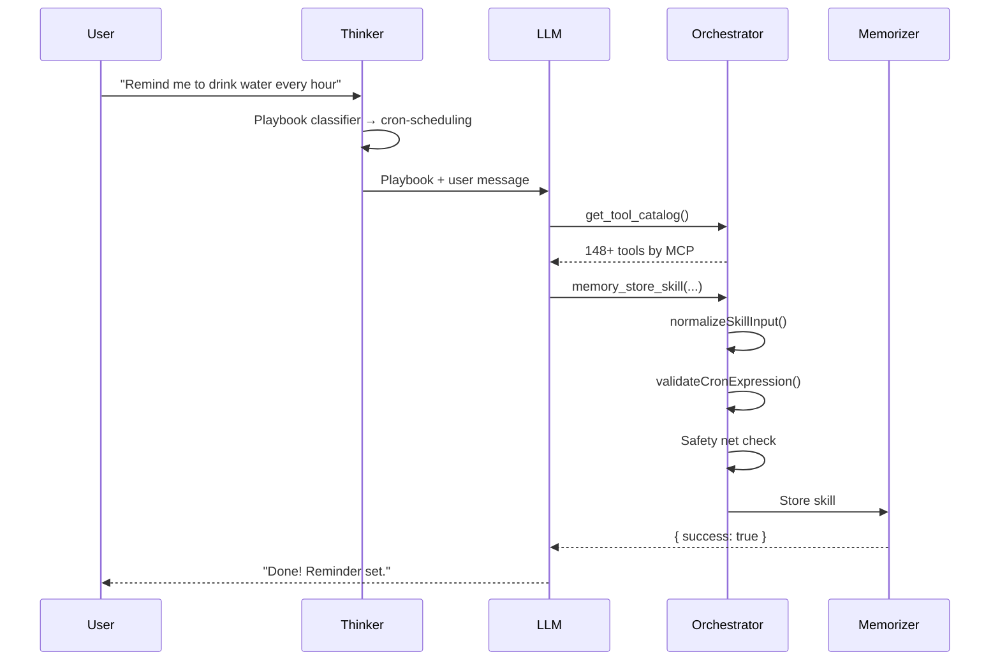

# Tooling & Skills Architecture

> How skills are created, validated, scheduled, and executed across the Annabelle ecosystem. Covers the two-tier execution model, input normalization, tool argument pipeline, and the evolution from cron jobs to unified skills.

---

## Table of Contents

1. [Architecture Overview](#architecture-overview)
2. [Execution Tiers](#execution-tiers)
3. [Skill Creation Flow](#skill-creation-flow)
4. [Skill Execution Flow](#skill-execution-flow)
5. [Tool Argument Normalization](#tool-argument-normalization)
6. [Resilience](#resilience)
7. [Tool Catalog & Discovery](#tool-catalog--discovery)
8. [SKILL.md File-Based Skills](#skillmd-file-based-skills)
9. [Evolution: Cron Jobs to Unified Skills](#evolution-cron-jobs-to-unified-skills)
10. [Key Files Reference](#key-files-reference)

---

## Architecture Overview



All scheduled tasks in Annabelle are **skills** — stored in Memorizer SQLite, scheduled via Inngest, executed via either direct tool calls (zero LLM cost) or Thinker agent reasoning (sandboxed LLM). There is no separate "cron job" concept.

```
User says "remind me to drink water every hour"
        │
        ▼
   ┌─────────┐        ┌──────────────┐        ┌────────────┐
   │ Thinker │──────▶│ Orchestrator  │──────▶│ Memorizer  │
   │         │  calls │  normalizes   │ stores │  SQLite    │
   │ playbook│  tool  │  validates    │ skill  │            │
   └─────────┘        └──────────────┘        └──────┬─────┘
                                                      │
                                               Inngest fires
                                               every 1 minute
                                                      │
                                               ┌──────▼─────┐
                                               │ Tier Router │
                                               └──┬──────┬──┘
                                                  │      │
                                          ┌───────▼┐  ┌──▼──────┐
                                          │ Direct │  │  Agent  │
                                          │ ~5ms   │  │  ~2s    │
                                          │ 0 LLM  │  │  LLM    │
                                          └────────┘  └─────────┘
```

---

## Execution Tiers

Skills support two execution tiers, selected automatically based on whether `execution_plan` is present:

| | Direct Tier | Agent Tier |
|---|---|---|
| **LLM involved** | No — direct tool call | Yes — Thinker reasons through instructions |
| **Use for** | Static reminders, fixed notifications | Multi-step workflows, decision-making |
| **Cost** | Zero tokens per fire | LLM tokens per execution |
| **Latency** | ~5ms | ~2-5s (depends on LLM + tools) |
| **Key field** | `execution_plan` (compiled steps) | `instructions` (natural language) |
| **Tool access** | Only tools in the plan | Strict sandbox: only `required_tools` |
| **Examples** | "Send 'Drink water!' at 9am" | "Check inbox, summarize urgent emails" |

### Tier Classification

The LLM decides the tier at **creation time** based on task complexity:

| User says | Tier | Stored as | Fire cost |
|-----------|------|-----------|-----------|
| "Send hello every minute" | Direct | `execution_plan: [{tool: "telegram_send_message", params: {message: "hello"}}]` | ~0 tokens, ~5ms |
| "Remind me at 3pm about dentist" | Direct (one-shot) | `execution_plan` + `trigger_config: {at: "..."}` | ~0 tokens, fires once |
| "Search AI news every 3 hours, summarize" | Agent | `instructions: "Search latest AI news..."` + `required_tools: [...]` | ~500-2000 tokens |
| "Check emails, classify urgent, draft replies" | Agent | `instructions: "..."` + `required_tools: [...]` + `max_steps: 10` | ~2000-5000 tokens |

**Decision rule:** If the task can be expressed as a fixed sequence of tool calls with static params → Direct. If it needs reasoning, summarization, classification, or dynamic content → Agent.

### Safety Net

If an `execution_plan` with more than 1 step is submitted, the system auto-converts it to Agent tier:

```
Orchestrator/src/routing/tool-router.ts (lines 445-462)
```

- Strips the `execution_plan` from args
- Populates `required_tools` from the plan's tool names
- Forces Agent tier execution

**Rationale:** Direct tier uses `executeWorkflow()` which has no result piping between steps. A multi-step plan would send literal `{{step1.result}}` instead of actual data. Converting to Agent tier lets the LLM reason about intermediate results.

---

## Skill Creation Flow




### Creation Steps

1. **Playbook activation** — The Thinker's playbook classifier matches the message (e.g., "remind me", "every hour") to the `cron-scheduling` playbook. The playbook is injected into the system prompt with structured instructions.

2. **Tool discovery** — The playbook forces inclusion of `get_tool_catalog` and `memory_store_skill`. The LLM calls `get_tool_catalog` to discover all available tools before creating the skill.

3. **Tier classification** — The LLM decides: simple fixed action → build `execution_plan` (Direct tier). Complex task needing decisions → write `instructions` (Agent tier).

4. **Input normalization** — The Orchestrator's `normalizeSkillInput()` (`Orchestrator/src/utils/skill-normalizer.ts`) fixes common LLM mistakes before storage:

   | Fix | Example |
   |-----|---------|
   | Re-nest flattened trigger_config | `{ schedule: "0 * * * *" }` at root → moved into `trigger_config` |
   | Normalize aliases | `cronExpression` → `schedule`, `intervalMinutes` → `interval_minutes` |
   | Convert relative times | `{ in_minutes: 5 }` → `{ at: "2026-02-14T15:05:00" }` |
   | Parse string arrays | `"[\"tool_a\"]"` → `["tool_a"]` |
   | Default agent_id | Missing → `"thinker"` |

5. **Validation** — Cron expressions are validated via `croner` at creation time. Bad expressions are rejected immediately (not at fire time). `required_tools` are checked against ToolRouter.

6. **Storage** — Skill is stored in Memorizer SQLite. If `execution_plan` has >1 step, it's auto-converted to Agent tier (safety net).

---

## Skill Execution Flow

See [diagrams/skill-execution-flow.mmd](diagrams/skill-execution-flow.mmd) for the full flowchart.

```
Orchestrator/src/jobs/skill-scheduler.ts — skillSchedulerFunction
```

The scheduler runs every minute via Inngest:

### Step 0: Auto-Enable

Disabled skills with `required_tools` are automatically re-enabled when all their tools become available (e.g., after an MCP reconnects). One-shot skills (those with `trigger_config.at`) are skipped — they should not be re-enabled after intentional disable.

### Step 1: Schedule Check

For each enabled cron skill, check if it's due:
- **Cron expression:** Parse with timezone, check if `nextRun` falls in current minute
- **Interval:** Check if `now - last_run_at >= interval_minutes`
- **One-shot:** Check if `now >= trigger_config.at` (fire once)

### Step 2: Graduated Backoff

After failures, retry delays increase progressively: **1 → 5 → 15 → 60 minutes**. After 5 consecutive failures, the skill is auto-disabled and a Telegram notification is sent. Failure counters are in-memory and reset on process restart.

### Step 3: Pre-flight Checks

**Calendar:** Meeting-related skills (name matches `/meeting|prep/i` AND requires `gmail_list_events`) check all calendars via free/busy API. No events in the next 2-hour window → skip silently (zero LLM cost).

**Email:** Email skills (name matches `/email/i` AND requires `gmail_get_new_emails`) check for new emails. No new emails → skip silently.

### Step 4: Tier Routing + Execution

**Direct Tier** (has `execution_plan`):
1. Parse execution plan from skill record
2. Call `executeWorkflow()` (`Orchestrator/src/jobs/executor.ts`) — sequential tool calls via ToolRouter
3. Auto-inject `chat_id` for `telegram_send_message` if missing
4. Zero LLM cost, ~5ms per fire

**Agent Tier** (has `instructions` only):
1. Dispatch to Thinker via `AgentManager.executeSkill()`
2. Thinker receives instructions + `required_tools` as strict sandbox (only those tools available)
3. LLM reasons, calls tools, produces summary
4. Costs LLM tokens per execution

### Post-Execution

- Update `last_run_at`, `last_run_status`, `last_run_summary` in Memorizer
- One-shot skills (`trigger_config.at`) auto-disable after firing
- Send Telegram notification if `notify_on_completion` is true
- On failure: send error notification, increment backoff counter

---

## Tool Argument Normalization

There are two normalization layers — one at skill creation time (Orchestrator-side) and one at tool call time (Thinker-side).

See [diagrams/tool-normalization-pipeline.mmd](diagrams/tool-normalization-pipeline.mmd) for a visual overview.

### Thinker-Side: Tool Call Normalization

```
Thinker/src/orchestrator/tools.ts
```

Every tool call from the LLM passes through this pipeline before reaching the Orchestrator:

```
args → coerceStringBooleans → stripNullValues → stripHallucinatedParams → injectChatId → Orchestrator
```

| Step | Function | What it fixes |
|------|----------|--------------|
| 1 | `coerceStringBooleans()` | `"true"` → `true`, `"false"` → `false` |
| 2 | `stripNullValues()` | Removes keys with `null` values (LLMs send `null` instead of omitting optional params) |
| 3 | `stripHallucinatedParams()` | Removes known hallucinated params (e.g., `teamId`/`slug` on `vercel_*` tools) |
| 4 | `injectChatId()` | Fixes `telegram_send_message` `chat_id`: replaces missing, non-string, or suspiciously long (>20 char) values with real primary chat_id from channel manager |

Additionally, `relaxSchemaTypes()` modifies JSON Schema definitions sent to the LLM:

- Numeric types also accept strings (`"type": "number"` → `"type": ["number", "string"]`)
- Boolean types also accept strings
- Optional properties also accept `null`

### Orchestrator-Side: Skill Input Normalization

```
Orchestrator/src/utils/skill-normalizer.ts
```

Applied at creation time when `memory_store_skill` or `memory_update_skill` is called:

| Step | What it fixes |
|------|--------------|
| Re-nest flattened fields | `schedule`, `interval_minutes`, `at`, `in_minutes` at root → moved into `trigger_config` |
| Normalize aliases | `cronExpression` → `schedule`, `intervalMinutes` → `interval_minutes` |
| Convert relative times | `in_minutes: 5` → `at: "2026-02-14T15:05:00"` (absolute ISO timestamp) |
| Infer trigger_type | Sets `trigger_type: "cron"` if `schedule`, `interval_minutes`, or `at` exists |
| Parse required_tools | JSON string → array, plain string → `[str]` |
| Parse max_steps | String → number |
| Default agent_id | Missing → `"thinker"` |

---

## Resilience

### Graduated Backoff

```
Orchestrator/src/utils/skill-normalizer.ts — getBackoffMinutes(), recordFailure(), recordSuccess()
```

Replaces the old flat 5-minute cooldown with progressive retry delays:

| Consecutive failures | Backoff | What happens |
|---------------------|---------|--------------|
| 1 | 1 minute | Quick retry — may be transient |
| 2 | 5 minutes | Moderate delay |
| 3 | 15 minutes | Longer delay |
| 4 | 60 minutes | Last chance |
| 5 | Auto-disable | Skill disabled + Telegram notification |

Failure counters are stored in-memory (`Map<number, number>`) and reset on process restart.

### Ollama Health Monitoring

```
Orchestrator/src/jobs/skill-scheduler.ts (lines 152-206)
```

The skill scheduler includes a rate-limited Ollama health check on every run (every minute):
- Pings `${OLLAMA_URL}/api/tags` with 3s timeout
- One-time Telegram alert when Ollama becomes unreachable
- Recovery notification when Ollama comes back online
- State tracked in `~/.annabelle/data/ollama-alert-state.json`

### Cost Controls Integration

If the Thinker's token usage spikes during a skill execution, the agent is auto-paused via the cost monitor. A Telegram notification is sent with the reason, token counts, and thresholds. See [cost-controls.md](cost-controls.md) for details.

---

## Tool Catalog & Discovery

### get_tool_catalog

```
Orchestrator/src/tools/tool-catalog.ts
```

A lightweight tool for LLMs to discover available tools before creating skills. Returns tool names + short descriptions (first sentence only), grouped by MCP:

```json
{
  "success": true,
  "data": {
    "summary": "142 tools across 8 MCP servers",
    "catalog": {
      "telegram": [
        { "name": "telegram_send_message", "description": "Send a message to a Telegram chat." }
      ],
      "gmail": [
        { "name": "gmail_send_email", "description": "Send an email." }
      ]
    }
  }
}
```

This replaces the old `AVAILABLE_TOOLS_DESCRIPTION` hardcoded list that only listed 30 of 148+ tools. The catalog is dynamic — always reflects the current ToolRouter state.

### Tool Refresh at Runtime

The Thinker has a 10-minute TTL cache for tools fetched from the Orchestrator (`GET /tools/list`). When MCPs are added or removed (via auto-discovery or hot-reload), the Thinker picks up the changes within 10 minutes without requiring a restart.

---

## SKILL.md File-Based Skills

```
~/.annabelle/skills/*/SKILL.md
```

File-based skills follow the [agentskills.io](https://agentskills.io/specification) specification with Annabelle extensions in the `metadata` block.

### Format

```yaml
---
name: code-review
description: Reviews code for quality, security, and best practices
metadata:
  keywords: [review, code review, audit]
  priority: 5
  required_tools: [filer_read_file, codexec_execute_code]
---

## Instructions

1. Read the specified file using filer_read_file
2. Analyze the code for...
```

### Two Roles

File-based skills serve two purposes:

**1. Playbook injectors** (event-triggered) — Skills with `keywords` participate in playbook classification. When the user's message matches, the skill's instructions are injected into the system prompt as workflow guidance.

**2. Scheduled executors** (cron-triggered) — Skills with `trigger_config` in their metadata auto-register in Memorizer and execute on schedule:

```yaml
metadata:
  required_tools:
    - searcher_news_search
    - telegram_send_message
  trigger_config:
    schedule: "0 */3 * * *"
  max_steps: 5
```

On startup + every 5-minute refresh:
- `SkillLoader` detects `trigger_config` in frontmatter
- If no matching DB skill exists → auto-creates via `memory_store_skill`
- If DB skill exists and file is newer → updates via `memory_update_skill`
- If file is deleted → disables the DB skill

This means you can **git-manage scheduled skills** — version control, deploy by copying files, share via the agentskills.io standard.

### Progressive Disclosure

Skills **without keywords** are not eligible for playbook classification. Instead, they appear as brief `<available_skills>` XML descriptions in the system prompt, telling the LLM what capabilities exist without bloating the prompt.

---

## Evolution: Cron Jobs to Unified Skills

### What Was Removed

| Removed | Replaced by |
|---------|-------------|
| `create_job` tool | `memory_store_skill` |
| `list_jobs` / `delete_job` / `get_job_status` tools | `memory_list_skills` / `memory_delete_skill` / `memory_get_skill` |
| Job storage (`~/.annabelle/data/jobs/*.json`) | Memorizer SQLite skills table |
| Cron job poller loop (`functions.ts` lines 208-330) | Skill scheduler (`skill-scheduler.ts`) |
| `executor.ts` backward compat map | Direct tier via `executeWorkflow()` |
| SKILL vs CRON JOB classification in playbook | All scheduling = skill |
| `AVAILABLE_TOOLS_DESCRIPTION` hardcoded list | `get_tool_catalog` (dynamic, from ToolRouter) |

### What Stayed

| Kept | Role |
|------|------|
| **Inngest** | Single scheduler — fires every minute |
| **Memorizer** | Single store — skills with schedule, instructions, required_tools |
| **Thinker** | Single executor — LLM reasons at fire time with required_tools |
| **Playbook** | Simplified — all scheduling goes through `get_tool_catalog` → `memory_store_skill` |
| **ToolRouter** | Unchanged — routes tool calls to MCPs |
| **required_tools validation** | Validates against ToolRouter at creation time |
| **Calendar pre-flight** | Skips meeting skills when no events |

### What Was Added

| New | Purpose |
|-----|---------|
| **Direct tier** | Zero-LLM execution for simple skills via `executeWorkflow()` |
| **Tier router** | Examines `execution_plan` presence to choose Direct vs Agent |
| **Input normalizer** | Fixes LLM formatting mistakes before storage |
| **Cron expression validation** | Validates via `croner` at creation time, not fire time |
| **Graduated backoff** | 1 → 5 → 15 → 60 min progressive retry + auto-disable after 5 failures |
| **One-shot `at` schedule** | "Remind me at 3pm" — fires once, auto-disables |
| **`get_tool_catalog`** | Dynamic tool discovery (replaces stale hardcoded list) |
| **Strict tool sandboxing** | Agent tier skills get ONLY `required_tools`, nothing else |
| **Safety net** | Multi-step `execution_plan` auto-converts to Agent tier |

### Why This Is Better

| Concern | Before (v2) | After (v3) |
|---------|-------------|------------|
| "Send hello" fires every minute | ~500 tokens per fire (LLM) | ~0 tokens (Direct tier) |
| 20 simple skills x 1440 fires/day | ~14.4M tokens/day | ~0 tokens/day |
| "Remind me at 3pm" | Not supported | One-shot `at` schedule, auto-disables |
| Bad cron expression | Stored, fails at fire time | Rejected at creation time |
| LLM malformed input | Stored as-is | Normalizer fixes before storage |
| Skill starts failing | Retries every fire, error spam | Graduated backoff + auto-disable |
| "Is this a cron job or a skill?" | Two confusing systems | Single concept: skill |

---

## Key Files Reference

| Component | File | Purpose |
|-----------|------|---------|
| Skill Scheduler | `Orchestrator/src/jobs/skill-scheduler.ts` | Inngest poller, auto-enable, schedule check, pre-flight, tier routing |
| Skill Normalizer | `Orchestrator/src/utils/skill-normalizer.ts` | Input normalization, cron validation, graduated backoff |
| Direct Tier Executor | `Orchestrator/src/jobs/executor.ts` | `executeWorkflow()`, `executeToolCall()` |
| Tool Catalog | `Orchestrator/src/tools/tool-catalog.ts` | `get_tool_catalog` — dynamic tool discovery |
| Tool Router (safety net) | `Orchestrator/src/routing/tool-router.ts` | Multi-step plan auto-conversion to Agent tier |
| Tool Normalization | `Thinker/src/orchestrator/tools.ts` | `relaxSchemaTypes()`, `stripNullValues()`, `injectChatId()` |
| Agent Loop | `Thinker/src/agent/loop.ts` | `processProactiveTask()` — Agent tier execution |
| Playbook Classifier | `Thinker/src/agent/playbook-classifier.ts` | Keyword matching for playbook activation |
| Playbook Cache | `Thinker/src/agent/playbook-cache.ts` | DB + file skill merging, 5-min refresh |
| Skill Loader | `Thinker/src/agent/skill-loader.ts` | SKILL.md parsing, trigger_config extraction |
| Skill Schema | `Memorizer-MCP/src/db/schema.ts` | `SkillRow` interface, skills table |
| Skill Seeding | `_scripts/seed-cron-skills.ts` | Default skill definitions |
| Thinker Client | `Orchestrator/src/agents/thinker-client.ts` | `executeSkill()` HTTP call |
| Cron Scheduling Playbook | `Thinker/src/agent/playbook-seed.ts` | Playbook instructions for skill creation |

### Diagrams

| Diagram | File | Description |
|---------|------|-------------|
| Architecture v3 | [diagrams/skill-architecture-v3.mmd](diagrams/skill-architecture-v3.mmd) | Full v3 architecture (current, implemented) |
| Legacy Architecture | [diagrams/skill-architecture-legacy.mmd](diagrams/skill-architecture-legacy.mmd) | Pre-v3 architecture (historical reference) |
| Skill Creation Flow | [diagrams/skill-creation-flow.mmd](diagrams/skill-creation-flow.mmd) | User → Playbook → LLM → Normalizer → Memorizer |
| Skill Execution Flow | [diagrams/skill-execution-flow.mmd](diagrams/skill-execution-flow.mmd) | Inngest → Pre-flight → Tier Router → Direct/Agent |
| Normalization Pipeline | [diagrams/tool-normalization-pipeline.mmd](diagrams/tool-normalization-pipeline.mmd) | Both Thinker-side and Orchestrator-side pipelines |
