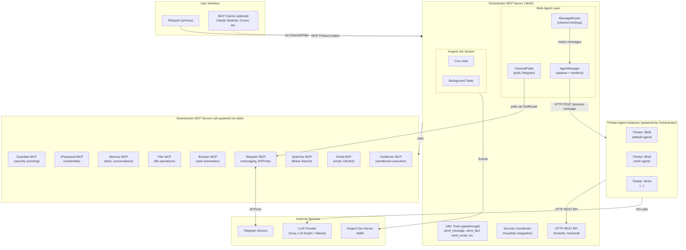
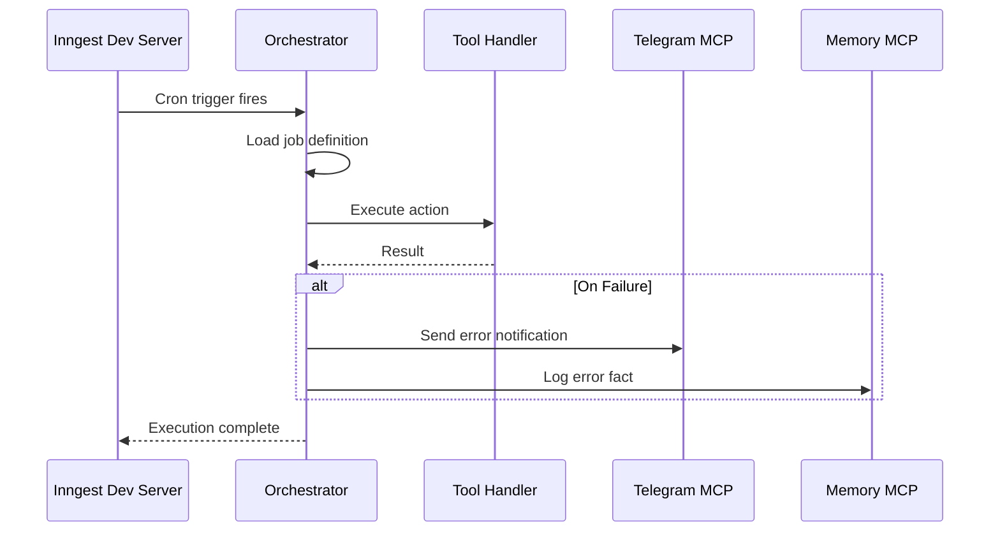

# Annabelle - System Architecture Overview

## What is Annabelle?

Annabelle is a personal AI assistant built on MCP (Model Context Protocol) architecture with defense-in-depth security. It coordinates between AI models, specialized MCP servers, and external data sources to provide intelligent, secure, and personalized assistance.

**Design Principles:**

- Security at every layer (no direct AI access to credentials or external systems)
- Modular MCP architecture (each capability is a separate, replaceable service)
- Learning assistant (remembers preferences, builds understanding over time)
- Single-user focus (personal assistant, not multi-tenant platform)

---

### MCP Client Integration (Optional)

Annabelle works standalone via Telegram. Optionally, any MCP-compatible client (Claude Desktop, Claude Code, Cursor, etc.) can connect to the Orchestrator as an additional interface. For example, to use with Claude Desktop, edit `~/Library/Application Support/Claude/claude_desktop_config.json`:

```json
{
  "mcpServers": {
    "annabelle": {
      "command": "node",
      "args": [
        "<repo-root>/Orchestrator/dist/Orchestrator/src/index.js"
      ],
      "env": {
        "TRANSPORT": "stdio",
        "TELEGRAM_MCP_URL": "http://localhost:8002",
        "SECURITY_FAIL_MODE": "open",
        "SCAN_ALL_INPUTS": "false",
        "LOG_LEVEL": "info"
      }
    }
  }
}
```

Replace `<repo-root>` with the absolute path to your cloned repository.

## Architecture Layers

### Phase 1: MCP-First Architecture (Current)

The current architecture uses **Orchestrator as an agent router and protocol bridge**:

- **Telegram** is the primary user interface — Orchestrator polls for messages and routes them to Thinker agents
- **Thinker agents** are spawned and managed by Orchestrator's AgentManager
- **Orchestrator** routes messages to the correct agent, enforces per-agent tool policies, and exposes a standard MCP interface
- **MCP clients** (Claude Desktop, Cursor, etc.) can optionally connect via stdio for direct tool access
- **Downstream MCPs** are all spawned by Orchestrator via stdio as child processes (auto-discovered from `package.json` manifests)



**ASCII Fallback:**

```text
┌─────────────────────────────────────────────────────────────────┐
│                      USER INTERFACE LAYER                        │
│                                                                  │
│  ┌─────────────────────────┐  ┌──────────────────────────────┐  │
│  │  Telegram (primary)     │  │  MCP Clients (optional)      │  │
│  │  via ChannelPoller      │  │  Claude Desktop, Cursor, etc │  │
│  └───────────┬─────────────┘  └───────────────┬──────────────┘  │
│              │                                │ stdio           │
└──────────────┼────────────────────────────────┼─────────────────┘
               ↓                                ↓
┌─────────────────────────────────────────────────────────────────┐
│                   ORCHESTRATOR MCP SERVER (:8010)                │
│                                                                  │
│  HTTP REST API: /health, /tools/list, /tools/call               │
│  MCP stdio: Standard MCP protocol for any compatible client     │
│                                                                  │
│  148+ Tools (passthrough): send_message, store_fact, create_file│
│                                                                  │
│  ┌──────────────────────────────────────────────────────────┐   │
│  │  Multi-Agent Layer                                        │   │
│  │  ┌───────────────┐ ┌───────────────┐ ┌───────────────┐  │   │
│  │  │ ChannelPoller │ │ MessageRouter │ │ AgentManager  │  │   │
│  │  │ (polls TG)    │ │ (bindings)    │ │ (spawn/monitor│  │   │
│  │  └───────────────┘ └───────────────┘ └───────┬───────┘  │   │
│  └──────────────────────────────────────────────┼───────────┘   │
│                                                  ↓               │
│  ┌──────────────────────────────────────────────────────────┐   │
│  │  THINKER AGENTS (spawned by AgentManager)                 │   │
│  │  ┌──────────────┐ ┌──────────────┐ ┌──────────────┐      │   │
│  │  │  Default     │ │  Work Agent  │ │  Agent N     │      │   │
│  │  │  (:8006)     │ │  (:8016)     │ │  (:801N)     │      │   │
│  │  └──────────────┘ └──────────────┘ └──────────────┘      │   │
│  └──────────────────────────────────────────────────────────┘   │
│                                                                  │
│  ┌──────────────────────────────────────────────────────────┐   │
│  │                    Inngest Job System                     │   │
│  │  ┌─────────────┐ ┌─────────────┐                         │   │
│  │  │  Cron Jobs  │ │ Background  │                         │   │
│  │  │             │ │   Tasks     │                         │   │
│  │  └─────────────┘ └─────────────┘                         │   │
│  └──────────────────────────────────────────────────────────┘   │
│                                                                  │
│  Security Coordinator (Guardian integration)                     │
└──────────────┬──────────────────────────────────────────────────┘
               │ stdio (spawns all MCPs as child processes)
               ↓
┌─────────────────────────────────────────────────────────────────┐
│  MCP SERVERS (all spawned via stdio)                             │
│  ┌──────────┐ ┌──────────┐ ┌──────────┐ ┌──────────┐          │
│  │ Guardian │ │ 1Password│ │  Memory  │ │ File Ops │          │
│  │   MCP    │ │   MCP    │ │   MCP    │ │   MCP    │          │
│  └──────────┘ └──────────┘ └──────────┘ └──────────┘          │
│  ┌──────────┐ ┌──────────┐ ┌──────────┐ ┌──────────┐          │
│  │ Telegram │ │ Searcher │ │  Gmail   │ │ Browser  │          │
│  │   MCP    │ │   MCP    │ │   MCP    │ │   MCP    │          │
│  └──────────┘ └──────────┘ └──────────┘ └──────────┘          │
│  ┌──────────┐                                                  │
│  │ CodeExec │                                                  │
│  │   MCP    │                                                  │
│  └──────────┘                                                  │
└─────────────────────────────────────────────────────────────────┘
```

### Phase 2: Custom UI (Future)

```
┌────────────────────────────────────────────────────────────────┐
│  MCP Clients (optional)        OR       Custom Web UI           │
│       │                                    │                    │
│       │ MCP stdio                          │ REST API           │
│       ↓                                    ↓                    │
│  ┌─────────────────────────────────────────────────────────┐   │
│  │              ORCHESTRATOR SERVICE                        │   │
│  │                                                          │   │
│  │   ┌────────────────────────────────────────────────┐    │   │
│  │   │              CORE LOGIC (shared)                │    │   │
│  │   └────────────────────────────────────────────────┘    │   │
│  │         ↑                           ↑                    │   │
│  │   ┌─────┴─────┐              ┌──────┴─────┐             │   │
│  │   │MCP Server │              │ REST API   │             │   │
│  │   └───────────┘              └────────────┘             │   │
│  │                                    │                     │   │
│  │                    ┌───────────────┴────────────────┐   │   │
│  │                    ↓                                ↓   │   │
│  │              Claude API                    LM Studio    │   │
│  │           (cloud, paid)              (local, free)      │   │
│  └─────────────────────────────────────────────────────────┘   │
│                              │                                  │
│                              ↓                                  │
│                    Downstream MCP Servers                       │
└────────────────────────────────────────────────────────────────┘
```

---

## AI Model Flexibility

The architecture supports **multiple AI backends** interchangeably:

### Thinker Agents (Primary)

Thinker agents are the primary way Annabelle processes messages. They receive messages from Orchestrator (routed from Telegram) and use configurable LLM providers:

| Provider | Type | Notes |
| --- | --- | --- |
| **Groq** | Cloud | Fast inference, default provider |
| **LM Studio** | Local | Free, private, variable quality |
| **Ollama** | Local | Free, good for smaller models |

### MCP Clients (Optional)

Any MCP-compatible application can also connect to the Orchestrator for direct tool access:

| Application | Connection | Notes |
| --- | --- | --- |
| Claude Desktop | MCP stdio | Best tool use, paid |
| Claude Code | MCP stdio | Terminal-based |
| Cursor | MCP stdio | IDE integration |
| LM Studio | MCP stdio | Free, private |

### Thinker LLM Configuration

Thinker supports multiple LLM providers via environment variables:

```bash
# Provider selection
THINKER_LLM_PROVIDER=groq  # groq | lmstudio | ollama

# Groq (cloud, fast, default)
GROQ_API_KEY=gsk_...
GROQ_MODEL=meta-llama/llama-4-maverick-17b-128e-instruct

# LM Studio (local)
LMSTUDIO_BASE_URL=http://localhost:1234/v1

# Ollama (local)
OLLAMA_BASE_URL=http://localhost:11434
OLLAMA_MODEL=llama3.2
```

### Phase 2: REST API - Model Selection

When you add custom UI, the orchestrator calls AI APIs directly:

```yaml
ai_models:
  # Cloud option (better quality, paid)
  claude:
    provider: anthropic
    model: claude-sonnet-4-20250514
    endpoint: https://api.anthropic.com/v1/messages
    api_key: ${ANTHROPIC_API_KEY}

  # Local option (free, private)
  lm_studio:
    provider: openai_compatible
    model: your-local-model
    endpoint: http://localhost:1234/v1/chat/completions
    api_key: not-needed

  # Configuration
  default: lm_studio # or: claude
  fallback: claude # if primary fails
```

### Model-Agnostic Design

The orchestrator's core logic works with ANY model:

- Tools are exposed via standard MCP protocol
- REST API uses OpenAI-compatible format (works with Claude, LM Studio, Ollama, etc.)
- No model-specific code in core logic

---

## Component Overview

### Orchestrator (MCP Server)

The orchestrator is the **central hub** of the system. It exposes high-level tools, manages multiple Thinker agent instances, polls Telegram for messages, and internally coordinates all other MCP servers. It also serves as an MCP server that any compatible client can connect to.

**Key Responsibilities:**

- **Agent routing** - Spawns Thinker instances via AgentManager, routes incoming messages to the correct agent via MessageRouter
- **Channel polling** - Polls Telegram for new messages via ChannelPoller (replaces Thinker's old direct polling)
- **Tool policy enforcement** - Per-agent `allowedTools`/`deniedTools` glob patterns filter which tools each agent can use
- **Per-agent Guardian overrides** - Agent-specific input/output scan flags merged on top of global defaults
- Expose passthrough tools to MCP clients (original MCP tool names like `send_message`, `store_fact`, `create_file`)
- Auto-discover tools from downstream MCPs via ToolRouter
- Security enforcement via Guardian MCP
- Session management (scoped by agentId)

### Memory MCP

Persistent learning and personalization. Stores facts learned from conversations, maintains user profile, enables memory transparency (user can see and edit what AI knows).

**Key Responsibilities:**

- Fact storage and retrieval
- Conversation logging
- User profile management (per agent)
- Memory transparency (export to viewable files)
- Automatic fact extraction from conversations
- Periodic synthesis of learnings

**Storage:** SQLite with sqlite-vec for hybrid search (vector embeddings + FTS5 full-text search).

### File Ops MCP

File system operations and workspace management. Creates files AI generates, manages access grants to user's existing files, handles workspace organization.

**Key Responsibilities:**

- Create/read/update/delete files in AI workspace
- Access control via grants (user approves folder access)
- Workspace organization
- Temporary file cleanup
- Audit logging of all file operations

### Security MCP (Guardian)

**Status:** ✅ Implemented

Prompt injection detection, jailbreak prevention, PII leakage scanning. Supports three scanning backends: **Groq Llama Guard** (cloud, fast), **Groq Safeguard** (cloud, policy-driven), and **Ollama** (local, offline). Provider is selected lazily based on environment variables.

### 1Password MCP

**Status:** ✅ Implemented

Secure credential retrieval. AI never sees raw credentials - only gets tokens/results.

### Telegram MCP

**Status:** ✅ Implemented

Send notifications and receive commands via Telegram. Uses **GramJS** (MTProto protocol) for user account access (not bot API). Spawned by Orchestrator via stdio.

**Key Features:**

- Full user account access (read any message, not just bot mentions)
- Real-time message capture via event handlers
- In-memory message queue (up to 1000 messages)
- Chat subscription filtering

### Searcher MCP

**Status:** ✅ Implemented

Web search via Brave Search API. Spawned by Orchestrator via stdio.

**Key Features:**

- `web_search` - General web search
- `news_search` - News-specific search
- `image_search` - Image search

### Gmail MCP

**Status:** ✅ Implemented

Email management via Gmail API with OAuth2 authentication. Spawned by Orchestrator via stdio.

**Key Features:**

- 30 tools covering messages, drafts, labels, attachments, filters, and calendar
- OAuth2 authentication (credentials stored at `~/.annabelle/gmail/`)
- Label name resolution (case-insensitive names, not just IDs)

### Browser MCP

**Status:** ✅ Implemented

Headless browser automation via Playwright. Enables agents to navigate web pages, interact with elements, and extract content.

- Uses `@playwright/mcp` for browser control
- Spawned via stdio by Orchestrator (auto-discovered as "web" MCP)

### CodeExec MCP

**Status:** ✅ Implemented

Sandboxed code execution in Python, Node.js, and Bash. Supports one-shot execution and persistent REPL sessions.

- `execute_code` - Run code in a sandboxed subprocess
- Script library: `save_script`, `get_script`, `list_scripts`, `search_scripts`, `run_script`
- Persistent sessions: `start_session`, `send_to_session`, `close_session`
- Environment variables stripped before execution (no credential leaks)
- Package installation with Guardian-scannable package names
- Docker sandbox mode designed but not yet implemented (Phase 5)

### Thinker (Agent Runtime)

**Status:** ✅ Implemented
**Specification:** `Thinker/ARCHITECTURE.md`

Passive AI reasoning engine that receives messages from Orchestrator via HTTP and processes them using LLM providers (Groq, LM Studio, Ollama). Orchestrator spawns one Thinker process per agent definition.

**Key Features:**

- **Passive runtime** - Receives messages via `POST /process-message` from Orchestrator, returns responses (does not poll or send directly)
- **LLM abstraction** - Supports Groq (cloud), LM Studio (local), Ollama (local), configurable per agent
- **ReAct agent loop** - Multi-step reasoning with tool use via Vercel AI SDK (`maxSteps: 8`)
- **Embedding-based tool selection** - Cosine similarity over tool description embeddings selects relevant tools per message, with persistent cache across restarts and hot-reload when tools change at runtime
- **Playbook seeding** - 8 default playbooks seeded on first startup (email triage, research, daily briefing, etc.)
- **Config-driven personality** - System prompt loaded from file path provided by Orchestrator at spawn
- **Context management** - Loads persona and facts from Memory MCP via Orchestrator's tool API
- **Per-agent tool filtering** - Discovers only tools allowed by agent's policy (via `agentId` query param)
- **LLM cost controls** - Anomaly-based spike detection with sliding-window algorithm; pauses agent and sends Telegram alert on abnormal token consumption
- **Subagent spawning** - Agents can spawn temporary subagents via `spawn_subagent` tool for parallel task delegation. Subagents run as separate processes on OS-assigned dynamic ports, inherit parent tool policies, and are auto-killed after completing their task or hitting a timeout
- **Lazy-spawn / idle-kill** - Agents register on startup but only spawn on first message. Idle agents are killed after configurable timeout (default 30 min). Reduces resource usage when agents aren't active

**Architecture:**

```
Orchestrator (:8010)
     │
     ├── lazy-spawns ──→ Thinker :8006 (default agent)
     ├── lazy-spawns ──→ Thinker :8016 (work agent)
     └── lazy-spawns ──→ Thinker :801N (...)
                              │
                              ├──HTTP──→ Orchestrator /tools/call (all tool access)
                              ├──→ LLM Provider (Groq/LM Studio/Ollama)
                              └── spawn_subagent ──→ Thinker :dynamic (temporary)
```

**Default Port:** 8006 (each additional agent gets its own port; subagents use OS-assigned dynamic ports)

### Inngest Job System

**Status:** ✅ Implemented (in Orchestrator)

Job management for scheduled and background tasks.

**Capabilities:**

- Recurring cron jobs with validated cron expressions (e.g., `0 9 * * *` = daily at 9am)
- IANA timezone support (e.g., `Europe/Warsaw`, `America/New_York`)
- One-time scheduled jobs at a specific future timestamp
- Background task queuing for immediate async execution
- Multi-step workflows with step dependencies
- Automatic retries (3x with exponential backoff)
- Real-time dashboard at `:8288`

**How cron execution works:**

A `cronJobPollerFunction` runs every minute via Inngest. It loads all enabled cron jobs, evaluates each expression against the current time (respecting timezones) using the [croner](https://github.com/nicknisi/croner) library, and executes those that are due. The `lastRunAt` timestamp prevents double execution.

**Documentation:** `Orchestrator/README.md` (Job Management section)

---

## Data Flow Patterns

### Pattern 1: User Request Flow

```
User sends message
       ↓
Orchestrator receives request
       ↓
Security MCP scans input ──→ [BLOCK if malicious]
       ↓
Memory MCP retrieves relevant context
       ↓
Orchestrator constructs enhanced prompt
       ↓
AI Model generates response (may include tool calls)
       ↓
[If tool calls] Execute via MCP servers
       ↓
[If sensitive tool] Security MCP scans output ──→ [BLOCK if PII leak]
       ↓
Memory MCP stores conversation + extracts facts
       ↓
Response returned to user
```

### Pattern 2: Scheduled Task Flow (Inngest)



**ASCII Fallback:**

```
Cron trigger fires (Inngest)
       ↓
Orchestrator loads job definition
       ↓
Execute tool calls via handler
       ↓
[If failure] Telegram notification + Memory logging
       ↓
Execution complete
```

### Pattern 3: Real-Time Telegram Message Flow (via Orchestrator)


**ASCII Fallback:**

```
Telegram User sends message
       ↓
Telegram Servers (MTProto)
       ↓ (instant)
GramJS NewMessage Event Handler (Telegram MCP, spawned via stdio)
       ↓
Orchestrator ChannelPoller polls get_messages (every 10s via ToolRouter)
       ↓
Filter: skip bot's own messages, old messages (>2min), duplicates, max 3/cycle
       ↓
MessageRouter resolves agentId from channel bindings
       ↓
POST /process-message to correct Thinker instance
       ↓
LLM processes message (Groq, maxSteps: 8)
       ↓ (if tools needed)
Thinker calls Orchestrator /tools/call (policy-filtered per agent)
       ↓
Orchestrator sends response via send_message (ToolRouter → Telegram MCP)
```

**Chat Discovery:** Orchestrator's ChannelPoller auto-discovers private chats via `list_chats`, excluding bot's own Saved Messages. Subscriptions refresh every 5 minutes.

**Note:** Inngest also polls Telegram (every 60s) to store messages in Memory MCP for history, but the ChannelPoller handles all real-time responses.

### Pattern 4: Webhook Event Flow (Future)

```
External event arrives (Gmail, Calendar, GitHub)
       ↓
Validate webhook signature
       ↓
Security MCP scans payload content
       ↓
Determine if significant
       ↓
[If significant] Construct prompt for AI analysis
       ↓
Execute AI recommendations
       ↓
Acknowledge webhook
```

---

## Agent Architecture

### Multi-Agent System (Implemented)

Orchestrator spawns and manages multiple Thinker instances, each with its own LLM config, system prompt, tool permissions, and channel bindings.

**Agent Configuration** (`agents.json`):

```json
{
  "agents": [
    {
      "agentId": "annabelle",
      "enabled": true,
      "port": 8006,
      "llmProvider": "groq",
      "model": "meta-llama/llama-4-maverick-17b-128e-instruct",
      "temperature": 0.6,
      "systemPrompt": "",
      "allowedTools": [],
      "deniedTools": [],
      "maxSteps": 8,
      "costControls": {
        "enabled": true,
        "shortWindowMinutes": 2,
        "spikeMultiplier": 3.0,
        "hardCapTokensPerHour": 250000,
        "minimumBaselineTokens": 1000,
        "notifyChatId": "<YOUR_TELEGRAM_CHAT_ID>"
      }
    }
  ],
  "bindings": [
    { "channel": "telegram", "chatId": "*", "agentId": "annabelle" }
  ]
}
```

**How It Works:**

1. **AgentManager** registers agents from `agents.json` on startup (lazy-spawn — no process started yet)
2. **ChannelPoller** polls Telegram for new messages via the ToolRouter
3. **MessageRouter** resolves which agent handles each message based on channel bindings (exact match → wildcard → default agent)
4. **AgentManager.ensureRunning()** lazy-spawns the agent on first message (deduplicates concurrent spawn requests)
5. Orchestrator dispatches the message to the correct Thinker via `POST /process-message`
6. Thinker runs its ReAct loop, calling tools back through Orchestrator's `/tools/call` endpoint
7. Orchestrator enforces **tool policy** — each agent only sees tools matching its `allowedTools`/`deniedTools` globs
8. Orchestrator sends the response back to Telegram via the ToolRouter
9. **Idle scanner** (every 5 min) kills agents with no activity beyond their `idleTimeoutMinutes`

**Subagent Spawning:** Agents can call the `spawn_subagent` tool to delegate tasks to temporary subagent processes. Subagents spawn on dynamic ports, inherit parent tool policies (subset only), cannot spawn their own subagents (single-level), and are killed after returning their result. Max 5 concurrent subagents per parent.

**Single-Agent Fallback:** If no `agents.json` is configured, Orchestrator falls back to connecting to a single Thinker at `THINKER_URL` — identical to pre-multi-agent behavior.

**Key Components:**

- `AgentManager` — registers agents (lazy-spawn), monitors health, auto-restarts crashed agents, tracks cost-pause state, manages subagent lifecycle
- `ChannelPoller` — polls Telegram via ToolRouter, deduplicates messages
- `MessageRouter` — resolves `(channel, chatId)` → `agentId` via config-driven bindings
- `ToolRouter.isToolAllowed()` — glob-based allow/deny filtering per agent
- `getEffectiveScanFlags(agentId)` — per-agent Guardian scan overrides

---

## Security Model

### Defense in Depth

```
Layer 1: Input Validation
         └── Malformed request rejection, rate limiting

Layer 2: Security MCP Scanning
         └── Prompt injection, jailbreak, social engineering detection

Layer 3: Tool Authorization
         └── Agent can only use permitted MCPs

Layer 4: Output Scanning (Selective)
         └── PII/credential leak prevention on sensitive operations

Layer 5: MCP Isolation
         └── Each MCP has minimal permissions, no direct internet access

Layer 6: Credential Separation
         └── Secrets in 1Password, never in prompts or logs

Layer 7: LLM Cost Controls
         └── Anomaly-based spike detection, hard cap, auto-pause with Telegram alert
```

### What Gets Scanned

| Operation           | Input Scan         | Output Scan         |
| ------------------- | ------------------ | ------------------- |
| User message        | ✅ Always          | -                   |
| AI response         | -                  | ❌ Usually not      |
| 1Password tool call | -                  | ✅ Always           |
| Telegram send       | -                  | ✅ Always           |
| Email send          | -                  | ✅ Always           |
| File read           | ✅ Content scanned | -                   |
| File write          | -                  | ✅ If external path |

---

## Storage Strategy

### System Files (Hidden)

```
~/.annabelle/
├── agents/               ← Agent persona files
│   └── annabelle/
│       └── instructions.md
├── data/
│   ├── memory.db          ← SQLite database
│   ├── grants.db          ← File access permissions
│   └── embedding-cache.json ← Thinker tool embedding cache
├── logs/
│   ├── orchestrator.log
│   ├── security.log
│   └── audit.log
├── sessions/             ← Thinker session state
├── skills/               ← Agent playbooks
├── gmail/                ← Gmail OAuth tokens
└── memory-export/         ← Memory transparency files
    ├── profile.json
    ├── facts/
    └── conversations/
```

### User Workspace (Visible)

```
~/Documents/AI-Workspace/   ← User chooses location
├── Documents/
│   ├── reports/
│   └── notes/
├── Code/
│   ├── python/
│   └── scripts/
├── Research/
└── temp/                   ← Auto-cleaned after 7 days
```

### User's Existing Files (Granted Access)

```
~/Documents/Work/           ← User grants access
├── Projects/               ← AI can read/write (if granted)
└── Reports/                ← AI can read-only (if granted)
```

---

## Implementation Phases

### Phase 1: Foundation ✅ Complete

**Goal:** Working MCP-based system with autonomous AI agents accessible via Telegram

**Components:**

- ✅ Security MCP (Guardian) - Prompt injection detection
- ✅ 1Password MCP - Secure credential retrieval
- ✅ Telegram MCP - Messaging with real-time event handling
- ✅ Memory MCP - Fact storage, conversations, profiles, vector search
- ✅ Filer MCP - File operations with grants
- ✅ Browser MCP - Headless browser automation via Playwright
- ✅ CodeExec MCP - Sandboxed code execution (Python, Node.js, Bash)
- ✅ Orchestrator MCP - Central coordination with 148+ tools (protocol bridge)
- ✅ Searcher MCP - Web search via Brave Search
- ✅ Gmail MCP - Email management with OAuth2
- ✅ Thinker - Autonomous AI agent with configurable LLM
- ✅ Inngest Job System - Cron jobs, background tasks, skill scheduling

**How it works:**

- Orchestrator acts as an **agent router and protocol bridge**:
  - Accepts MCP stdio connections from any compatible client (Claude Desktop, Cursor, etc.)
  - Spawns and manages Thinker agent instances via AgentManager
  - Polls Telegram via ChannelPoller, routes messages to agents via MessageRouter
  - Auto-discovers and spawns all MCPs via stdio from `package.json` manifests
  - Loads external third-party MCPs from `external-mcps.json` with hot-reload
- Thinker instances receive messages from Orchestrator, process via LLM, return responses
- Inngest handles scheduled and background tasks (cron jobs, skill scheduling, health reports)

**Key Files:**

- `start-all.sh` - Launches Inngest + Ollama + Orchestrator (auto-discovers and spawns all MCPs + Thinker agents)
- `rebuild.sh` - Rebuilds all packages (Shared first, then rest in parallel)
- `restart.sh` - Full restart (kill → rebuild → start)
- `test.sh` - Comprehensive test suite (health checks, curl tests, vitest, pytest)
- `HOW-TO-ADD-NEW-MPC.md` - Full guide for creating or integrating new MCPs
- `command-list.md` - Telegram slash command reference
- `.documentation/` - 15 detailed system docs (architecture, tools, commands, sessions, memory, startup, etc.)

### Phase 2: Custom UI (Future)

**Goal:** Add custom web interface alongside existing Telegram and MCP access

**Add:**

- REST API interface to orchestrator
- Custom web chat UI
- Orchestrator calls Claude API directly
- Full prompt control

**Still works:**

- Telegram via Thinker agents
- MCP clients via stdio (backward compatible)
- All existing functionality

### Phase 3: Enhanced Memory

**Goal:** Smarter memory and more MCPs

**Add:**

- ✅ Vector embeddings for semantic search (sqlite-vec) - Complete
- Weekly memory synthesis
- More MCP servers (GSuite, GitHub, Calendar)
- Webhook processing

### Phase 4: Advanced Features

**Goal:** Power user capabilities

**Add:**

- ✅ Multi-agent support - Orchestrator spawns multiple Thinker instances with per-agent config, channel bindings, tool policies, and Guardian overrides
- Obsidian workspace integration
- ✅ Workflow engine (Inngest) - Complete
- ✅ Scheduled tasks (Inngest cron) - Complete
- ✅ Real-time Telegram messages - Complete (now via Orchestrator's ChannelPoller)

---

## Cross-Reference Index

| Topic                | Primary Document              | Description                            |
| -------------------- | ----------------------------- | -------------------------------------- |
| Orchestrator         | Orchestrator/README.md        | Agent routing, tool policies, jobs     |
| Guardian security    | Guardian/README.md            | Multi-provider scanning, pass-through  |
| Thinker architecture | Thinker/README.md             | Agent loop, LLM providers, tool selection, cost safety |
| Shared library       | Shared/README.md              | Types, utilities, embeddings, testing  |
| Telegram commands    | command-list.md               | Slash commands reference               |
| Memory system        | Memorizer-MCP/README.md       | Facts, conversations, profiles         |
| File operations      | Filer-MCP/README.md           | Workspace, grants, audit log           |
| Gmail integration    | Gmail-MCP/README.md           | OAuth2, 30 tools, polling              |
| Telegram MCP         | Telegram-MCP/README.md        | GramJS, real-time events, 16 tools     |
| 1Password            | Onepassword-MCP/README.md     | Read-only credential access            |
| Browser automation   | Browser-MCP/README.md         | Playwright headless browser            |
| Searcher             | Searcher-MCP/testing.md       | Brave Search integration               |
| CodeExec             | CodeExec-MCP/README.md        | Sandboxed code execution               |
| Getting started      | GETTING-STARTED.md            | Setup guide for new developers         |
| Adding new MCPs      | HOW-TO-ADD-NEW-MPC.md         | Full MCP creation/integration guide    |
| Testing guide        | TESTING.md                    | Multi-level test strategy              |
| System documentation | .documentation/               | 15 detailed docs (architecture, tools, commands, etc.) |

---

## Naming Conventions

### MCP Servers

- Format: `{capability}-mcp`
- Examples: `security-mcp`, `memory-mcp`, `telegram-mcp`
- **Ports:**
  - Thinker default agent: 8006 (additional agents get their own ports)
  - Orchestrator HTTP: 8010
  - Inngest Dev Server: 8288
  - All MCPs: stdio (no ports — spawned as child processes by Orchestrator)

### Agents

- Format: lowercase, kebab-case
- Examples: `annabelle`, `work-assistant`, `code-reviewer`
- Configured in `agents.json` with per-agent port, LLM config, system prompt, tool policy

### Configuration Files

- Format: `{component}.yaml` or `{component}-config.yaml`
- Environment variables: `ANNABELLE_{COMPONENT}_{SETTING}`

### Database Tables

- Format: `snake_case`
- Examples: `facts`, `conversations`, `user_profiles`, `file_grants`

---

## Key Design Decisions

| Decision             | Choice                | Rationale                                                    |
| -------------------- | --------------------- | ------------------------------------------------------------ |
| MCP vs monolith      | MCP architecture      | Modularity, replaceability, security isolation               |
| Single vs multi-user | Single user           | Simpler, personal assistant focus                            |
| AI model             | **Model-agnostic**    | Works with Claude, LM Studio, Ollama, any OpenAI-compatible  |
| Default AI           | User choice           | Claude (quality) OR LM Studio (privacy/free)                 |
| Vector DB            | sqlite-vec            | Hybrid search (vector + FTS5) in Memory MCP                  |
| Memory transparency  | Yes                   | User control over what AI knows                              |
| Obsidian integration | Deferred              | Nice-to-have, not core                                       |
| Multi-agent          | **Yes (implemented)** | Orchestrator spawns agents, routes messages, enforces policy |

---

## Next Steps

1. **Read** `Orchestrator/README.md` for orchestrator architecture and multi-agent setup
2. **Read** `Thinker/ARCHITECTURE.md` for agent design and safety controls
3. **Read** `Guardian/README.md` for security scanning configuration
4. **Read** `command-list.md` for Telegram slash command reference
