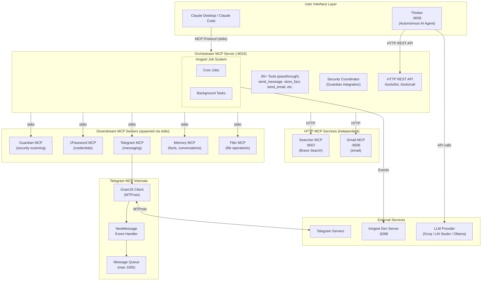
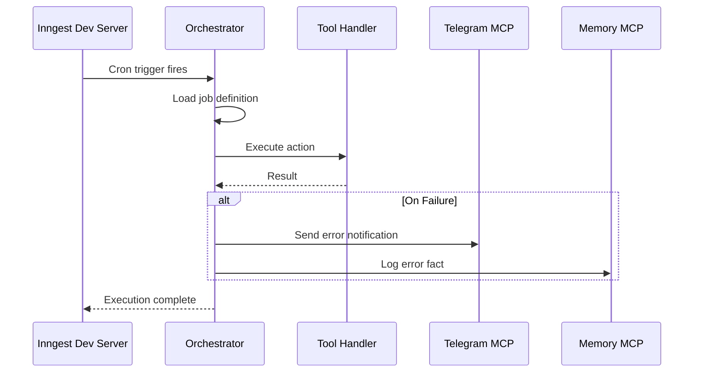
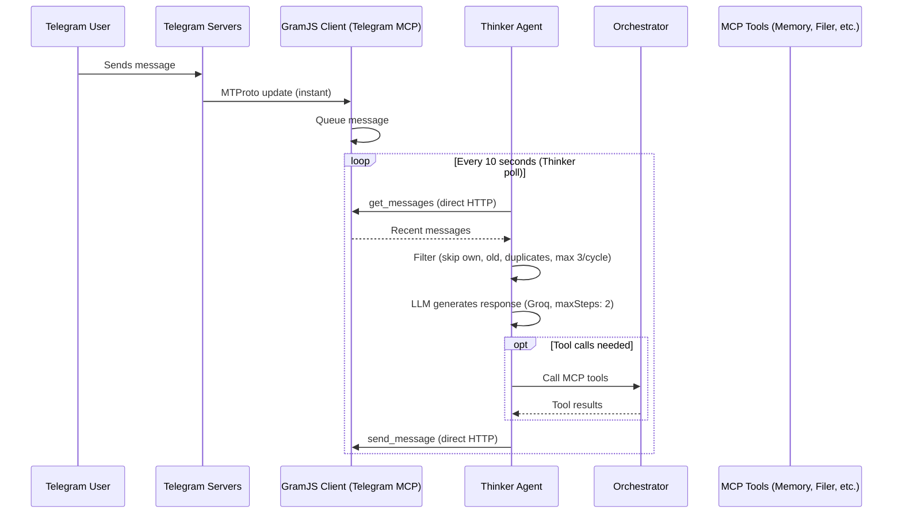

# Annabelle - System Architecture Overview

## What is Annabelle?

Annabelle is a personal AI assistant built on MCP (Model Context Protocol) architecture with defense-in-depth security. It coordinates between AI models, specialized MCP servers, and external data sources to provide intelligent, secure, and personalized assistance.

**Design Principles:**

- Security at every layer (no direct AI access to credentials or external systems)
- Modular MCP architecture (each capability is a separate, replaceable service)
- Learning assistant (remembers preferences, builds understanding over time)
- Single-user focus (personal assistant, not multi-tenant platform)

---

Paste this to claude if you want to launch annabelle from there. it autostarts whenever claude is launched.
to ad mcps cmd shift g and then ~/Library/Application Support/Claude/claude_desktop_config.json

    "annabelle": {
      "command": "node",
      "args": [
        "/Users/tomasz/Coding/AI Assistants/MCPs/Orchestrator/dist/Orchestrator/src/index.js"
      ],
      "env": {
        "TRANSPORT": "stdio",
        "TELEGRAM_MCP_URL": "http://localhost:8002",
        "GUARDIAN_MCP_URL": "http://localhost:8003",
        "ONEPASSWORD_MCP_URL": "http://localhost:8001",
        "FILER_MCP_URL": "http://localhost:8004",
        "MEMORY_MCP_URL": "http://localhost:8005",
        "SECURITY_FAIL_MODE": "open",
        "SCAN_ALL_INPUTS": "false",
        "LOG_LEVEL": "info"
      }
    }

## Architecture Layers

### Phase 1: MCP-First Architecture (Current)

The current architecture uses **Orchestrator as a protocol bridge**:

- **Claude Desktop/Code** connects via MCP stdio protocol
- **Thinker** (autonomous AI agent) connects via HTTP REST API
- **Downstream MCPs** are spawned by Orchestrator via stdio (no separate HTTP ports)



**ASCII Fallback:**

```
┌─────────────────────────────────────────────────────────────────┐
│                      USER INTERFACE LAYER                        │
│                                                                  │
│  ┌─────────────────────────┐    ┌─────────────────────────┐     │
│  │  Claude Desktop/Code    │    │       THINKER           │     │
│  │                         │    │      (:8006)            │     │
│  │  (MCP client)           │    │  (Autonomous AI Agent)  │     │
│  └───────────┬─────────────┘    └───────────┬─────────────┘     │
│              │ stdio                        │ HTTP               │
└──────────────┼──────────────────────────────┼───────────────────┘
               │                              │
               └──────────────┬───────────────┘
                              ↓
┌─────────────────────────────────────────────────────────────────┐
│                   ORCHESTRATOR MCP SERVER (:8010)                │
│                                                                  │
│  HTTP REST API: /health, /tools/list, /tools/call               │
│  MCP stdio: Standard MCP protocol for Claude Desktop            │
│                                                                  │
│  65+ Tools (passthrough): send_message, store_fact, create_file │
│                                                                  │
│  ┌──────────────────────────────────────────────────────────┐   │
│  │                    Inngest Job System                     │   │
│  │  ┌─────────────┐ ┌─────────────┐                         │   │
│  │  │  Cron Jobs  │ │ Background  │                         │   │
│  │  │             │ │   Tasks     │                         │   │
│  │  └─────────────┘ └─────────────┘                         │   │
│  └──────────────────────────────────────────────────────────┘   │
│                                                                  │
│  Security Coordinator (Guardian integration)                     │
└──────────────┬──────────────────────────────────┬───────────────┘
               │ stdio (spawns child processes)   │ HTTP
               ↓                                  ↓
┌──────────────────────────────────┐ ┌────────────────────────────┐
│  STDIO MCP SERVERS (spawned)     │ │  HTTP MCP SERVICES         │
│  ┌──────────┐ ┌──────────┐      │ │  ┌──────────┐              │
│  │ Guardian │ │ 1Password│      │ │  │ Searcher │              │
│  │   MCP    │ │   MCP    │      │ │  │ (:8007)  │              │
│  │ (stdio)  │ │ (stdio)  │      │ │  └──────────┘              │
│  └──────────┘ └──────────┘      │ │  ┌──────────┐              │
│  ┌──────────┐ ┌──────────┐      │ │  │  Gmail   │              │
│  │ Telegram │ │  Memory  │      │ │  │ (:8008)  │              │
│  │   MCP    │ │   MCP    │      │ │  └──────────┘              │
│  │ (stdio)  │ │ (stdio)  │      │ │                            │
│  └────┬─────┘ └──────────┘      │ └────────────────────────────┘
│  ┌──────────┐       │           │
│  │ File Ops │       │ GramJS    │
│  │   MCP    │       ↓           │
│  │ (stdio)  │ ┌──────────────┐  │
│  └──────────┘ │  Telegram    │  │
│               │  Servers     │  │
│               └──────────────┘  │
└──────────────────────────────────┘
```

### Phase 2: Custom UI (Future)

```
┌────────────────────────────────────────────────────────────────┐
│  Claude Desktop / LM Studio    OR       Custom Web UI           │
│       │                                    │                    │
│       │ MCP                                │ REST API           │
│       ↓                                    ↓                    │
│  ┌─────────────────────────────────────────────────────────┐   │
│  │              ORCHESTRATOR SERVICE                        │   │
│  │                                                          │   │
│  │   ┌────────────────────────────────────────────────┐    │   │
│  │   │              CORE LOGIC (shared)                │    │   │
│  │   └────────────────────────────────────────────────┘    │   │
│  │         ↑                           ↑                    │   │
│  │   ┌─────┴─────┐              ┌──────┴─────┐             │   │
│  │   │MCP Server │              │ REST API   │             │   │
│  │   └───────────┘              └────────────┘             │   │
│  │                                    │                     │   │
│  │                    ┌───────────────┴────────────────┐   │   │
│  │                    ↓                                ↓   │   │
│  │              Claude API                    LM Studio    │   │
│  │           (cloud, paid)              (local, free)      │   │
│  └─────────────────────────────────────────────────────────┘   │
│                              │                                  │
│                              ↓                                  │
│                    Downstream MCP Servers                       │
└────────────────────────────────────────────────────────────────┘
```

---

## AI Model Flexibility

The architecture supports **multiple AI backends** interchangeably:

### Phase 1: MCP Client Applications

| Application        | AI Model              | Connection | Notes                              |
| ------------------ | --------------------- | ---------- | ---------------------------------- |
| **Claude Desktop** | Claude (cloud)        | MCP stdio  | Best tool use, paid                |
| **Claude Code**    | Claude (cloud)        | MCP stdio  | Terminal-based                     |
| **Thinker**        | Groq/LM Studio/Ollama | HTTP REST  | Autonomous agent, configurable LLM |
| **LM Studio**      | Local models          | MCP stdio  | Free, private, variable quality    |

All can connect to the Orchestrator and use your tools.

### Thinker LLM Configuration

Thinker supports multiple LLM providers via environment variables:

```bash
# Provider selection
THINKER_LLM_PROVIDER=groq  # groq | lmstudio | ollama

# Groq (cloud, fast, default)
GROQ_API_KEY=gsk_...
GROQ_MODEL=llama-3.3-70b-versatile

# LM Studio (local)
LMSTUDIO_BASE_URL=http://localhost:1234/v1

# Ollama (local)
OLLAMA_BASE_URL=http://localhost:11434
OLLAMA_MODEL=llama3.2
```

### Phase 2: REST API - Model Selection

When you add custom UI, the orchestrator calls AI APIs directly:

```yaml
ai_models:
  # Cloud option (better quality, paid)
  claude:
    provider: anthropic
    model: claude-sonnet-4-20250514
    endpoint: https://api.anthropic.com/v1/messages
    api_key: ${ANTHROPIC_API_KEY}

  # Local option (free, private)
  lm_studio:
    provider: openai_compatible
    model: your-local-model
    endpoint: http://localhost:1234/v1/chat/completions
    api_key: not-needed

  # Configuration
  default: lm_studio # or: claude
  fallback: claude # if primary fails
```

### Model-Agnostic Design

The orchestrator's core logic works with ANY model:

- Tools are exposed via standard MCP protocol
- REST API uses OpenAI-compatible format (works with Claude, LM Studio, Ollama, etc.)
- No model-specific code in core logic

---

## Component Overview

### Orchestrator (MCP Server)

**Specification:** `Orchestrator/ORCHESTRATION_LAYER_SPEC.md`

The orchestrator is itself an **MCP server** that Claude Desktop/Code connects to. It exposes high-level tools and internally coordinates all other MCP servers.

**Phase 1 (MCP Server):**

- Claude Desktop/Code is the UI
- Claude is the AI brain
- Orchestrator provides tools to Claude
- Tools internally coordinate security, memory, and other MCPs

**Phase 2 (REST API - Future):**

- Add custom web UI alongside Claude Desktop
- REST API calls Claude API directly
- Same core logic, new interface

**Key Responsibilities:**

- Expose passthrough tools to Claude (original MCP tool names like send_message, store_fact, create_file)
- Auto-discover tools from downstream MCPs via ToolRouter
- Security enforcement via Guardian MCP
- Memory coordination via Memory MCP
- Tool execution via downstream MCPs
- Session management

### Memory MCP

**Specification:** `Memory/MEMORY_MCP_SPEC.md`

Persistent learning and personalization. Stores facts learned from conversations, maintains user profile, enables memory transparency (user can see and edit what AI knows).

**Key Responsibilities:**

- Fact storage and retrieval
- Conversation logging
- User profile management (per agent)
- Memory transparency (export to viewable files)
- Automatic fact extraction from conversations
- Periodic synthesis of learnings

**Phase 1 Scope:** Simple key-value and text storage. No vector database or semantic search initially.

### File Ops MCP

**Specification:** `FileOps/FILE_OPS_MCP_SPEC.md`

File system operations and workspace management. Creates files AI generates, manages access grants to user's existing files, handles workspace organization.

**Key Responsibilities:**

- Create/read/update/delete files in AI workspace
- Access control via grants (user approves folder access)
- Workspace organization
- Temporary file cleanup
- Audit logging of all file operations

### Security MCP (Guardian)

**Status:** ✅ Implemented

Prompt injection detection, jailbreak prevention, PII leakage scanning using Granite Guardian model.

### 1Password MCP

**Status:** ✅ Implemented

Secure credential retrieval. AI never sees raw credentials - only gets tokens/results.

### Telegram MCP

**Status:** ✅ Implemented

Send notifications and receive commands via Telegram. Uses **GramJS** (MTProto protocol) for user account access (not bot API).

**Key Features:**

- Full user account access (read any message, not just bot mentions)
- Real-time message capture via event handlers
- In-memory message queue (up to 1000 messages)
- Chat subscription filtering

### Searcher MCP

**Status:** ✅ Implemented

Web search via Brave Search API. Runs as an independent HTTP service on port 8007.

**Key Features:**

- `web_search` - General web search
- `news_search` - News-specific search
- HTTP transport (not spawned by Orchestrator)

### Gmail MCP

**Status:** ✅ Implemented

Email management via Gmail API with OAuth2 authentication. Runs as an independent HTTP service on port 8008.

**Key Features:**

- 18 tools covering messages, drafts, labels, and attachments
- OAuth2 authentication (credentials stored at `~/.annabelle/gmail/`)
- Optional background email polling with configurable interval
- Optional Telegram notifications for new emails
- HTTP transport (not spawned by Orchestrator)

### Thinker (Autonomous AI Agent)

**Status:** ✅ Implemented
**Specification:** `Thinker/ARCHITECTURE.md`

Standalone AI reasoning engine that processes Telegram messages autonomously using LLM providers (Groq, LM Studio, Ollama).

**Key Features:**

- **Dual connection** - Direct HTTP to Telegram MCP (:8002) for messaging, Orchestrator (:8010) for all other tools
- **LLM abstraction** - Supports Groq (cloud), LM Studio (local), Ollama (local)
- **ReAct agent loop** - Multi-step reasoning with tool use via Vercel AI SDK (`maxSteps: 2`)
- **Chat auto-discovery** - Calls `list_chats` to find private chats, always excludes bot's own Saved Messages
- **Context management** - Loads persona and facts from Memory MCP
- **Cost safeguards** - Timestamp filter (last 2 min only), per-cycle cap (3 messages), hardened circuit breaker, rate limiting

**Architecture:**

```
Thinker (:8006) ──HTTP──→ Telegram MCP (:8002)    [direct: polling + sending]
     │
     ├──HTTP──→ Orchestrator (:8010) ──stdio──→ Memory, Filer, Guardian, etc.
     │
     └──→ LLM Provider (Groq/LM Studio/Ollama)
```

**Port:** 8006

### Inngest Job System

**Status:** ✅ Implemented (in Orchestrator)

Job management for scheduled and background tasks.

**Capabilities:**

- Recurring cron jobs with validated cron expressions (e.g., `0 9 * * *` = daily at 9am)
- IANA timezone support (e.g., `Europe/Warsaw`, `America/New_York`)
- One-time scheduled jobs at a specific future timestamp
- Background task queuing for immediate async execution
- Multi-step workflows with step dependencies
- Automatic retries (3x with exponential backoff)
- Real-time dashboard at `:8288`

**How cron execution works:**

A `cronJobPollerFunction` runs every minute via Inngest. It loads all enabled cron jobs, evaluates each expression against the current time (respecting timezones) using the [croner](https://github.com/nicknisi/croner) library, and executes those that are due. The `lastRunAt` timestamp prevents double execution.

**Documentation:** `Orchestrator/JOBS_README.md`

---

## Data Flow Patterns

### Pattern 1: User Request Flow

```
User sends message
       ↓
Orchestrator receives request
       ↓
Security MCP scans input ──→ [BLOCK if malicious]
       ↓
Memory MCP retrieves relevant context
       ↓
Orchestrator constructs enhanced prompt
       ↓
AI Model generates response (may include tool calls)
       ↓
[If tool calls] Execute via MCP servers
       ↓
[If sensitive tool] Security MCP scans output ──→ [BLOCK if PII leak]
       ↓
Memory MCP stores conversation + extracts facts
       ↓
Response returned to user
```

### Pattern 2: Scheduled Task Flow (Inngest)



**ASCII Fallback:**

```
Cron trigger fires (Inngest)
       ↓
Orchestrator loads job definition
       ↓
Execute tool calls via handler
       ↓
[If failure] Telegram notification + Memory logging
       ↓
Execution complete
```

### Pattern 3: Real-Time Telegram Message Flow (via Thinker)



**ASCII Fallback:**

```
Telegram User sends message
       ↓
Telegram Servers (MTProto)
       ↓ (instant)
GramJS NewMessage Event Handler (Telegram MCP :8002)
       ↓
Thinker polls get_messages (direct HTTP, every 10s)
       ↓
Filter: skip bot's own messages, old messages (>2min), duplicates, max 3/cycle
       ↓
LLM processes message (Groq, maxSteps: 2)
       ↓ (if tools needed)
Orchestrator routes tool calls to downstream MCPs
       ↓
Thinker sends response via send_message (direct HTTP to Telegram MCP)
```

**Chat Discovery:** Thinker auto-discovers private chats via `list_chats`, excluding bot's own Saved Messages. Subscriptions refresh every 5 minutes.

**Note:** Inngest also polls Telegram (every 60s) to store messages in Memory MCP for history, but Thinker handles all real-time responses.

### Pattern 4: Webhook Event Flow (Future)

```
External event arrives (Gmail, Calendar, GitHub)
       ↓
Validate webhook signature
       ↓
Security MCP scans payload content
       ↓
Determine if significant
       ↓
[If significant] Construct prompt for AI analysis
       ↓
Execute AI recommendations
       ↓
Acknowledge webhook
```

---

## Agent Architecture

### Phase 1: Single Agent (MVP)

One general-purpose agent called **"main"** handles all requests.

```
Agent: main
├── Model: Claude Sonnet 4
├── MCP Access: All servers
├── Memory Scope: Global
└── Capabilities: All tasks (code, research, communication, general)
```

**Why single agent first:**

- Simpler to build and debug
- Proves orchestration works correctly
- Easier to understand behavior
- Foundation for multi-agent future

### Future: Multi-Agent Architecture

The system is **designed** for multiple specialized agents, but this is deferred.

```
Planned Agents:
├── main      → General coordinator, handles routing
├── coder     → Technical specialist, code generation
├── researcher → Deep analysis, information synthesis
├── secretary → Communications, scheduling, contacts
└── guardian  → Security monitoring (always-on observer)

Agent Selection:
├── Explicit: User says "@coder help me with Python"
├── Automatic: System classifies intent and routes
└── Delegation: Main agent consults specialists
```

**Architecture Readiness:**

- Memory MCP supports per-agent memory scopes
- Orchestrator config supports multiple agent definitions
- Shared user profile across agents
- Agent isolation with selective sharing

---

## Security Model

### Defense in Depth

```
Layer 1: Input Validation
         └── Malformed request rejection, rate limiting

Layer 2: Security MCP Scanning
         └── Prompt injection, jailbreak, social engineering detection

Layer 3: Tool Authorization
         └── Agent can only use permitted MCPs

Layer 4: Output Scanning (Selective)
         └── PII/credential leak prevention on sensitive operations

Layer 5: MCP Isolation
         └── Each MCP has minimal permissions, no direct internet access

Layer 6: Credential Separation
         └── Secrets in 1Password, never in prompts or logs
```

### What Gets Scanned

| Operation           | Input Scan         | Output Scan         |
| ------------------- | ------------------ | ------------------- |
| User message        | ✅ Always          | -                   |
| AI response         | -                  | ❌ Usually not      |
| 1Password tool call | -                  | ✅ Always           |
| Telegram send       | -                  | ✅ Always           |
| Email send          | -                  | ✅ Always           |
| File read           | ✅ Content scanned | -                   |
| File write          | -                  | ✅ If external path |

---

## Storage Strategy

### System Files (Hidden)

```
~/.annabelle/
├── config/
│   ├── orchestrator.yaml
│   ├── agents.yaml
│   └── mcp-servers.yaml
├── data/
│   ├── memory.db          ← SQLite database
│   └── grants.db          ← File access permissions
├── logs/
│   ├── orchestrator.log
│   ├── security.log
│   └── audit.log
└── memory-export/         ← Memory transparency files
    ├── profile.json
    ├── facts/
    └── conversations/
```

### User Workspace (Visible)

```
~/Documents/AI-Workspace/   ← User chooses location
├── Documents/
│   ├── reports/
│   └── notes/
├── Code/
│   ├── python/
│   └── scripts/
├── Research/
└── temp/                   ← Auto-cleaned after 7 days
```

### User's Existing Files (Granted Access)

```
~/Documents/Work/           ← User grants access
├── Projects/               ← AI can read/write (if granted)
└── Reports/                ← AI can read-only (if granted)
```

---

## Implementation Phases

### Phase 1: Foundation ✅ Complete

**Goal:** Working MCP-based system with Claude Desktop and autonomous AI agent

**Components:**

- ✅ Security MCP (Guardian) - Prompt injection detection
- ✅ 1Password MCP - Secure credential retrieval
- ✅ Telegram MCP - Messaging with real-time event handling
- ✅ Memory MCP - Fact storage, conversations, profiles
- ✅ Filer MCP - File operations with grants
- ✅ Orchestrator MCP - Central coordination with 65+ tools (protocol bridge)
- ✅ Searcher MCP - Web search via Brave Search (HTTP :8007)
- ✅ Gmail MCP - Email management with OAuth2 (HTTP :8008)
- ✅ Thinker - Autonomous AI agent with configurable LLM
- ✅ Inngest Job System - Cron jobs, background tasks, workflows

**How it works:**

- Orchestrator acts as a **protocol bridge**:
  - Accepts MCP stdio from Claude Desktop/Code
  - Accepts HTTP REST from Thinker
  - Spawns downstream MCPs via stdio (Guardian, Telegram, 1Password, Memory, Filer)
  - Connects to independent HTTP MCP services (Searcher :8007, Gmail :8008)
- Thinker processes Telegram messages autonomously using Groq/LM Studio/Ollama
- Inngest handles scheduled and background tasks

**Key Files:**

- `launch-all.sh` - Launches Orchestrator (spawns MCPs) + Thinker + Inngest
- `Orchestrator/JOBS_README.md` - Job system documentation
- `Thinker/ARCHITECTURE.md` - Thinker design and configuration
- `Telegram/src/telegram/events.ts` - Real-time event handling

### Phase 2: Custom UI (Future)

**Goal:** Add custom web interface alongside Claude Desktop

**Add:**

- REST API interface to orchestrator
- Custom web chat UI
- Orchestrator calls Claude API directly
- Full prompt control

**Still works:**

- Claude Desktop via MCP (backward compatible)
- All existing functionality

### Phase 3: Enhanced Memory

**Goal:** Smarter memory and more MCPs

**Add:**

- Vector embeddings for semantic search
- Weekly memory synthesis
- More MCP servers (GSuite, GitHub, Calendar)
- Webhook processing

### Phase 4: Advanced Features

**Goal:** Power user capabilities

**Add:**

- Multi-agent support (coder, researcher, secretary)
- Obsidian workspace integration
- ✅ Workflow engine (Inngest) - Complete
- ✅ Scheduled tasks (Inngest cron) - Complete
- ✅ Real-time Telegram messages - Complete

---

## Cross-Reference Index

| Topic                | Primary Document     | Related Sections                 |
| -------------------- | -------------------- | -------------------------------- |
| Request routing      | Orchestrator/SPEC.md | Section: Request Intake          |
| Security scanning    | Orchestrator/SPEC.md | Section: Security Integration    |
| MCP coordination     | Orchestrator/SPEC.md | Section: MCP Server Coordination |
| Task scheduling      | Orchestrator/SPEC.md | Section: Task Scheduling         |
| Webhooks             | Orchestrator/SPEC.md | Section: Webhook Handling        |
| Memory storage       | Memory/SPEC.md       | Section: Storage Architecture    |
| Fact extraction      | Memory/SPEC.md       | Section: Automatic Learning      |
| User profile         | Memory/SPEC.md       | Section: Profile Management      |
| Memory transparency  | Memory/SPEC.md       | Section: Memory Export           |
| File operations      | FileOps/SPEC.md      | Section: Core Operations         |
| Workspace management | FileOps/SPEC.md      | Section: Workspace               |
| Access grants        | FileOps/SPEC.md      | Section: Grants System           |

---

## Naming Conventions

### MCP Servers

- Format: `{capability}-mcp`
- Examples: `security-mcp`, `memory-mcp`, `telegram-mcp`
- **Ports (new architecture):**
  - Orchestrator HTTP: 8010
  - Thinker: 8006
  - Searcher HTTP: 8007
  - Gmail HTTP: 8008
  - Inngest Dev Server: 8288
  - Downstream MCPs: spawned via stdio (no ports)
- **Legacy ports (individual HTTP mode):**
  - 8000-8005 range (backwards compatibility)

### Agents

- Format: lowercase single word
- Examples: `main`, `coder`, `researcher`
- Reserved: `guardian` (security observer)

### Configuration Files

- Format: `{component}.yaml` or `{component}-config.yaml`
- Environment variables: `ANNABELLE_{COMPONENT}_{SETTING}`

### Database Tables

- Format: `snake_case`
- Examples: `facts`, `conversations`, `user_profiles`, `file_grants`

---

## Key Design Decisions

| Decision              | Choice             | Rationale                                                   |
| --------------------- | ------------------ | ----------------------------------------------------------- |
| MCP vs monolith       | MCP architecture   | Modularity, replaceability, security isolation              |
| Single vs multi-user  | Single user        | Simpler, personal assistant focus                           |
| AI model              | **Model-agnostic** | Works with Claude, LM Studio, Ollama, any OpenAI-compatible |
| Default AI            | User choice        | Claude (quality) OR LM Studio (privacy/free)                |
| Vector DB initially   | No                 | Simplicity first, add later if needed                       |
| Memory transparency   | Yes                | User control over what AI knows                             |
| Obsidian integration  | Deferred           | Nice-to-have, not core                                      |
| Multi-agent initially | No                 | Single agent MVP, architecture ready                        |

---

## Next Steps

1. **Read** `Orchestrator/ORCHESTRATION_LAYER_SPEC.md` for orchestrator implementation
2. **Read** `Memory/MEMORY_MCP_SPEC.md` for memory system implementation
3. **Read** `FileOps/FILE_OPS_MCP_SPEC.md` for file operations implementation
4. **Implement** orchestrator first (coordinates everything else)
5. **Implement** Memory MCP (enables personalization)
6. **Implement** File Ops MCP (enables file creation)
