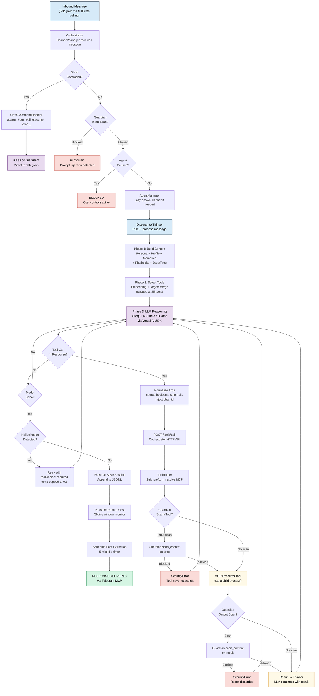
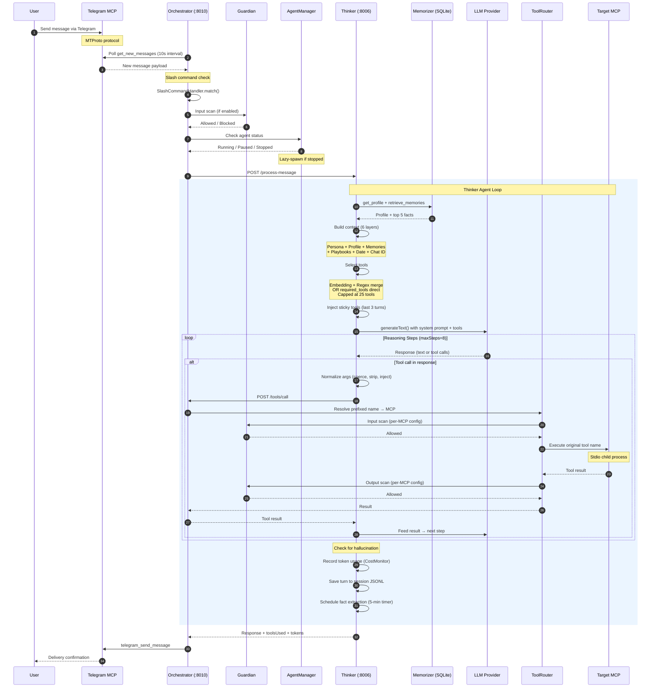

# Annabelle Architecture: How the MCP-Based Agent System Works

*Prepared for Tomasz Cwik — February 2026*

---

## Decision-Making Flowchart: How Annabelle Processes a Request

The flowchart below shows every decision point from the moment a Telegram message arrives to the final response delivery. Light-red nodes are rejection paths (slash commands intercepted, Guardian blocks, agent paused). Light-purple is the Thinker's LLM reasoning loop where the model generates responses and calls tools. Light-yellow is the tool execution cycle where calls flow through the Orchestrator to MCPs. Green is the successful delivery endpoint.

The flow has three distinct layers. The **top layer** is the Orchestrator's routing logic: Telegram polling, slash command interception, Guardian scanning, and agent dispatch. The **middle layer** is the Thinker's agent runtime: context building, tool selection, LLM reasoning, and hallucination detection. The **bottom layer** is the tool execution pipeline: ToolRouter resolution, Guardian input/output scanning, MCP execution, and result normalization.

Notice that tool calls leave the Thinker entirely — they go back through the Orchestrator's HTTP API, get routed to the correct MCP child process, and return. This separation means the Thinker never talks to MCPs directly, and every tool call can be scanned by Guardian.



---

## Waterfall Sequence Diagram: Request Flow Through Components Over Time

The sequence diagram shows the temporal flow of a request across ten system components. Reading left to right: User, Telegram MCP, Orchestrator, Guardian, AgentManager, Thinker, Memorizer, LLM Provider, ToolRouter, and target MCP.

The blue-shaded rectangle in the middle is the **Thinker Agent Loop** — the core of Annabelle. This is where context building, tool selection, LLM reasoning, and session persistence happen. Annabelle uses a **stop-call-resume** pattern: the LLM generates a response, the Vercel AI SDK intercepts tool calls, the Thinker sends them to the Orchestrator, waits for results, and feeds them back for the next reasoning step.

The **Guardian scanning** steps are unique to Annabelle — they appear as checkpoints before and after MCP tool execution, creating a security envelope around every tool call. This is the architectural feature that distinguishes Annabelle's safety model.

The numbered arrows show the exact order of operations. Follow them to trace a complete request lifecycle from "Send message" to "Delivery confirmation."



---

## What Annabelle Is

Annabelle is a self-hosted, security-first personal AI assistant built as a TypeScript monorepo of independent MCP (Model Context Protocol) packages. It connects to users through Telegram as its primary channel, manages 11 MCPs (10 built-in + external MCP support), exposes 148+ tools, and runs 7 proactive scheduled skills. The whole stack runs on a single machine — no cloud infrastructure required beyond LLM API keys.

At its core, Annabelle is a hub-and-spoke system built on the MCP protocol: one central **Orchestrator** process spawns and manages all MCP servers as child processes, routes tool calls, and coordinates the **Thinker** — a separate LLM-powered reasoning agent that handles conversations, decides which tools to call, and maintains persistent memory. A dedicated **Guardian** MCP scans every tool input and output for prompt injection, creating a security layer that wraps the entire system.

The key architectural decisions: process isolation (every MCP is a separate process), security-by-default (Guardian wraps all MCPs), intelligent tool selection (embedding + keyword matching, capped at 25 tools), and two-tier skill execution (zero-LLM direct execution for simple tasks, full agent reasoning for complex ones).

---

## 1. The Hub Architecture

### The Orchestrator (Hub)

The Orchestrator is an Express HTTP server on port 8010, implemented across `Orchestrator/src/`. It's the single control plane for the entire system:

```
                              ┌────────────────────┐
                              │   Orchestrator     │
                              │     (:8010)        │
                              │   HTTP API +       │
                              │   MCP Lifecycle    │
                              └────────┬───────────┘
         ┌──────────┬──────────┬───────┴───────┬──────────┬──────────┐
         │          │          │               │          │          │
      Guardian  1Password   Filer         Memorizer   CodeExec   Searcher
      (stdio)   (stdio)    (stdio)        (stdio)     (stdio)    (stdio)
         │          │          │               │          │          │
      Gmail    Telegram    Browser         External MCPs
      (stdio)   (stdio)    (stdio)        (hot-reload)
```

The Orchestrator handles: MCP lifecycle management (spawn, health check, auto-restart), tool routing via the ToolRouter (prefixed names → correct MCP), agent management (lazy-spawn, idle-kill, subagent coordination), channel polling (Telegram message ingestion), slash command processing, Guardian security integration, Inngest function registration, and startup notification via Telegram.

Every MCP is a **child process** communicating via stdin/stdout using the MCP JSON-RPC protocol. The Orchestrator is the only process that talks to all MCPs. The Thinker never talks to MCPs directly — all tool calls go through the Orchestrator's HTTP API (`POST /tools/call`).

### MCP Clients (Spokes)

Each MCP is spawned as a stdio child process. The Orchestrator wraps each one in a `StdioMCPClient` that manages the process lifecycle:

| MCP | Purpose | Transport | Sensitive |
|---|---|---|---|
| Guardian | Prompt injection scanning | Stdio | No |
| 1Password | Read-only vault access via `op` CLI | Stdio | Yes |
| Filer | File operations with workspace isolation | Stdio | Yes |
| Memorizer | Persistent memory (facts, skills, profiles) | Stdio | No |
| CodeExec | Sandboxed code execution (Python/Node/Bash) | Stdio | Yes |
| Searcher | Web/news/image search via Brave API | Stdio | No |
| Gmail | Email + Google Calendar via OAuth | Stdio | Yes |
| Telegram | Messaging via MTProto protocol | Stdio | Yes |
| Browser | Headless Chromium via Playwright | Stdio | Yes |

External MCPs (PostHog, Vercel, Neon, GitHub, etc.) are declared in `external-mcps.json` and hot-reloaded at runtime via `ExternalMCPWatcher` — no restart required.

### HTTP API

| Endpoint | Auth | Purpose |
|----------|------|---------|
| `GET /health` | None | Basic health check |
| `GET /status` | Token | Full system status (MCPs, agents, tools) |
| `POST /message` | Token | Send message to agent |
| `GET /tools/list` | Token | List all available tools |
| `POST /tools/call` | Token | Execute a tool via ToolRouter |
| `GET /agents` | Token | List agents with status |
| `POST /agents/:id/resume` | Token | Resume cost-paused agent |

Auth via `X-Annabelle-Token` header (generated by `start-all.sh`, stored at `~/.annabelle/annabelle.token`).

---

## 2. The Thinker Agent Runtime

This is the brain of the system. Implemented as a separate Node.js process on port 8006, the Thinker handles all LLM reasoning, context management, and conversation flow.

### Context Building (6 Layers)

Every time the Thinker processes a message, it assembles a fresh context. The composition, in order:

| Layer | Source | Token Impact |
|---|---|---|
| Tool preamble | `TOOL_PREAMBLE` constant enforcing structured tool calling | ~100 tokens |
| Base persona | `~/.annabelle/agents/{agentId}/instructions.md` | ~400-600 tokens |
| User profile | Memorizer `get_profile` — structured knowledge about the user | ~100-300 tokens |
| Date/time + chat ID | Current time in user's timezone, target chat identifier | ~20 tokens |
| Matched playbooks | Keyword-matched behavioral instructions (placed near end for recency) | ~200-500 tokens |
| Relevant memories | Top 5 facts from `retrieve_memories` (very end — strong attention) | ~100-250 tokens |

After the system prompt, conversation history is selected using **semantic relevance filtering**:
1. Load last 30 messages from session JSONL
2. Always include last 3 exchanges (6 messages) for recency
3. Score older messages by embedding cosine similarity to current message
4. Include older exchanges above threshold (default 0.45)
5. Cap total at 20 messages, maintain chronological order
6. Repair broken message chains (orphan tool results, missing results)
7. Truncate old tool results to one-line summaries (preserve last 2 verbatim)

### Tool Selection (Three-Path Architecture)

The Thinker doesn't send all 148+ tools to the LLM. Instead, it selects a relevant subset through one of three paths:

```
                    ┌─────────────────────────┐
                    │   Message arrives        │
                    └────────────┬────────────┘
                                 │
                    ┌────────────▼────────────┐
                    │  Is this a skill with   │
                    │  required_tools?         │
                    └────────┬───────┬────────┘
                        Yes  │       │  No
                             ▼       ▼
              ┌──────────────┐   ┌──────────────────┐
              │ Direct       │   │ Is embedding      │
              │ resolution   │   │ selector ready?   │
              │ (3-5 tools)  │   └──────┬─────┬──────┘
              └──────────────┘      Yes │     │ No
                                       ▼     ▼
                            ┌──────────┐ ┌──────────┐
                            │ Embedding│ │ Regex    │
                            │ + Regex  │ │ only     │
                            │ merge    │ │(fallback)│
                            └──────────┘ └──────────┘
```

**Path 1 — Required Tools (skill shortcut):** Skills declare exact tool names. These are resolved directly from the tool map — bypassing both embedding and regex selection. A skill needing 3 tools gets exactly 3 tools (~600 tokens instead of ~14,000).

**Path 2 — Embedding + Regex merge:** Semantic similarity finds tools related to the user's message. Keyword routes activate tool groups (e.g., "email" → Gmail tools, "search" → Searcher tools). Results are unioned and capped at 25 tools via tiered priority.

**Path 3 — Regex fallback:** When embedding provider is unavailable, keyword routes alone select tools. Default groups `['search', 'memory']` activate when no keywords match.

After selection, **sticky tools** from the last 3 turns are injected (up to 8) — enabling follow-ups like "send it to John too" without re-matching tools.

### The LLM Loop

The Thinker uses the **Vercel AI SDK** (`generateText()`) for its reasoning loop:

1. Build system prompt + conversation history + selected tools
2. Call LLM (Groq, LM Studio, or Ollama)
3. LLM returns text, tool calls, or both
4. For each tool call: normalize args → POST to Orchestrator → get result
5. Feed results back to LLM for next step
6. Repeat until LLM signals done or maxSteps reached (default: 8)

This is a **stop-call-resume** pattern, not inline tool execution. Each tool call is a full HTTP round-trip through the Orchestrator. The benefit: every call passes through Guardian scanning and the ToolRouter's policy layer.

### Hallucination Guard

LLMs sometimes claim they performed an action ("I've sent the email") without actually calling any tools. The hallucination guard detects this:

1. After LLM responds, check: were any tools called? Does the response claim an action?
2. If action-claim with zero tool calls → **retry** with `toolChoice: 'required'`, temperature capped at 0.3
3. If retry succeeds with tool calls → use retry result
4. If retry still fails → replace with: "I wasn't able to complete this action. Please try again."

---

## 3. Memory Architecture: SQLite-Powered Hybrid Search

The entire memory system runs on a single SQLite database at `~/.annabelle/data/memory.db` via better-sqlite3. No external vector DB, no cloud service.

### Database Schema

| Table | Purpose | Key Columns |
|-------|---------|-------------|
| `facts` | Discrete learnings about users | fact, category, source, confidence, timestamps |
| `conversations` | Full interaction history | user_message, agent_response, tags |
| `profiles` | Structured user knowledge per agent | profile_data (JSON) |
| `profile_history` | Rollback capability | profile_data, changed_at, change_reason |
| `skills` | Autonomous behavior definitions | trigger_config, instructions, execution_plan, required_tools |
| `contacts` | People the user works with | name, email, company, role, type |
| `projects` | Things user works on | name, status, type, priority, participants |

### Hybrid Search: 3-Tier Fallback

**Tier 1 — Hybrid (Vector + FTS5):** When an embedding provider is configured:

- **Vector search:** Embed the query via Ollama (`nomic-embed-text`), find nearest neighbors in `vec_facts` (sqlite-vec extension). Distance converted to similarity: `1 / (1 + distance)`.
- **FTS5 search:** SQLite full-text search with Porter stemming and BM25 ranking. Query terms split, quoted, joined with OR.
- **Combine:** Both run in parallel. Results merged via weighted combination (configurable `vectorWeight` + `textWeight`), min-max normalized to [0, 1], sorted by final score.

**Tier 2 — FTS5 Only:** When embedding provider is unavailable. Same FTS5 query, results used directly.

**Tier 3 — LIKE Fallback:** When both return zero results. Substring matching — slowest but most forgiving.

### Automatic Fact Extraction

After a conversation goes idle for 5 minutes, the Thinker automatically extracts facts:

1. Take last 20 messages, fetch existing facts for deduplication
2. Call cheap model (Groq Llama 8B) with: "Extract CLEAR, EXPLICIT facts NOT in known list"
3. Max 5 facts per extraction, confidence-scored (0.9+ explicit, 0.7-0.9 strongly implied)
4. Store each fact with category: `preference`, `background`, `pattern`, `project`, `contact`, `decision`

### Deduplication

New facts are checked against existing ones:
- **Exact match:** Identical text in same agent → update timestamp, return existing ID
- **Fuzzy dedup:** Extract keywords, compute overlap with same-category facts. Overlap >= 0.6 → flag as similar (still stores, but warns)

### Sensitive Data Protection

`isFactSafe()` checks for patterns that look like passwords, tokens, or API keys before storing. Unsafe facts are rejected.

---

## 4. Session Management: JSONL Storage with Semantic Filtering

### Storage Format

Sessions are stored as append-only JSONL files at `~/.annabelle/sessions/{agentId}/{chatId}.jsonl`:

```json
{"type": "header", "chatId": "8304042211", "agentId": "annabelle", "createdAt": "2026-02-11T01:14:59.755Z", "version": 1}
{"type": "turn", "user": "What emails do I have?", "assistant": "You have 20 unread...", "toolsUsed": ["gmail_list_emails"], "tokens": {"prompt": 12955, "completion": 100}}
{"type": "compaction", "summary": "The user asked about emails...", "compactedTurns": 25}
```

### Compaction

When conversations get too long, older messages are summarized:

| Trigger | Threshold |
|---------|-----------|
| Minimum turns | 8 |
| Minimum characters | 20,000 (~5,000 tokens) |
| Cooldown between compactions | 2 minutes |

Process: Keep last 5 turns verbatim → Summarize older turns via Groq Llama 8B → Rewrite JSONL atomically (temp file → rename).

### History Repair

The repair function fixes three types of broken message chains:
1. **Leading orphan tool results** at start of history → Remove
2. **Missing tool results** (tool call but no result follows) → Insert synthetic error result
3. **Orphaned tool results** referencing nonexistent tool calls → Remove

### History Tool Result Truncation

Old tool results can be massive (20K+ chars for a single `web_fetch`). The truncation function:
- Keep last 2 tool result messages verbatim
- Replace older ones with: `[toolName: truncated, was N chars]`
- Potential savings: 5K-50K tokens per turn

---

## 5. Security: Guardian Integration

Guardian is the security layer — a transparent decorator inside the Orchestrator that wraps downstream MCP clients. It scans tool inputs and outputs for prompt injection, social engineering, and other threats using IBM Granite Guardian.

### The Decorator Pattern

```
Caller (Thinker)
  │
  │  callTool(name, args)
  ▼
GuardedMCPClient
  │
  ├── [1] INPUT SCAN (if scanInput: true)
  │     └── Guardian scan_content on JSON.stringify(args)
  │     └── Blocked? → SecurityError (tool never executes)
  │
  ├── [2] EXECUTE tool on downstream MCP
  │
  ├── [3] OUTPUT SCAN (if scanOutput: true)
  │     └── Guardian scan_content on JSON.stringify(result)
  │     └── Blocked? → SecurityError (result discarded)
  │
  ▼
Result returned (or SecurityError thrown)
```

### Per-MCP Configuration

| MCP | Input Scan | Output Scan | Rationale |
|-----|-----------|------------|-----------|
| Telegram | Off | Off | Outgoing = AI-composed; incoming = read-only echoes |
| 1Password | On | Off | Protect credential queries; vault data is trusted |
| Memory | On | Off | Protect stored facts; internally managed |
| Filer | On | On | File paths/content could carry payloads; disk files may contain injections |
| Searcher | Off | On | Search queries low-risk; web results are untrusted |
| Gmail | On | On | Email drafts could contain injections; inbound emails are primary injection vector |
| CodeExec | On | Off | Code args high-risk; output is consequence of scanned input |
| Unknown MCPs | On | On | Default: both directions scanned (untrusted) |

### Fail Modes

| Mode | Behavior | Use Case |
|------|----------|----------|
| `'closed'` (default) | All tool calls blocked if Guardian down | Security-first |
| `'open'` | All tool calls allowed without scanning | Availability-first |

### Threat Types

Guardian normalizes across providers: `prompt_injection`, `jailbreak`, `harmful_content`, `social_engineering`, `data_exfiltration`, `privilege_escalation`, `code_execution`, `malicious_content`, `scan_error`.

### Per-Agent Overrides

Different agents can have different scanning profiles:

```typescript
agentOverrides: {
  'code-review': { input: { codexec: true }, output: { codexec: true } },
  'casual-chat': { input: { memory: false } },
}
```

---

## 6. The Skill System: Two-Tier Scheduled Execution

All scheduled tasks in Annabelle are **skills** — stored in Memorizer SQLite, scheduled via Inngest (fires every 1 minute), executed via either direct tool calls or Thinker agent reasoning. There is no separate "cron job" concept.

### Execution Tiers

| | Direct Tier | Agent Tier |
|---|---|---|
| **LLM involved** | No — direct tool call | Yes — Thinker reasons through instructions |
| **Use for** | Static reminders, fixed notifications | Multi-step workflows, decision-making |
| **Cost** | Zero tokens per fire | LLM tokens per execution |
| **Latency** | ~5ms | ~2-5s |
| **Key field** | `execution_plan` (compiled steps) | `instructions` (natural language) |
| **Tool access** | Only tools in the plan | Strict sandbox: only `required_tools` |
| **Examples** | "Send 'Drink water!' at 9am" | "Check inbox, summarize urgent emails" |

### Skill Types

| Trigger | Config | Behavior |
|---------|--------|----------|
| Cron expression | `{ "schedule": "0 9 * * *" }` | Precise recurring |
| Interval | `{ "interval_minutes": 30 }` | Every-N-minutes |
| One-shot absolute | `{ "at": "2026-02-14T15:00:00" }` | Fires once, auto-disables |
| One-shot relative | `{ "in_minutes": 10 }` | Converted to absolute at creation time |
| Event-driven | Keywords in SKILL.md | Triggered by matching user messages |

### Default Skills (from seed)

| Skill | Schedule | Tier |
|-------|----------|------|
| Email Processor | Every 60 min | Agent |
| Morning Briefing | 6:00 AM | Agent |
| Evening Recap | 6:00 PM | Agent |
| Weekly Digest | Sunday 6:00 PM | Agent |
| Follow-up Tracker | 9:00 AM | Agent |
| Pre-meeting Prep | Every 15 min | Agent |
| Meeting Overload Warning | 8:00 PM | Agent |

### Graduated Backoff

After failures, retry delays increase progressively:

| Consecutive Failures | Backoff | Action |
|---------------------|---------|--------|
| 1 | 1 minute | Quick retry |
| 2 | 5 minutes | Moderate delay |
| 3 | 15 minutes | Longer delay |
| 4 | 60 minutes | Last chance |
| 5 | Auto-disable | Skill disabled + Telegram notification |

### Pre-flight Checks

Before executing a skill, the scheduler checks if the skill has any work to do:
- **Calendar skills:** No events in next 2-hour window → skip silently (zero LLM cost)
- **Email skills:** No new emails → skip silently

### Safety Net

If an `execution_plan` with more than 1 step is submitted, the system auto-converts it to Agent tier. Direct tier uses `executeWorkflow()` which has no result piping between steps — a multi-step plan would send literal `{{step1.result}}` instead of actual data.

### File-Based Skills (SKILL.md)

Skills can also be defined as `~/.annabelle/skills/*/SKILL.md` files following the agentskills.io specification. These are auto-synced to Memorizer on startup + every 5-minute refresh. You can **git-manage scheduled skills** — version control, deploy by copying files.

---

## 7. Cost Controls: Sliding-Window Anomaly Detection

The `CostMonitor` in the Thinker tracks token usage and detects runaway consumption.

### Sliding Window

60 buckets, one per minute, covering a 1-hour window. Each bucket tracks `promptTokens`, `completionTokens`, `callCount`.

```
Minute:  [t-59] [t-58] ... [t-shortWindow] ... [t-1] [t-0]
         ├────── baseline window ──────────┤├─ short ─────┤
```

### Two Thresholds

**Hard Cap (always active):**
```
totalTokensInWindow >= hardCapTokensPerHour  →  PAUSE
```

**Spike Detection (requires baseline):**
```
IF baselineTokens >= minimumBaselineTokens:
  shortRate = shortWindowTokens / shortWindowMinutes
  baselineRate = baselineTokens / activeBaselineBuckets
  IF shortRate > baselineRate × spikeMultiplier  →  PAUSE
```

**Active-bucket averaging:** Baseline rate uses only buckets with at least 1 LLM call. This prevents idle minutes from deflating the baseline and causing false spikes.

### Pause Behavior

1. **Thinker side:** `CostMonitor.paused = true`. Next message returns immediately with pause reason.
2. **Orchestrator side:** `AgentManager.isAgentPaused()` blocks messages before they reach Thinker.
3. **Telegram notification** sent to configured admin chat.
4. **Resume:** Manual via `POST /agents/{agentId}/resume` (optional `resetWindow: true`).

### Default Configuration

```json
{
  "shortWindowMinutes": 2,
  "spikeMultiplier": 3.0,
  "hardCapTokensPerHour": 250000,
  "minimumBaselineTokens": 1000
}
```

---

## 8. Auto-Discovery and External MCPs

### Package Manifest Discovery

At startup, the Orchestrator's scanner reads sibling directories for `package.json` files containing an `"annabelle"` field:

```json
{
  "annabelle": {
    "mcpName": "filer",
    "transport": "stdio",
    "sensitive": true
  }
}
```

Optional fields: `role: "guardian"` (always first), `role: "channel"` (polling bindings), `transport: "http"` + `httpPort`, `command` + `commandArgs` (for non-Node MCPs like Python).

Disable via environment: `${NAME}_MCP_ENABLED=false`.

### External MCPs (Hot-Reload)

Third-party MCP servers are declared in `external-mcps.json` at the project root:

```json
{
  "mcpServers": {
    "posthog": {
      "command": "npx",
      "args": ["-y", "@posthog/mcp-server"],
      "env": { "POSTHOG_API_KEY": "${POSTHOG_API_KEY}" }
    }
  }
}
```

Features:
- **Hot-reload:** File is watched with 500ms debounce. Changes take effect without restart.
- **Env var resolution:** `${VAR}` placeholders resolved from process environment.
- **Startup diff:** Current MCPs compared against `~/.annabelle/last-known-mcps.json`. Added/removed MCPs reported via Telegram notification.
- **Guardian protection:** External MCPs get default scanning (both input + output) as untrusted.

### Tool Refresh at Runtime

The Thinker has a 10-minute TTL cache for tools fetched from the Orchestrator. When MCPs are added or removed, changes propagate within 10 minutes without restart.

---

## 9. Monorepo Structure

Each subdirectory is an independent npm package. There is no root `package.json`:

```
MCPs/
├── Orchestrator/              # Central hub (:8010)
│   └── src/
│       ├── core/              # orchestrator.ts, agent-manager.ts
│       ├── routing/           # tool-router.ts
│       ├── channels/          # channel-manager.ts
│       ├── commands/          # slash-commands.ts
│       ├── jobs/              # skill-scheduler.ts, executor.ts
│       ├── mcp-clients/       # stdio-client.ts, guarded-client.ts
│       └── config/            # scanner.ts, guardian.ts, agents.ts
├── Thinker/                   # LLM agent (:8006)
│   └── src/
│       ├── agent/             # loop.ts, tool-selection.ts, fact-extractor.ts
│       ├── session/           # store.ts (JSONL)
│       ├── cost/              # monitor.ts
│       └── orchestrator/      # tools.ts (normalization)
├── Guardian/                  # Security MCP
├── Memorizer-MCP/             # Persistent memory (SQLite)
├── Gmail-MCP/                 # Email + Calendar
├── Telegram-MCP/              # Messaging (MTProto)
├── Filer-MCP/                 # File operations
├── 1Password-MCP/             # Vault access
├── CodeExec-MCP/              # Code execution
├── Searcher-MCP/              # Web search (Brave)
├── Browser-MCP/               # Headless Chromium
├── Shared/                    # @mcp/shared (types, registerTool, discovery)
├── _scripts/                  # Seed scripts
├── .documentation/            # System documentation (15 files)
├── _openclaw-benchmark/       # This benchmarking directory
├── agents.json                # Agent definitions + cost controls
├── external-mcps.json         # Third-party MCP declarations
├── start-all.sh               # Boot the full stack
├── rebuild.sh                 # Rebuild all packages
├── restart.sh                 # Kill + rebuild + start
└── test.sh                    # Health checks + tests
```

### Key Dependencies

| Category | Library | Role |
|---|---|---|
| LLM Integration | Vercel AI SDK (`ai`) | `generateText()`, tool calling, streaming |
| MCP Protocol | `@modelcontextprotocol/sdk` | MCP client/server, JSON-RPC, tool schemas |
| Schema | `zod` | Input validation for all MCP tools |
| Database | `better-sqlite3` + `sqlite-vec` + FTS5 | Memory, embeddings, full-text search |
| Embeddings | Ollama (`nomic-embed-text`), LM Studio | Tool selection, memory search |
| Telegram | `telegram` (MTProto) | User-facing messaging |
| Google | `googleapis` (OAuth) | Gmail + Calendar |
| Browser | `@playwright/mcp` + Chromium | Web automation |
| Search | Brave Search API | Web/news/image search |
| Build | `tsc` (per-package) | TypeScript compilation |
| Scheduling | Inngest (dev server) | Cron skills, background jobs |

Runtime requirement: **Node.js ≥ 20**.

---

## 10. Startup Sequence

Boot is driven by `start-all.sh`:

| Phase | What Happens | Duration |
|-------|-------------|----------|
| 1. Pre-flight | Auto-discovery scan, process cleanup, token generation | Instant |
| 2. Persona & Skills | Create agent directories, copy default persona, ensure skills dir | Instant |
| 3. Documentation Sync | Copy `.documentation/*.md` → `~/.annabelle/documentation/` | Instant |
| 4. Inngest | Start dev server on port 8288, wait 3s | 3-5s |
| 5. Orchestrator | Start on port 8010. Inside `initialize()`: Guardian first → all MCPs → tool discovery → health monitoring → external MCP watcher → agent registration → startup notification | 5-15s |
| 6. Post-startup | Cron skill seeding (background), Inngest registration. Thinker NOT started — lazy-spawns on first message. | Background |

Total: approximately 15-30 seconds.

---

## 11. Observability

### Diagnostics (`/diagnose`)

22 automated health checks across 7 categories:

| Category | Checks |
|----------|--------|
| Services (5) | MCP health, Agent health, Inngest, Cost status, Halt state |
| Embedding (3) | Ollama connectivity, Cache size, Memory DB size |
| Logs (3) | File sizes, Error rate baseline, Trace freshness |
| Cron (4) | Stale jobs, Failed skills, Failed tasks, Queue depth |
| Tools (2) | Tool count drift, Guardian availability |
| Data (3) | Directory size, Session count, Documentation freshness |
| Security (2) | Recent threat rate, Guardian scan quality |

### Logging

| Log | Location | Purpose |
|-----|----------|---------|
| Orchestrator | `~/.annabelle/logs/orchestrator.log` | MCP spawn, health checks, startup |
| Thinker | `~/.annabelle/logs/thinker.log` | LLM calls, tool selection, costs |
| Traces | `~/.annabelle/logs/traces.jsonl` | Request-level tracing |
| Guardian | `Guardian/logs/audit.jsonl` | Security scan audit trail |
| Filer | `~/.annabelle/logs/fileops-audit.log` | File operation audit |

### Slash Commands

| Command | Purpose |
|---------|---------|
| `/status` | System overview (MCPs, agents, tools) |
| `/status summary` | Detailed report with Guardian stats |
| `/logs [N]` | Recent log entries |
| `/security` | Guardian config + availability |
| `/security N` | Last N security threats |
| `/cron` | Scheduled skill status |
| `/kill` / `/resume` | Stop/restart services |
| `/diagnose` | Run 22 health checks |
| `/delete` | Clear session history |
| `/browser` | Browser automation status |

---

## Pros and Cons

### What's Good

**Security-first architecture.** Guardian is a dedicated, always-on security layer that wraps every MCP. Input/output scanning is configurable per-MCP with sensible defaults (untrusted MCPs get both directions scanned). Fail-closed by default — if the security layer goes down, nothing gets through. No other personal AI assistant has this level of built-in prompt injection defense.

**Intelligent tool selection.** The three-path architecture (required_tools / embedding+regex / regex fallback) keeps token costs low. Skills get 3-5 tools instead of 72+, saving ~13,000 tokens per execution. The 25-tool cap with tiered priority ensures the LLM always has relevant tools without context window bloat. Sticky tools enable natural follow-up conversations.

**Two-tier skill execution.** Simple reminders cost zero LLM tokens — direct tool calls at ~5ms. Complex workflows get full agent reasoning. The tier decision happens at creation time, not execution time. The safety net catches multi-step execution plans that need result piping. Graduated backoff prevents error storms.

**Hybrid memory search.** Vector + FTS5 + LIKE fallback on a single SQLite database. No external infrastructure. Automatic fact extraction, confidence scoring, deduplication, and sensitive data protection. The 3-tier fallback means search degrades gracefully if the embedding provider goes down.

**Cost controls with anomaly detection.** Not just a hard cap — active-bucket averaging prevents false positives during idle periods. Spike detection catches runaway usage relative to baseline patterns. Orchestrator-level blocking prevents any further token consumption once paused. Explicit resume required — no auto-recovery.

**Process isolation.** Every MCP is a separate child process. A crashed MCP doesn't take down the system — the Orchestrator auto-restarts it. The Thinker is a separate process too. This isolation means a buggy tool implementation can't corrupt the Orchestrator or other MCPs.

### What's Not Great

**Single messaging channel.** Telegram is the only user-facing channel. No WhatsApp, Discord, Slack, or Matrix adapters. For a personal assistant, one channel might be enough — but it limits reach if other platforms are needed.

**No voice capabilities.** Voice spec exists but isn't implemented. No STT, TTS, or live talk mode.

**Stop-call-resume latency.** Tool calls leave the Thinker, go through the Orchestrator's HTTP API, get routed to the MCP, scanned by Guardian (potentially twice), and return. This adds latency compared to inline tool execution. The tradeoff is security — every call gets scanned.

**No self-programming.** The LLM can't write and deploy its own tools at runtime. Annabelle's CodeExec runs sandboxed code, but it can't extend the system's permanent tool set.

**Ecosystem depends on external MCPs.** 148+ tools across 10 built-in MCPs. External MCP support allows third-party integrations, but there's no community marketplace or shared skill repository.

**Single-process Orchestrator.** The hub is a single point of failure. If the Orchestrator crashes, all MCPs and the Thinker become unreachable. Health monitoring and auto-restart mitigate this, but there's no clustering or failover.

---

## Bottom Line

Annabelle's architecture is that of a security-conscious, well-tested personal infrastructure project. The Guardian MCP — a dedicated prompt injection scanner wrapping every tool call — is the standout architectural decision. Nothing in the open-source personal AI space has this level of built-in safety. The three-path tool selection, two-tier skill execution, and anomaly-based cost controls show careful engineering focused on efficiency and safety rather than raw feature count.

The gaps are clear: single channel, no voice, no self-programming, no community ecosystem. But the core design — process isolation, security-by-default, intelligent token management — makes it a disciplined system for someone who wants a personal assistant handling real credentials, real email, and real money. The tradeoff is reach for depth: fewer features, but the ones that exist are secure, tested, and observable.

---

*Sources:*

- [Annabelle System Documentation](.documentation/) — 15 files covering architecture, MCPs, tools, skills, memory, sessions, startup, cost controls, logging, error patterns, prompt creation, external MCPs, and commands
- [Annabelle CLAUDE.md](CLAUDE.md) — Project-level architecture rules and conventions
- [Orchestrator README](Orchestrator/README.md) — Auto-discovery guide, cost controls, adding new MCPs
- [Guardian README](Guardian/README.md) — Provider selection, tool schemas, scan configuration
- [Memorizer-MCP source](Memorizer-MCP/src/) — SQLite schema, hybrid search, embedding pipeline
- [Thinker source](Thinker/src/) — Agent loop, tool selection, cost monitor, session management
