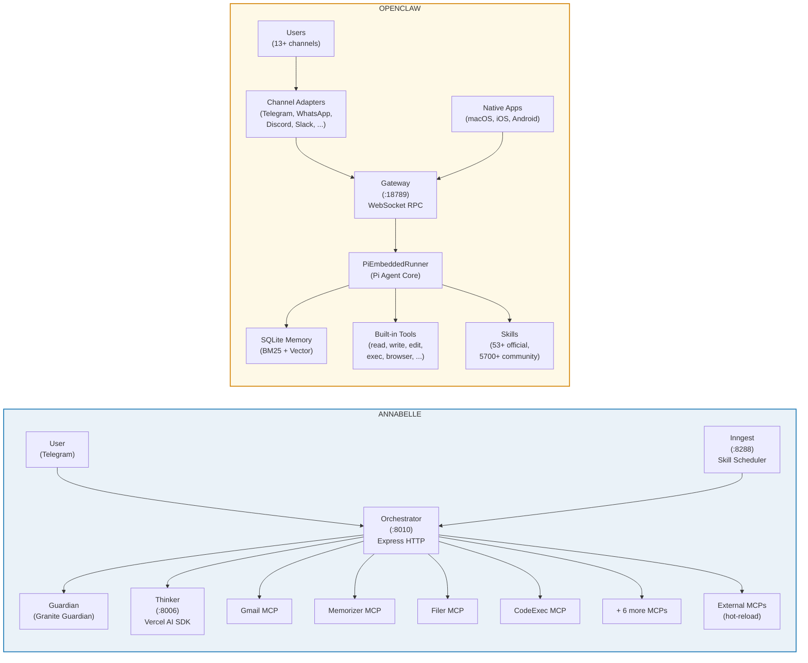
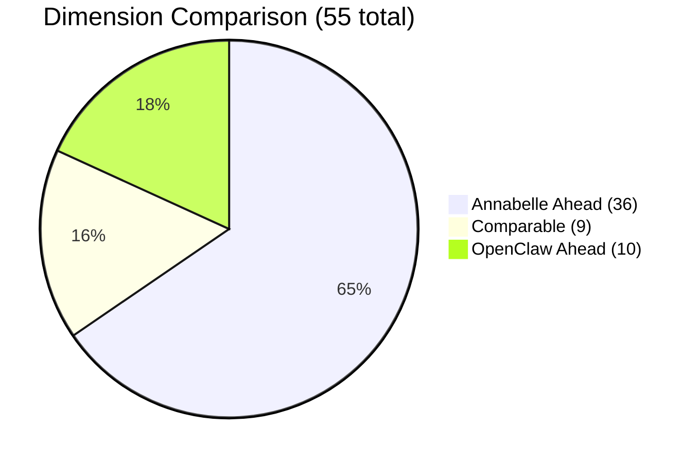

# Annabelle vs OpenClaw

## Technical Capability Comparison

**February 15, 2026 | Annabelle v1.0.0 vs OpenClaw v2026.2.14 | Excludes messaging integrations**

---

## What Is OpenClaw?

OpenClaw bills itself as "the AI that actually does things." It is an open-source personal AI assistant (176,000+ GitHub stars, 56 contributors on the latest release alone) that runs locally on the user's machine — Mac, Windows, or Linux — and connects through familiar chat interfaces: WhatsApp, Telegram, Discord, Slack, Signal, iMessage, and 7+ more. The core philosophy is accessibility and agency: rather than answering questions, OpenClaw clears inboxes, manages calendars, sends messages, automates file operations, and controls smart home devices. The LLM has full access to the local filesystem, shell, and browser.

OpenClaw emphasizes user ownership — "your context and skills live on YOUR computer, not a walled garden" — and an open, hackable ecosystem. The system can write and deploy its own tools at runtime (OpenClaw Foundry), and the community contributes 5,700+ skills in the ClawHub marketplace. 53+ official skills and 50+ integrations cover productivity, development, and third-party services. Native apps for macOS, iOS, and Android provide a polished multi-device experience. The v2026.2.14 release (February 15, 2026) is the project's largest security hardening to date, with 50+ security patches responding to the January 2026 supply chain incident (CVE-2026-25253).

## What Is Annabelle?

Annabelle is an MCP-based AI assistant platform designed to parallelise any workflow at scale and be extended in minutes, not days. The system runs as a constellation of independent processes — an Orchestrator hub, an agent runtime, and 10+ MCP servers as isolated child processes — communicating over the open Model Context Protocol standard. Any LLM provider can be plugged in (cloud or local), and any MCP-compatible server can be added with zero code changes via hot-reload.

The multi-process architecture means every capability runs in its own process with its own memory space. New MCPs — in any language — drop in as sibling directories and are auto-discovered at startup. External third-party MCPs load at runtime from a single config file, automatically wrapped by Guardian, Annabelle's dedicated security layer that pre-scans every tool input and post-scans every tool output for prompt injection. This plug-and-play extensibility, combined with true process-level parallelism across CPU cores, enables concurrent multi-agent workflows where each agent orchestrates its own set of tools independently.

---

## Architecture Comparison

### Structural Differences

| Aspect | Annabelle | OpenClaw |
|--------|-----------|----------|
| **Hub** | Orchestrator (HTTP API) | Gateway (WebSocket RPC) |
| **Agent** | Separate process (Thinker) | Embedded (PiEmbeddedRunner) |
| **Tools** | MCPs as child processes | Built-in functions |
| **Security** | Guardian wraps all MCPs | Tool policy layer |
| **Tool execution** | Stop-call-resume (HTTP round-trip) | Inline backfill (mid-stream) |
| **Discovery** | Package manifest auto-scan | Config-file based |
| **Channels** | Telegram only | 13+ platforms |
| **Memory** | SQLite (7 tables, 3-tier search) | SQLite (Markdown files, 2-tier search) |
| **Skills** | Inngest scheduler + 2-tier execution | Filesystem skills + lazy loading |
| **Native apps** | None | macOS, iOS, Android |

---

## Scorecard Summary

| | Count |
|---|---|
| **Annabelle Ahead** | 36 of 55 dimensions |
| **Comparable** | 9 of 55 dimensions |
| **OpenClaw Ahead** | 10 of 55 dimensions |

**Scope:** Core architecture, inference, execution, safety, memory, agents, web, voice, files, email, skills, observability, architectural extensibility & parallelism. **Excludes:** Messaging channel breadth (OpenClaw's 13+ channels vs Annabelle's Telegram-only) — this is a separate strategic dimension, not a capability comparison.

**Methodology:** Each of the 13 major categories contains 3-6 sub-dimensions, totaling 55 individual comparisons. Each sub-dimension is scored as **Annabelle**, **Comparable**, or **OpenClaw** based on current implementation status, not roadmap.

---

## 1. Core Architecture

| # | Dimension | Annabelle | OpenClaw | Edge |
|---|-----------|-----------|----------|------|
| 1 | **Runtime Model** | Orchestrator (Express HTTP :8010) spawns MCPs as stdio child processes. Thinker is separate Node.js process. Process isolation by design. | Single-process Gateway (WebSocket :18789) with embedded PiEmbeddedRunner. All in one process. | **Annabelle** — process isolation means a crashed MCP doesn't take down the system |
| 2 | **Process Architecture** | Multi-process: Orchestrator + Thinker + 10 MCP child processes + Inngest. Each MCP is an independent process with its own memory space. | Single-process: Gateway embeds agent runtime, channel adapters, tools. Simpler but single point of failure. | **Annabelle** — fault isolation, individual MCP restart without system downtime |
| 3 | **Transport Protocol** | MCP JSON-RPC over stdio (child processes). HTTP API between Orchestrator and Thinker. Auth token for HTTP endpoints. | WebSocket RPC with TypeBox schema validation. Same protocol for CLI, web, native apps. Swift type generation from schemas. | **Comparable** — different tradeoffs. MCP is a standard protocol; TypeBox is more tightly integrated |
| 4 | **Auto-Discovery** | Scans sibling directories for `package.json` with `"annabelle"` manifest. Dynamic config at startup. Env-based disable (`${NAME}_MCP_ENABLED=false`). | Configured via `agents.json` / `openclaw.json`. Skills discovered from filesystem directories. No manifest-based MCP discovery. | **Annabelle** — drop a folder, build, restart. Zero config for new MCPs |
| 5 | **Plugin / Extension Model** | External MCPs via `external-mcps.json`. Hot-reload (fs.watch, 500ms debounce). Env var resolution. Startup diff with Telegram notification. Guardian wraps all external MCPs. | Channel adapters in `extensions/`. Skills as filesystem directories. MCP integration limited (ACP disables MCP for HTTP/SSE). | **Annabelle** — hot-reload, no restart, automatic security wrapping, any MCP server with zero code |

---

## 2. LLM & Inference

| # | Dimension | Annabelle | OpenClaw | Edge |
|---|-----------|-----------|----------|------|
| 6 | **Model Support** | Groq (Llama, Mixtral), Ollama (local models), LM Studio (local). Three providers, all local-friendly. | Claude, GPT, Grok, DeepSeek, OpenRouter (auto-routes to cheapest), Ollama, node-llama-cpp (fully local). 7+ providers. | **OpenClaw** — broader provider support, OpenRouter dynamic routing |
| 7 | **Tool Selection** | Three-path: required_tools (3-5 tools, ~600 tokens) / embedding+regex merge / regex fallback. Hard cap at 25 tools. Tiered priority. Sticky tools for follow-ups. | All registered tools sent to LLM. No dynamic selection. 25+ built-in tools always available. Skills loaded lazily on-demand via `read_file`. | **Annabelle** — dramatic token savings (3-5 tools vs all), intelligent selection per message |
| 8 | **Cost Controls** | Built-in CostMonitor: sliding 60-bucket window, spike detection (active-bucket averaging), hard cap, auto-pause, Telegram alerts, manual resume. Per-agent configuration. 16 tests. | No native cost controls. Zero budgets, limits, or alerts. Third-party solutions (ClawWatcher, RelayPlane). KARMA framework proposed but not implemented. | **Annabelle** — production-grade cost monitoring vs none |
| 9 | **Context Management** | Semantic history filtering (cosine similarity), history tool result truncation (old → one-liner), session compaction (Groq Llama 8B summarization). ~4K-8K tokens per interactive turn. | Context file proliferation (7 files per turn: SOUL.md, AGENTS.md, TOOLS.md, IDENTITY.md, USER.md, MEMORY.md, HEARTBEAT.md). Context compaction via silent agentic turn. Unlimited context growth. | **Annabelle** — leaner context, semantic filtering drops irrelevant history, truncation saves 5K-50K tokens/turn |

---

## 3. Code Execution

| # | Dimension | Annabelle | OpenClaw | Edge |
|---|-----------|-----------|----------|------|
| 10 | **Execution Approach** | CodeExec MCP: sandboxed one-shot + persistent sessions. Python, Node.js, Bash. Script library (save, search, run). | Pi Coding Tools: `read`, `write`, `edit`, `exec`, `process`. Battle-tested with 176K+ users. Inline execution mid-stream. | **OpenClaw** — more mature, inline execution, broader usage base |
| 11 | **Sandboxing** | Environment variables stripped before code execution. No credentials leak to sandboxed code. Process-level isolation via MCP. | Docker containers (ephemeral, per-session). Configurable: all/non-main/disabled. Isolated filesystem, network, CPU/memory limits. v2026.2.14: separate browser-container bind mounts (`sandbox.browser.binds`), sandbox file tools are bind-mount aware with read-only enforcement. | **OpenClaw** — container-level isolation is stronger than process-level env stripping |
| 12 | **REPL / Sessions** | Persistent sessions: `start_session`, `send_to_session`, `close_session`. State maintained across calls. Session timeout and cleanup. | PTY emulation via `@lydell/node-pty`. Full terminal sessions. Process subprocess management. | **Comparable** — both support persistent sessions with different approaches |
| 13 | **Self-Programming** | Not supported. CodeExec runs sandboxed code but cannot extend the system's permanent tool set. | OpenClaw Foundry: LLM writes, tests, and deploys its own tools at runtime. Learns user workflows, creates new capabilities. | **OpenClaw** — fundamentally different capability. Annabelle can't extend itself |
| 14 | **Script Library** | `save_script`, `get_script`, `list_scripts`, `search_scripts`, `run_script`, `save_and_run_script`, `delete_script`. Named scripts with metadata. | Skills as code — write skills that execute tools. Bundled + workspace + managed skill directories. | **Comparable** — different abstraction (scripts vs skills), similar outcome |

---

## 4. Safety & Security

| # | Dimension | Annabelle | OpenClaw | Edge |
|---|-----------|-----------|----------|------|
| 15 | **Input Scanning** | Guardian MCP: dedicated, always-on. IBM Granite Guardian. Scans tool inputs before execution. Per-MCP toggle. Fail-closed by default. | No dedicated input scanning. 7-layer tool policy check (allow/deny). Code safety scanner (skills only). v2026.2.14: recalled memories treated as untrusted context (escaped + non-instruction framing), auto-capture skips likely prompt-injection payloads, SSRF guards hardened across all channels. | **Annabelle** — dedicated ML-based scanning vs infrastructure hardening without content-level analysis |
| 16 | **Output Scanning** | Guardian scans tool outputs before returning to caller. Per-MCP toggle. Web results, email content, file contents all scannable. | No output scanning. Tool results returned directly to LLM. | **Annabelle** — catches prompt injection in untrusted content (emails, web pages) |
| 17 | **Tool Policies** | Per-agent `allowedTools` / `deniedTools` (glob patterns). ToolRouter filters before sending to Thinker. Required_tools sandboxing for skills. | 7-layer precedence hierarchy. Complex but configurable. Per-agent tool allow/deny. | **Comparable** — both have per-agent tool policies, OpenClaw's is more granular |
| 18 | **Authentication & Network** | HTTP API with generated token (`X-Annabelle-Token`). All MCPs are local child processes — no network exposure. External MCPs get env var resolution. | WebSocket with pairing handshake. Bonjour/mDNS discovery. Tailscale/SSH tunneling for remote. Network-exposed by design (multi-device). v2026.2.14: hardened webhook auth (Telegram requires secret, Twilio/Telnyx require signature verification), SSRF guard fixes (IPv4-mapped IPv6 bypass blocked), Bonjour TXT no longer authoritative for routing, autoconnect requires previously trusted gateway. | **Annabelle** — smaller attack surface (local-only). OpenClaw hardened but still network-exposed by design |
| 19 | **Credential Isolation** | 1Password MCP is read-only by design. CodeExec strips environment variables. Filer has forbidden paths (~/.ssh, ~/.aws, ~/.config). | Sandbox mode isolates credentials. Docker containers get clean environment. But host mode exposes everything. v2026.2.14: PATH hardening (project-local `node_modules/.bin` disabled by default, node-host PATH overrides disallowed), shell injection prevention on macOS keychain, process cleanup scoped to owned PIDs. | **Annabelle** — defense-in-depth: read-only vault + env stripping + forbidden paths, always active regardless of mode |
| 20 | **Supply Chain Security** | External MCPs in `external-mcps.json` are auto-wrapped by Guardian. Startup diff detects changes. Hot-reload with security wrapping. | CVE-2026-25253 (RCE via malicious skills, Jan 2026). Code safety scanner (v2026.2.6). v2026.2.14: archive extraction entry/size limits for ZIP/TAR, skill archive path traversal prevention, hook transform modules restricted to `~/.openclaw/hooks/transforms`, hook manifest entries outside package directory ignored. Significant post-incident hardening. | **Annabelle** — proactive Guardian wrapping vs reactive post-incident hardening. OpenClaw has improved significantly but response is infrastructure-level, not runtime content scanning |

---

## 5. Memory & Learning

| # | Dimension | Annabelle | OpenClaw | Edge |
|---|-----------|-----------|----------|------|
| 21 | **Storage Architecture** | SQLite (better-sqlite3) + sqlite-vec + FTS5. Single database at `~/.annabelle/data/memory.db`. 7 tables: facts, conversations, profiles, profile_history, skills, contacts, projects. | SQLite + sqlite-vec + FTS5. Hybrid search: 70/30 vector+BM25 blend. Memories stored as readable Markdown files. | **Comparable** — same technology stack, similar hybrid search. Annabelle has more structured tables |
| 22 | **Auto-Learning** | Automatic fact extraction after 5-min idle. Groq Llama 8B. Max 5 facts per extraction. Confidence scoring (0.7+ threshold). Categories: preference, background, pattern, project, contact, decision. | LLM voluntarily writes to memory via `memory` tool. Context compaction triggers memory writes. Model-driven, not system-driven. v2026.2.14: `autoCapture` now requires explicit opt-in (default disabled) for PII safety; auto-capture restricted to user messages only; prompt-injection payloads skipped. | **Annabelle** — automatic extraction with confidence scoring vs opt-in model-driven writes |
| 23 | **User Profiles** | Structured profiles per agent (`profile_data` JSON). Profile history with rollback capability. Separate contacts and projects tables. | User context in `USER.md` file. Updated by LLM or user. No structured schema, no rollback. | **Annabelle** — structured, versioned, rollback-capable profiles |
| 24 | **Search Quality** | 3-tier hybrid: Vector + FTS5 + LIKE fallback. Configurable weights. Porter stemming. Graceful degradation when embedding provider is down. | 2-tier hybrid: Vector + BM25. 70/30 blend, 4x candidate pool reranked. No LIKE fallback. | **Annabelle** — 3-tier fallback ensures search always works, even without embeddings |
| 25 | **Deduplication** | Exact match check + fuzzy dedup (keyword overlap >= 0.6). Sensitive data protection (`isFactSafe()` rejects passwords/tokens). | No explicit deduplication. LLM decides what to write. Duplicate memories possible. | **Annabelle** — automatic dedup + sensitive data filtering |
| 26 | **Export & Edit** | `export_memory`, `import_memory` tools. Full database export/import. Facts editable via `update_fact`, `delete_fact`. | Memories as Markdown files — directly editable. File-first philosophy. No formal export/import. | **Comparable** — different approaches. OpenClaw's file-first is more user-friendly for manual editing |

---

## 6. Agent Management

| # | Dimension | Annabelle | OpenClaw | Edge |
|---|-----------|-----------|----------|------|
| 27 | **Multi-Agent** | Agent definitions in `agents.json`. Lazy-spawn, idle-kill, health monitoring. Auto-restart (30s interval, max 5 restarts, 10s cooldown). | Multiple agents in `agents.json`/`openclaw.json`. Different models, tools, workspaces per agent. Model failover chains. | **Comparable** — both support multi-agent, similar config approach |
| 28 | **Subagent Spawning** | `spawn_subagent` tool. Single-level depth. Max 5 concurrent per parent. Auto-kill timer. Dynamic port allocation. Tool policy inheritance. Cascade-kill on parent stop. | `sessions` tool creates sub-agents. Multi-level nesting. Lane queue isolation (8 concurrent). Shared state optional. | **OpenClaw** — deeper nesting, more mature concurrency model |
| 29 | **Agent Teams** | Not implemented. Subagents are independent — no shared state, no inter-agent messaging, no task dependencies. | Experimental: shared state, inter-agent messaging, task dependencies. Early but functional. | **OpenClaw** — emerging capability that Annabelle lacks entirely |
| 30 | **Agent Lifecycle** | States: stopped → starting → running → stopping. Lazy-spawn on first message. Idle-kill after configurable timeout. Health monitoring with auto-restart. | Running until Gateway stops. No lazy-spawn (agents start with Gateway). Lane queue manages concurrency. | **Annabelle** — resource-efficient lazy-spawn + idle-kill reduces memory usage when agents aren't needed |

---

## 7. Web & Browser

| # | Dimension | Annabelle | OpenClaw | Edge |
|---|-----------|-----------|----------|------|
| 31 | **Browser Automation** | Browser MCP: headless Chromium via `@playwright/mcp`. Navigation, element interaction, screenshots, HTML extraction. 60s timeout. | Chrome DevTools Protocol: navigation, snapshots, actions. A2UI canvas rendering. Device node control. | **Comparable** — similar core capabilities, OpenClaw has canvas rendering |
| 32 | **Web Search** | Searcher MCP: Brave Search API. `web_search`, `news_search`, `image_search`. Separate tools for each search type. | No built-in web search tool. Browser tool can navigate to search engines. Skills can implement search. | **Annabelle** — dedicated, structured search tools vs browser-based workarounds |
| 33 | **URL Fetch** | `web_fetch`: fetch URL, extract content as markdown via Readability + Turndown. Clean article extraction. | `read` tool can fetch URLs. Browser tool for full page rendering. | **Annabelle** — purpose-built URL-to-markdown extraction |

---

## 8. Voice

| # | Dimension | Annabelle | OpenClaw | Edge |
|---|-----------|-----------|----------|------|
| 34 | **Speech-to-Text** | Spec complete but not implemented. Planned: free Groq Whisper. | Integrated STT pipeline. Multiple providers supported. | **OpenClaw** — implemented vs specced |
| 35 | **Text-to-Speech** | Not implemented. | ElevenLabs Conversational AI 2.0. Voice cloning. Sub-100ms latency. | **OpenClaw** — full TTS with voice cloning |
| 36 | **Live Talk Mode** | Not implemented. | Full live talk mode with wake-word detection, continuous listening, real-time response. | **OpenClaw** — fully implemented voice interaction |

---

## 9. File Management

| # | Dimension | Annabelle | OpenClaw | Edge |
|---|-----------|-----------|----------|------|
| 37 | **File System Access** | Filer MCP: `create_file`, `read_file`, `list_files`, `update_file`, `delete_file`, `move_file`, `copy_file`, `search_files`. Full CRUD. Workspace isolation. | Pi Coding Tools: `read`, `write`, `edit`. Simpler but effective. Works within agent workspace. | **Annabelle** — richer file operations (move, copy, search, audit log) |
| 38 | **Path Safety** | Workspace isolation: relative paths resolve within workspace. Absolute paths require grants. Forbidden paths: `~/.ssh/`, `~/.gnupg/`, `~/.aws/`, `~/.config/`, `/etc/`, `/var/`. Path traversal blocked. | Sandbox-dependent: Docker mode = isolated filesystem. Host mode = no restrictions. Workspace root configurable. | **Annabelle** — always-on path safety regardless of sandbox mode |
| 39 | **Permission Grants** | `check_grant`, `request_grant`, `list_grants`. SQLite-backed grant storage. System grants for safe paths. Granular per-path access control. | No grant system. Sandbox mode or unrestricted. | **Annabelle** — fine-grained, auditable permission system |
| 40 | **Audit Trail** | JSONL audit log at `~/.annabelle/logs/fileops-audit.log`. Every file operation logged with timestamp, path, operation type. | No file operation audit. | **Annabelle** — complete file operation audit trail |

---

## 10. Email

| # | Dimension | Annabelle | OpenClaw | Edge |
|---|-----------|-----------|----------|------|
| 41 | **Provider Integration** | Gmail MCP: full Google API integration. Email (list, get, send, reply, delete, labels, drafts, attachments, filters). Calendar (list, CRUD events, free/busy). OAuth token management. | No built-in email. Skills can implement email via APIs. Browser tool can interact with webmail. | **Annabelle** — deep, native Gmail integration with 25+ email/calendar tools |
| 42 | **Proactive Email Processing** | Email Processor skill (every 60 min, Agent tier). Pre-flight check: skip if no new emails. Integration with contacts and projects for context. | No proactive email processing. Skills could be written for this. | **Annabelle** — automatic email triage with context awareness |

---

## 11. Proactive & Skills

| # | Dimension | Annabelle | OpenClaw | Edge |
|---|-----------|-----------|----------|------|
| 43 | **Skill Ecosystem** | 7 default proactive skills + user-created skills. SKILL.md file format (agentskills.io spec). Database + file-based. 15 event-driven playbooks. | 53+ official skills, 5,700+ community skills in ClawHub. 50+ integrations. Self-programming fills gaps. | **OpenClaw** — massive ecosystem. 5,700+ community skills vs 7+15 |
| 44 | **Scheduling System** | Inngest dev server. Cron expressions, intervals, one-shot timestamps. Direct tier (0 tokens, ~5ms) + Agent tier (LLM reasoning). Graduated backoff. Pre-flight checks. Auto-enable when tools become available. | `cron` tool for scheduling. Lane queue isolation. No execution tier optimization. | **Annabelle** — two-tier execution saves tokens, graduated backoff prevents error storms |
| 45 | **Admin CLI** | Slash commands via Telegram: `/status`, `/logs`, `/security`, `/cron`, `/kill`, `/resume`, `/diagnose`, `/delete`, `/browser`. | CLI commands, web dashboard, native app interfaces. More surface area. | **Comparable** — Annabelle's slash commands are comprehensive; OpenClaw has more surfaces |

---

## 12. Observability & Quality

| # | Dimension | Annabelle | OpenClaw | Edge |
|---|-----------|-----------|----------|------|
| 46 | **Health Checks** | 22 automated checks across 7 categories via `/diagnose`. 60s MCP health loop with auto-restart. Ollama health monitoring with stateful alerts. Health report every 6 hours. | Basic health endpoints. No automated diagnostic suite. No periodic health reporting. | **Annabelle** — comprehensive automated diagnostics |
| 47 | **Logging** | Structured text logs (stderr-safe for stdio MCPs). Domain-specific JSONL audit trails (Guardian, Filer, CodeExec, Thinker traces). Two-tier: operational + audit. | Standard logging. No structured audit trails. | **Annabelle** — audit trails for security, files, and execution |
| 48 | **Startup Notification** | Telegram notification on boot: MCP count, external MCPs, changes since last boot (startup diff), failures. | No startup notification. | **Annabelle** — instant visibility into system state changes |
| 49 | **Test Coverage** | 170+ test files across packages. vitest (Node), pytest (Python). Shared test infrastructure. Per-package + integration tests. | Test suites in `test/` directory. Coverage varies across 69+ modules. | **Annabelle** — stronger testing discipline for a smaller codebase |
| 50 | **Type Safety** | TypeScript strict mode. Generic `registerTool<T>()`. Zod schemas for all tool inputs. `StandardResponse` contract across MCPs. Zero `any` types policy. | TypeBox for wire protocol. TypeScript across codebase. Less strict — large module count makes enforcement harder. | **Annabelle** — stricter enforcement, zod validation at every boundary |

---

## 13. Architectural Extensibility & Concurrent Parallelism

| # | Dimension | Annabelle | OpenClaw | Edge |
|---|-----------|-----------|----------|------|
| 51 | **Process Model** | Multi-process: Orchestrator + Thinker + 10+ MCP child processes. Each MCP runs in its own OS process with independent memory, heap, and event loop. True parallel execution across CPU cores — a blocked MCP doesn't starve others. | Single-process monolith: Gateway embeds agent runtime, channel adapters, and tools in one Node.js event loop. Concurrency is cooperative (async/await). CPU-bound work in one tool blocks the entire pipeline. | **Annabelle** — OS-level parallelism vs single event-loop concurrency |
| 52 | **Extension Protocol** | MCP (Model Context Protocol) — open, language-agnostic standard. New tools can be written in any language (Node, Python, Go, Rust). Same protocol used by Claude Code, Cursor, Windsurf, and other AI tools. Stdio transport for local MCPs, HTTP for remote. | Proprietary skill format — JavaScript/TypeScript only. Skills run in-process, sharing the Gateway's event loop and memory. MCP support partially available but disabled for HTTP/SSE channels. | **Annabelle** — language-agnostic open standard vs single-language in-process model |
| 53 | **Add-a-Capability Speed** | Drop a folder with `package.json` manifest → `npm run build` → restart Orchestrator. External MCPs: add one JSON entry → hot-reload (no restart). Auto-discovery scans sibling directories. Guardian wraps automatically. | Write a skill (JS/TS), place in skills directory, restart or wait for lazy load. Or install from ClawHub marketplace. No manifest-based auto-discovery for custom tools. | **Annabelle** — zero-code hot-reload for external MCPs; manifest-based auto-discovery for internal ones |
| 54 | **Concurrent Multi-Agent** | Each agent spawns as an independent Thinker process with its own LLM connection, tool set, and session state. Multiple agents execute tool calls in parallel across different CPU cores. Subagents cascade-kill on parent stop. | Single-process agents share the event loop. Lane queue isolation (8 concurrent) serialises work within each lane. `sessions` tool creates sub-agents, but all share the same process resources. | **Annabelle** — true multi-core parallelism for concurrent agents vs serialised lane queues |
| 55 | **Isolation & Fault Tolerance** | A crashed MCP is auto-restarted without affecting the Orchestrator or other MCPs. Memory leaks in one MCP don't propagate. Each process can be independently upgraded, restarted, or replaced. | A crash in any tool or adapter can bring down the entire Gateway process. Memory leaks accumulate in the shared heap. Upgrading one component means restarting the whole system. | **Annabelle** — process isolation provides fault boundaries; monolith is all-or-nothing |

---

## Key Takeaways

### Where Annabelle Is Stronger

**1. Safety Architecture**

Guardian MCP is a dedicated, always-on safety layer with ML-based scanning (IBM Granite Guardian). It pre-scans tool inputs, post-scans tool outputs, has per-MCP configuration, per-agent overrides, and fails closed by default. Every external MCP is automatically wrapped.

OpenClaw's security track record: CVE-2026-25253 (RCE vulnerability, Jan 2026), 42,665+ exposed instances, 230+ malicious skills detected. Response: code safety scanner (v2026.2.6), then a massive security release (v2026.2.14) with 50+ security fixes — SSRF hardening, path traversal prevention, webhook auth requirements, memory anti-injection, archive extraction limits. The gap has narrowed significantly at the infrastructure level, but OpenClaw still lacks dedicated ML-based content scanning at tool boundaries.

*For a personal assistant handling real email, real credentials, and real money, the architectural difference matters: Guardian scans content at every tool call boundary; OpenClaw hardens the infrastructure around tool calls.*

**2. Token Efficiency**

Three-path tool selection: required_tools bypass (72+ tools → 3-5 tools), embedding+regex merge (intelligent per-message selection), hard cap at 25 tools. History tool result truncation: old results → one-line summaries (saves 5K-50K tokens/turn). Session compaction via cheap model. Two-tier skill execution: Direct tier fires at ~0 tokens.

Combined savings per session: ~13K-50K tokens compared to sending all tools + full history.

**3. Cost Controls**

Built-in CostMonitor with sliding-window anomaly detection. Active-bucket averaging prevents false positives. Spike detection catches runaway usage. Hard cap as safety net. Auto-pause + Telegram notification + manual resume. Per-agent configuration.

OpenClaw has zero native cost controls — no budgets, no limits, no alerts. Third-party solutions exist but are external.

**4. Engineering Discipline**

TypeScript strict mode, generic `registerTool<T>()`, zero `any` types. Zod schemas at every tool boundary. `StandardResponse` contract across all MCPs. 170+ test files. Deep health checks (22 automated diagnostics). Two-tier logging with JSONL audit trails. Startup notification with diff detection.

**5. External MCP System**

Third-party MCPs via `external-mcps.json` with hot-reload (no restart), env var resolution, startup diff, Telegram notification, and automatic Guardian wrapping. Adds any MCP server with zero code changes. Untrusted by default — both directions scanned.

### Where OpenClaw Is Stronger

**1. Code Execution Maturity**

Pi runtime is battle-tested with 176K+ users. Inline tool execution (backfill mid-stream) reduces latency. Self-programming via OpenClaw Foundry: LLM writes, tests, and deploys its own tools at runtime. This is a fundamentally different capability — Annabelle's CodeExec runs sandboxed code but can't extend the system.

**2. Model Breadth**

GPT, Grok, DeepSeek, OpenRouter (auto-routes to cheapest), plus Claude and Ollama. OpenRouter Auto Model routes tasks dynamically. Model failover chains for reliability. Annabelle supports Groq, Ollama, and LM Studio — fewer providers, no auto-routing.

**3. Voice**

Full STT/TTS pipeline: ElevenLabs Conversational AI 2.0, sub-100ms latency, voice cloning, live talk mode with wake-word detection. Annabelle has a spec but no implementation.

**4. Skill Ecosystem**

53+ official skills, 5,700+ community skills in ClawHub, 50+ integrations. Self-programming fills any gap — the LLM can create new skills on the fly. Annabelle has 7 proactive skills + 15 playbooks + growing external MCP support. The ecosystem difference is orders of magnitude.

**5. Multi-Device & Agent Teams**

Native apps for macOS, iOS, Android. Bonjour/mDNS discovery. Multi-device sync. Experimental agent teams with shared state and inter-agent messaging. Annabelle is Telegram-only with single-level subagents and no shared state.

---

## Changes Since Last Comparison (Feb 12 → Feb 15)

This section tracks changes since the previous comparison document (v1 dated February 12, 2026).

### Annabelle Changes

| Change | Impact |
|--------|--------|
| Documentation consolidation | 15 comprehensive .documentation files covering full system. Enables this benchmark update. |
| No functional changes | Architecture, MCPs, and capabilities remain at v1.0.0 |

### OpenClaw v2026.2.14 (Released Feb 15, 2026)

This is a **major security and stability release** — 100+ fixes, 50+ security patches, 56 contributors. Key changes by category:

**Security Hardening (50+ fixes):**

| Area | Changes |
|------|---------|
| **SSRF** | IPv4-mapped IPv6 bypass blocked. Feishu, Tlon URL fetching hardened. Browser control CSRF hardening. |
| **Path traversal** | `apply_patch` workspace-root bounds enforced (non-sandbox). Symlink-escape checks for delete hunks. Archive extraction entry/size limits (ZIP/TAR). |
| **Webhook auth** | Telegram requires `webhookSecret`. Twilio/Telnyx require signature verification. BlueBubbles loopback-only for passwordless. |
| **Memory anti-injection** | Recalled memories treated as untrusted context (escaped + non-instruction framing). Auto-capture skips prompt-injection payloads. Auto-capture now opt-in (`autoCapture: true` required). |
| **Process security** | Shell injection prevented on child process spawn (Windows cmd.exe). macOS keychain credential shell injection fixed. PATH hardening: project-local `node_modules/.bin` disabled by default. |
| **Supply chain** | Skill archive path traversal blocked. Hook transform modules restricted to `~/.openclaw/hooks/transforms`. Hook manifest entries outside package dir ignored. |
| **Channel auth** | Telegram: numeric sender IDs required for allowlists. Slack: DM command authorization enforced with `dmPolicy=open`. Google Chat: `users/<email>` deprecated. Discovery: Bonjour TXT no longer authoritative, autoconnect requires trusted gateway. |
| **Media** | Local allowlist hardening (explicit `readFile` override, reject filesystem-root `localRoots`). Oversized base64 rejected pre-decode. URL media fetches bounded. |
| **Gateway** | Tool-supplied `gatewayUrl` restricted to loopback/configured. `system.execApprovals` blocked via `node.invoke`. Raw config values no longer leaked in `skills.status`. |

**New Features (minor):**

| Feature | Detail |
|---------|--------|
| Telegram polls | `openclaw message poll` with duration, silent delivery, anonymity controls |
| Slack/Discord DM config | `dmPolicy` + `allowFrom` aliases; `openclaw doctor --fix` migrates legacy keys |
| Discord exec approvals | Target channels, DM, or both via `channels.discord.execApprovals.target` |
| Browser sandbox binds | `sandbox.browser.binds` for separate browser-container bind mounts |

**Memory System (20+ fixes):**

| Area | Changes |
|------|---------|
| QMD optimization | Exact docid matches before prefix fallback. Result limits passed to search. Windowed reads avoid full file loading. Unchanged session exports skip rewrite. |
| QMD resilience | Noisy stdout JSON parsing. Null-byte `ENOTDIR` self-healing. Multi-collection ranking corruption fix. |
| Memory management | Bounded growth across 6 subsystems: diagnostic state, `agentRunSeq`, `ABORT_MEMORY`, thread-starter cache, directory cache, remote-skills cache. All with TTL + max-size eviction. |

**TUI Stability (10+ fixes):**
- In-flight streaming preserved during concurrent run finalization
- Pre-tool streamed text preserved during tool-boundary deltas
- ANSI/binary history sanitization prevents startup crashes
- Light theme contrast fix (terminal default foreground)
- Session scope honoring for named sessions

**Cron Reliability:**
- Past-due recurring jobs no longer silently skipped
- Stale `runningAtMs` markers handled (prevents restart loops)
- Agent identity preserved in cron outbound messages

### Previously Tracked Changes (incorporated in this version)

These changes were noted in the v1 comparison and remain reflected in the current scorecard:

1. **Subagent spawning** — Implemented in Annabelle: single-level depth, cascade-kill, auto-kill timers, max 5 concurrent
2. **Lazy-spawn / idle-kill** — Implemented: agents register at startup but only spawn on first message
3. **External MCP system** — Implemented: `external-mcps.json`, hot-reload, startup diff, Guardian wrapping
4. **Proactive skills** — 7 seeded skills on Inngest cron: Email Processor, Morning Briefing, Evening Recap, Weekly Digest, Follow-up Tracker, Pre-meeting Prep, Meeting Overload Warning
5. **Token optimization** — required_tools bypass (72+ → 3-5 tools), history truncation (old results → one-liners)
6. **OpenClaw supply chain incident** — 230+ malicious skills detected (Jan 2026), code safety scanner added in v2026.2.6

---

## Strategic Assessment

### Opposite Ends of the Same Problem

OpenClaw optimizes for **reach** — every model, every channel, every use case. The community fills capability gaps through 5,700+ skills. Self-programming fills anything the community hasn't. The philosophy: cover the most ground.

Annabelle optimizes for **depth** — type-safe contracts, process isolation, dedicated security scanning, structured memory with confidence scoring, production observability. The philosophy: do fewer things, but do them with engineering discipline.

### The Safety Gap Has Narrowed — But Not Closed

OpenClaw's January 2026 supply chain incident (230+ malicious skills, CVE-2026-25253) prompted a serious response. v2026.2.14 is the most security-focused release in the project's history: 50+ security fixes covering SSRF, path traversal, webhook authentication, memory prompt-injection defense, archive extraction limits, process isolation, and channel-level auth hardening. Recalled memories are now treated as untrusted context. Auto-capture requires explicit opt-in. Discovery and autoconnect security are significantly tightened.

However, the architectural difference remains: OpenClaw's security improvements are **infrastructure-level** — hardening paths, validating inputs at system boundaries, preventing traversal and injection at the transport layer. Annabelle's Guardian operates at the **content level** — ML-based scanning of what flows through tools, not just how it gets there. OpenClaw still has no equivalent of pre/post-scanning tool content with a dedicated ML model.

Annabelle's defense-in-depth: Guardian wraps all MCPs (including external), per-MCP scanning configuration, fail-closed by default, per-agent overrides, forbidden paths, env stripping, read-only vault access. Every layer is active by default, not opt-in.

### The Capability Gap Has Narrowed

Since the previous comparison, Annabelle has added: subagent spawning, lazy-spawn/idle-kill, external MCP hot-reload, 7 proactive skills, two-tier skill execution, token optimization via required_tools and history truncation.

Remaining gaps: voice (specced not built), self-programming (philosophical choice), model breadth (3 providers vs 7+), ecosystem (148+ tools vs 5,700+ skills), multi-device (none vs 3 native apps), agent teams (not implemented).

### Bottom Line

| | Annabelle | OpenClaw |
|---|---|---|
| **Best for** | Security-conscious users handling real credentials, email, and financial data | Power users wanting maximum flexibility and community ecosystem |
| **Strongest at** | Safety architecture, token efficiency, cost controls, engineering discipline, observability | Code execution maturity, model breadth, voice, ecosystem, multi-device |
| **Weakest at** | Channel breadth, voice, ecosystem size, self-programming | Cost controls, content-level security scanning, token management |
| **Philosophy** | Depth over reach — fewer features, each secure and tested | Reach over depth — cover every use case, community fills gaps |

Annabelle is the more cautious, production-minded system — extensible by design, with plug-and-play parallelism that scales across cores. OpenClaw is the more ambitious, community-driven platform — and v2026.2.14 shows it is now taking security seriously at scale. The choice depends on whether you prioritize safety, efficiency, and architectural extensibility (Annabelle) or flexibility and ecosystem breadth (OpenClaw).

---

*Sources:*

- [Annabelle System Documentation](.documentation/) — 15 files, February 2026
- [OpenClaw Architecture Analysis](OpenClaw_PI_Architecture_Analysis.md) — February 2026
- [OpenClaw GitHub](https://github.com/openclaw/openclaw) — v2026.2.14
- [OpenClaw v2026.2.14 Release Notes](https://github.com/openclaw/openclaw/releases/tag/v2026.2.14) — 100+ fixes, 50+ security patches
- [OpenClaw Docs](https://docs.openclaw.ai)
- [CVE-2026-25253 Disclosure](https://nvd.nist.gov/vuln/detail/CVE-2026-25253)
