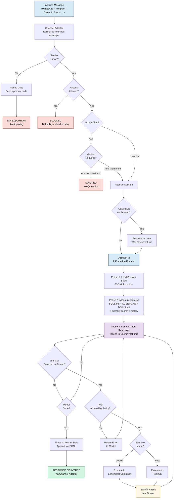
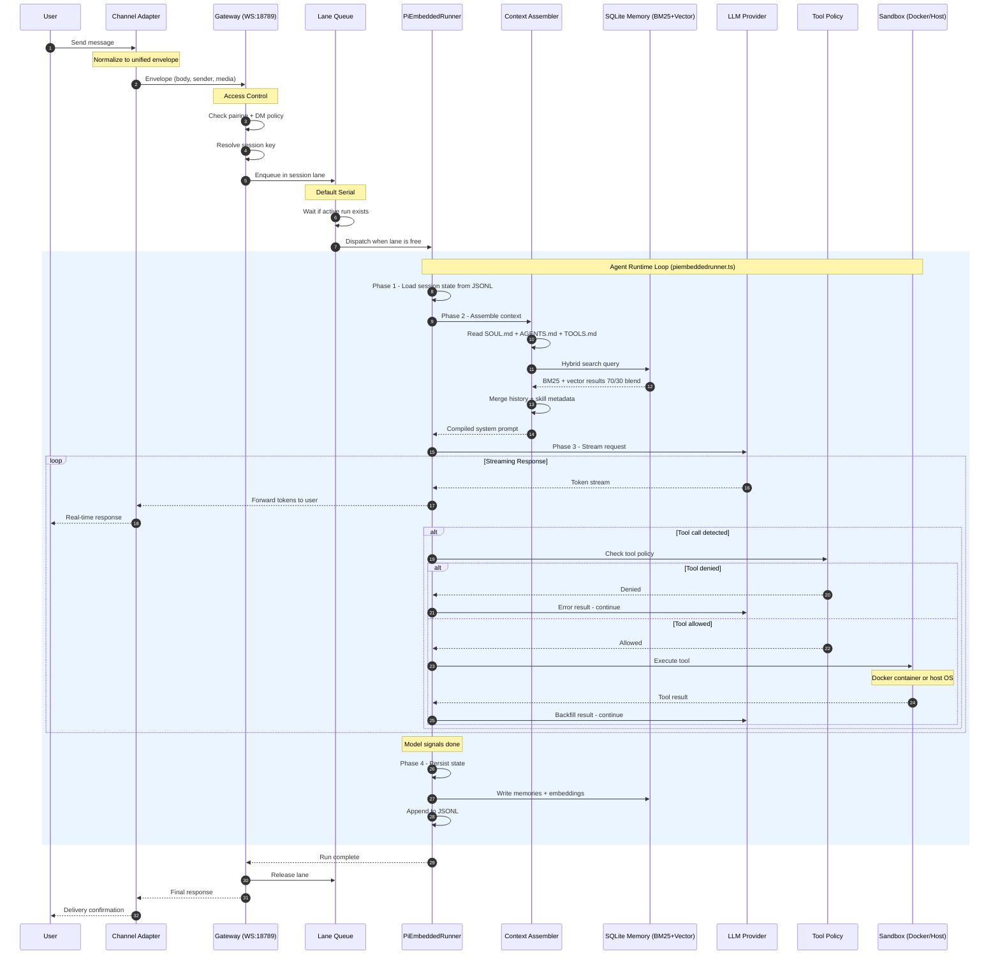

# OpenClaw Architecture: How the Pi Agent Implementation Works

*Prepared for Tomasz Cwik — February 2026*

---

## Decision-Making Flowchart: How OpenClaw Processes a Request

The flowchart below shows every decision point from the moment a message arrives on any platform to the final response delivery. Light-red nodes are rejection paths (unknown sender, blocked access, missing mention). Light-purple is the streaming loop where the model generates tokens. Light-yellow is the tool backfill cycle where results get injected back into the stream. Green is the successful delivery endpoint.

The flow has two distinct halves. The **upper half** is the Gateway's routing logic: access control, session resolution, and lane queuing. The **lower half** is the agent runtime loop inside `piembeddedrunner.ts`: the four phases (load state, assemble context, stream response, persist state) with the inline tool execution cycle nested inside Phase 3.

Notice that tool execution doesn't break out of the streaming loop — the model continues generating after backfill. This is the key architectural decision that makes OpenClaw's agent feel responsive compared to stop-regenerate frameworks.



---

## Waterfall Sequence Diagram: Request Flow Through Components Over Time

The sequence diagram shows the temporal flow of a request across all ten system components. Reading left to right: User, Channel Adapter, Gateway, Lane Queue, PiEmbeddedRunner, Context Assembler, SQLite Memory, LLM Provider, Tool Policy, and Sandbox.

The blue-shaded rectangle in the middle is the **Agent Runtime Loop** — the core of OpenClaw. This is where all four phases execute: session loading, context assembly (with the hybrid BM25+vector memory search), streaming model response, and state persistence.

The **loop** block inside Phase 3 is the streaming response cycle. Notice how tool calls are detected mid-stream, policy-checked, executed (in Docker or on host), and their results backfilled — all without leaving the loop. The model continues generating from where it left off. This inline execution is what distinguishes Pi's architecture from conventional agent frameworks that use a stop-call-restart pattern.

The numbered arrows (1 through ~30) show the exact order of operations. Follow them to trace a complete request lifecycle from "Send message" to "Delivery confirmation."



---

## What OpenClaw Is

OpenClaw is a self-hosted, local-first personal AI assistant built as a TypeScript monorepo (~40,000 lines, ~69 modules). It connects to 13+ messaging platforms (WhatsApp, Telegram, Discord, Slack, Signal, iMessage, Teams, Matrix, and more) through a single local Gateway process. The whole thing runs on your machine — no cloud dependency required.

At its core, OpenClaw is a hub-and-spoke system: one central WebSocket Gateway coordinates all messaging channels, agent sessions, tool executions, and native device connections. The agent runtime is built on top of the **Pi Agent Core library** (`@mariozechner/pi-agent-core`), a minimal coding agent framework created by Mario Zechner. This is the "Pi" in the architecture — the minimal agent that powers everything.

---

## 1. The Hub-and-Spoke Architecture

### The Gateway (Hub)

The Gateway is a WebSocket RPC server (default `ws://127.0.0.1:18789`) implemented across `src/gateway/`. It's the single control plane for the entire system:

```
                         ┌──────────────┐
                         │   Gateway    │
                         │  (WS:18789)  │
                         └──────┬───────┘
            ┌───────┬───────┬───┴───┬───────┬───────┐
            │       │       │       │       │       │
         Telegram WhatsApp Discord Slack  Signal  macOS
         adapter  adapter  adapter adapter adapter  app
```

The Gateway handles: session lifecycle (create, resolve, queue, dispatch), access control (DM policies, pairing, mention gating), webhook routing from external platforms, cron scheduling, and web dashboard serving.

Every client — CLI, web UI, native apps, headless nodes — connects over the same WebSocket protocol, declares its role and scope at handshake, and communicates via typed RPC frames.

### Channel Adapters (Spokes)

Each messaging platform gets an adapter in `src/<channel>/` or `extensions/<channel>/` that normalizes platform-specific messages into a unified envelope:

```json
{
  "body": "plain text message",
  "media": [{ "type": "image", "url": "...", "caption": "..." }],
  "sender": "normalized-sender-id",
  "channelId": "telegram|whatsapp|discord|...",
  "isGroupChat": true,
  "groupName": "My Group",
  "timestamp": 1707900000
}
```

Key adapters and their underlying libraries:

| Channel | Library | Notes |
|---|---|---|
| Telegram | **grammY** | TypeScript Bot API framework |
| WhatsApp | **Baileys** | WebSocket connection to WhatsApp Web protocol |
| Discord | **discord.js** | Full Discord API client |
| Slack | **@slack/bolt** | Slack Bolt framework |
| Matrix | **@matrix-org/matrix-sdk-js** | With native crypto for E2E encryption |

Each adapter handles protocol normalization (stickers → images, embeds → media, reactions → text), access control enforcement, session routing to the correct agent, and bidirectional delivery (formatting responses back to platform constraints like character limits, threading, media support).

---

## 2. The Pi Agent Runtime: PiEmbeddedRunner

This is the heart of the system. Implemented in `src/agents/piembeddedrunner.ts`, it uses the Pi Agent Core library as its execution engine.

### The Four-Phase Loop

Every agent turn executes exactly four phases:

**Phase 1 — Session Resolution.** Load the serialized session state from disk. Sessions are stored as append-only JSONL files at `~/.openclaw/agents/<agentId>/sessions/<session-id>.jsonl`.

**Phase 2 — Context Assembly.** This is where the system prompt is built fresh for every run. It merges:

| Source | What It Contains |
|---|---|
| `AGENTS.md` | Agent instructions and operational guidelines |
| `SOUL.md` | Personality, tone, behavioral philosophy |
| `TOOLS.md` | Available tool definitions (auto-generated from registered tools) |
| `IDENTITY.md` | How the agent presents itself |
| `USER.md` | User context and preferences |
| `MEMORY.md` | References to persistent memories |
| Daily log | Timestamped events and interactions |
| Conversation history | Compacted if over threshold |
| Hybrid search results | BM25 + vector from SQLite memory |
| Skill definitions | Workspace, managed, or bundled skills |

The compiled prompt has a fixed section structure: Tooling → Safety → Skills → Self-Update → Workspace → Documentation → Sandbox → Injected Bootstrap Content.

**Phase 3 — Streaming Model Response with Inline Tool Execution.** This is the clever part. The runtime:

1. Streams tokens from the model provider (Anthropic Claude, OpenAI, or fallback)
2. Watches the stream in real-time for `tool_use` blocks as they appear
3. Intercepts the tool call mid-generation
4. Executes the tool immediately (shell command, browser action, file operation, etc.)
5. **Backfills** the result directly into the ongoing generation
6. The model incorporates the result and continues reasoning
7. Repeats until the model signals completion (`NO_REPLY` or end-of-turn)

This is not a stop-generate-execute-regenerate loop. The tool execution happens *inline* with the streaming response. No round-trip latency — the model sees tool results as part of its own continuous generation.

**Phase 4 — State Persistence.** Write updated session to disk: new conversation entries, tool execution history, memory embeddings, session metadata.

### The Tool System

Tools are registered via `createOpenClawCodingTools()`, which combines Pi Coding Tools with OpenClaw-specific extensions:

**Pi Coding Tools** (from `@mariozechner/pi-coding-agent`):

| Tool | What It Does |
|---|---|
| `read(path)` | Read file contents |
| `write(path, content)` | Create or overwrite files |
| `edit(path, range, content)` | Modify existing files |
| `exec(command)` | Execute shell commands |
| `process` | Subprocess management |

**OpenClaw-Specific Tools:**

| Tool | What It Does |
|---|---|
| `browser` | Chrome DevTools Protocol automation — navigation, snapshots, actions |
| `canvas` | A2UI visual workspace rendering |
| `nodes` | Device control on macOS/iOS/Android companion apps |
| `cron` | Schedule recurring jobs |
| `sessions` | Create and spawn sub-agents |
| `message` | Send replies to users across channels |
| `memory` | Write durable memories before context compaction |

Tool execution goes through a policy check (seven-layer precedence hierarchy) before running. If a tool is denied at any level, it doesn't execute regardless of what the model requests. Tools can also run inside Docker sandbox containers depending on configuration.

---

## 3. Memory Architecture: SQLite-Powered Hybrid RAG

This is one of OpenClaw's strongest architectural decisions. The entire memory system runs on a single SQLite database — no external vector DB, no cloud service.

### Hybrid Search: BM25 + Vector Embeddings

OpenClaw combines two search approaches on the same data:

**Vector Search (Semantic Similarity):** Embeddings are generated for each memory chunk (512–1024 tokens) and stored via the `sqlite-vec` extension. Cosine similarity finds semantically related conversations — good for "find conversations about deployment strategies" even if the exact word "deployment" never appears.

**BM25 Search (Keyword Matching):** SQLite FTS5 full-text search for exact token matching. Excels at finding error codes, function names, unique identifiers — things that vectors are bad at.

**Hybrid Blend:** Results are ranked 70% vector similarity + 30% BM25 keyword score, using the union of both result sets (not intersection). A 4x candidate pool is sampled and then reranked.

### Context Window Compaction

When sessions approach token limits, a clever mechanism kicks in:

1. The runtime detects the token count approaching the context window size
2. It triggers a **silent agentic turn** — invisible to the user
3. The model is prompted to write important facts to durable memory via the `memory` tool
4. Older conversation history is auto-summarized to reduce tokens
5. The original turn continues after compaction

The key insight: memory is written *before* it's discarded, so nothing important is lost. And the memory system is file-first — all memories are stored as readable Markdown, not opaque embeddings. Users own their data completely.

---

## 4. Session Management: Lane Queues

OpenClaw's concurrency model is built on a lane queue system with the philosophy **"Default Serial, Explicit Parallel."**

Each session gets its own lane — an independent queue:

| Lane | Purpose | Default Concurrency |
|---|---|---|
| Main | Primary chat workflow | 4 |
| Cron | Scheduled jobs (isolated: `cron:<job_id>`) | 1 |
| Subagent | Child agent spawning | 8 |
| Nested | Nested tool calls within a run | 1 |

The enforcement flow:

```
runEmbeddedPiAgent enqueues by session key (lane: session:<key>)
    → Guarantees only one active run per session
    → Then queued into global lane (main by default)
    → Overall parallelism capped by agents.defaults.maxConcurrent
```

Messages within a session are processed serially by default — a second message waits until the first run completes. This prevents state corruption. Cross-session work runs in parallel up to the concurrency cap.

---

## 5. Multi-Agent Architecture

OpenClaw supports multiple agents with different models, tools, and workspaces — configured in `agents.json` / `openclaw.json`:

```json
{
  "agents": {
    "list": [
      {
        "id": "main",
        "model": "claude-opus-4-6",
        "tools": { "allow": ["*"] },
        "subagents": { "allowAgents": ["research", "coding"] }
      },
      {
        "id": "research",
        "model": "openrouter/deepseek-r1-distill"
      }
    ]
  }
}
```

The main agent runs on an expensive model (Claude Opus 4.6 at ~$15/M tokens) and spawns sub-agents on cheaper models (DeepSeek R1 at ~$2.74/M tokens) for specific tasks. Each agent maintains isolated workspace, session history, and auth profiles.

**Model Failover:** If the primary model fails (auth, billing, rate limit), OpenClaw tries fallback models. OpenRouter can rotate through multiple provider API keys for redundancy.

**Cost gap:** OpenClaw currently lacks native cost controls — no built-in budgets, limits, or alerts. Third-party solutions (ClawWatcher, RelayPlane, Clawly) fill this gap. A KARMA framework has been proposed with monthly budgets, threshold alerts, and auto-blocking.

---

## 6. Monorepo Structure

The project uses **pnpm workspaces**:

```
openclaw/
├── src/                  # Primary source (~69 modules)
│   ├── agents/           # Agent runtime (piembeddedrunner.ts)
│   ├── gateway/          # WebSocket gateway
│   ├── channels/         # Channel management
│   ├── cli/              # Command-line interface
│   ├── daemon/           # Background service
│   ├── memory/           # Memory/RAG system
│   ├── sessions/         # Session management
│   ├── browser/          # Chrome automation
│   ├── canvas-host/      # Canvas rendering
│   ├── tools/            # Tool implementations
│   └── [44+ more modules]
├── packages/             # Core library packages
├── extensions/           # Channel integrations
├── apps/                 # Native apps (macOS, iOS, Android)
│   └── OpenClawKit/      # Shared native framework
├── skills/               # Bundled skills
├── ui/                   # Web UI components
├── docs/                 # Documentation
└── test/                 # Test suites
```

### Key Dependencies

| Category | Library | Role |
|---|---|---|
| Agent Core | `@mariozechner/pi-agent-core` v0.49.3 | Execution engine |
| Agent Core | `@mariozechner/pi-coding-agent` | Coding tool framework |
| Database | `sqlite3` + `sqlite-vec` + FTS5 | Memory, sessions, RAG |
| Schema | `TypeBox` | Wire-format validation |
| Build | `pnpm`, `esbuild`, `tsdown` | Monorepo management |
| Image | `sharp`, `@napi-rs/canvas` | Image processing |
| Terminal | `@lydell/node-pty` | PTY emulation |
| Local LLM | `node-llama-cpp` | Optional local inference |

Runtime requirement: **Node.js ≥ 22**.

---

## 7. Native Apps and Device Nodes

OpenClaw ships native apps for macOS (menu bar), iOS, and Android that connect to the Gateway as device nodes.

**Discovery:** Devices find the Gateway via **Bonjour/mDNS** (`_openclaw-gw._tcp`) on local network, or use explicit hostname/IP.

**Connection:** WebSocket to the Gateway (same protocol as CLI and web). Pairing handshake with approval codes for first-time connections.

**Capabilities:** Native apps provide camera/microphone access, voice wake-word detection, canvas rendering, chat interface, and push notifications. The `nodes` tool in the agent runtime can control these device capabilities.

**Remote access:** Tailscale Serve/Funnel for secure tunneling, SSH port forwarding (`ssh -L 18789:localhost:18789 user@remote`), or TLS reverse proxies.

---

## 8. The WebSocket Protocol: TypeBox Validation

All communication between Gateway, clients, and devices uses a strictly typed protocol defined in `src/gateway/protocol/schema.ts`:

```json
{ "type": "req", "id": 1, "method": "tool.exec", "params": {...} }
{ "type": "res", "id": 1, "ok": true, "payload": {...} }
{ "type": "event", "event": "message", "payload": {...}, "seq": 1, "stateVersion": 2 }
```

TypeBox schemas (`Type.Object()` with `additionalProperties: false`) validate every frame at runtime. The same schema definitions generate Swift types for the macOS app — single source of truth across platforms.

Live schema export: `https://raw.githubusercontent.com/openclaw/openclaw/main/dist/protocol.schema.json`

---

## 9. Skills: Lazy Loading and Resolution

Skills are reusable agent behavior modules that extend capabilities. They resolve in priority order:

1. **Workspace skills** — `~/.openclaw/workspace/skills/`
2. **Managed/local skills** — `~/.openclaw/managed-skills/`
3. **Bundled skills** — `node_modules/openclaw/skills/`
4. **Extra directories** — configured via `skills.load.extraDirs[]`

**Lazy loading:** On session start, OpenClaw snapshots eligible skills (filesystem scan + filtering) and caches the result with a version hash. Subsequent turns in the same session reuse the cached snapshot — no filesystem scan on every turn. Skill metadata (file paths only) is injected into the prompt, but actual `SKILL.md` content is loaded on-demand via the `read_file` tool. This keeps the context window lean.

Skills can be toggled on/off, supplied with environment variables, and allow/deny listed per agent.

---

## 10. Sandbox Architecture

Tool execution runs in one of three modes based on `agents.defaults.sandbox.mode`:

| Mode | Behavior |
|---|---|
| `"all"` | Every session gets an ephemeral Docker container |
| `"non-main"` | Main DM runs on host; group/channel sessions get containers |
| `"disabled"` | Everything on host |

Each container provides isolated filesystem, configurable network, CPU/memory limits. Containers are destroyed after execution.

---

## Pros and Cons

### What's Good

**Local-first, no cloud dependency.** The entire stack — Gateway, memory, sessions, embeddings — runs on SQLite on your machine. No vendor lock-in, no data leaving your network. This is a strong architectural choice for a personal assistant.

**The inline tool execution model.** Backfilling tool results into the streaming response without a stop-regenerate cycle is elegant. It reduces latency and makes the agent feel responsive. Most agent frameworks use a loop-and-restart pattern — Pi's inline approach is measurably faster.

**Hybrid RAG on SQLite.** Combining BM25 keyword search with vector embeddings in a single SQLite database is pragmatic engineering. No Pinecone, no Weaviate, no infrastructure overhead. The 70/30 blend and union-based ranking handles both semantic queries and exact lookups well.

**The channel adapter pattern.** Normalizing 13+ messaging protocols into a single envelope format is clean and extensible. Adding a new channel means implementing one adapter, not touching the core.

**TypeBox schema validation.** Single source of truth for types across TypeScript server, WebSocket protocol, and Swift native apps. Runtime validation catches protocol errors before they reach handlers. This is solid engineering for a multi-platform system.

**Lane queue concurrency model.** Default-serial-per-session prevents state corruption without sacrificing cross-session parallelism. Simple, correct, and hard to misuse.

### What's Not Great

**No native cost controls.** For a system that can spawn sub-agents and make unlimited API calls, having zero built-in budgets or limits is a real gap. Third-party solutions exist, but this should be core functionality.

**Single-process Gateway.** The hub-and-spoke model means the Gateway is a single point of failure. If the process crashes, all channels go down. There's no clustering, no horizontal scaling, no failover. Fine for personal use — problematic if you're running this for a team.

**Native dependency complexity.** `node-pty`, `sqlite-vec`, `node-llama-cpp`, `sharp`, `@napi-rs/canvas` — all require native compilation. This makes installation fragile across platforms and Node versions. The pnpm workspace setup helps, but native deps remain a pain point.

**Monorepo scale.** 69+ modules in `src/`, separate `packages/`, `extensions/`, `apps/`, `skills/` directories. The codebase is large and navigation isn't always obvious. Documentation exists but doesn't fully map the module graph.

**Context file proliferation.** SOUL.md, AGENTS.md, TOOLS.md, IDENTITY.md, USER.md, MEMORY.md, HEARTBEAT.md — seven files consumed on every turn. These eat tokens on every request, and the distinction between some of them (AGENTS.md vs IDENTITY.md, for instance) is unclear. A simpler configuration surface would help.

**MCP integration is limited.** OpenClaw can connect to MCP servers, but the Agent Client Protocol (ACP) explicitly disables MCP for HTTP/SSE transports. Workarounds exist (mcporter CLI), but the integration isn't seamless.

---

## Bottom Line

OpenClaw's architecture is that of a well-engineered personal infrastructure project that grew into something much bigger. The Pi agent core — minimal, stream-first, inline tool execution — is genuinely good design. The SQLite-powered hybrid RAG is pragmatic and effective. The channel adapter pattern scales well.

The weaknesses are what you'd expect from a project that started as one person's assistant: single-process, no cost controls, complex native dependencies, and a configuration surface that's grown organically rather than being designed top-down. None of these are fatal — they're the natural tradeoffs of a local-first system optimized for power users over enterprise deployments.

---

*Sources:*

- [OpenClaw GitHub](https://github.com/openclaw/openclaw)
- [Architecture Overview — Paolo Perazzo](https://ppaolo.substack.com/p/openclaw-system-architecture-overview)
- [Pi: The Minimal Agent — Armin Ronacher](https://lucumr.pocoo.org/2026/1/31/pi/)
- [Pi Anatomy — Shivam Agarwal](https://medium.com/@shivam.agarwal.in/agentic-ai-pi-anatomy-of-a-minimal-coding-agent-powering-openclaw-5ecd4dd6b440)
- [Memory Architecture — Shivam Agarwal](https://medium.com/@shivam.agarwal.in/agentic-ai-openclaw-moltbot-clawdbots-memory-architecture-explained-61c3b9697488)
- [Local-First RAG with SQLite — PingCAP](https://www.pingcap.com/blog/local-first-rag-using-sqlite-ai-agent-memory-openclaw/)
- [Three-Layer Design Deep Dive — EastonDev](https://eastondev.com/blog/en/posts/ai/20260205-openclaw-architecture-guide/)
- [Multi-Channel Config — EastonDev](https://eastondev.com/blog/en/posts/ai/20260205-openclaw-multi-channel-config/)
- [Identity Architecture — MMNTM](https://www.mmntm.net/articles/openclaw-identity-architecture)
- [Multi-Model Routing — VelvetShark](https://velvetshark.com/openclaw-multi-model-routing)
- [OpenClaw Docs](https://docs.openclaw.ai)
- [DeepWiki: OpenClaw](https://deepwiki.com/openclaw/openclaw)
