# Tooling for Cron & Skills — Architecture Comparison

## Problems Identified (Feb 13, 2026)

1. **Playbook keywords too narrow** — `"every three minutes"` doesn't match `"every minute"` keyword
2. **LLM hallucinated tool name** — `create_job` stored `get_status` for a news search task
3. **Stale hardcoded tool list** — `create_job` description lists 30 tools, actual system has 148+
4. **No validation at creation** — `create_job` accepts any tool name, fails at execution time

---

## Diagram 1: OpenClaw Architecture



**Key design choices:**
- Cron stores **messages**, not tool calls — LLM reasons at execution time
- **All tools always in context** — no tool selector, no catalog lookup needed
- No intent classifier — LLM decides everything from tool descriptions
- Aggressive **input normalization** forgives LLM formatting mistakes
- Resilience: exponential backoff, auto-disable after 3 failures, stuck detection

---

## Diagram 2: Annabelle Current Architecture


**Failure points (red):**
1. Playbook classifier uses exact keyword matching — `"every three hours"` doesn't match any keyword
2. Without the playbook, LLM never gets structured instructions or `get_tool_catalog`
3. `create_job` has stale hardcoded tool list (30 tools, missing `searcher_news_search`)
4. No validation of `action.toolName` — hallucinated name gets stored
5. Cron executor fails at runtime — `get_status` is a custom handler, not in ToolRouter

---

## Diagram 3: Proposed Architecture



**What changes (green = new/fixed):**

| Component | Location | Change |
|-----------|----------|--------|
| Playbook Classifier | **Thinker** | Keyword matching → embedding similarity |
| `create_job` validation | **Orchestrator** | Validates `action.toolName` against ToolRouter + custom handlers |
| `create_job` description | **Orchestrator** | Dynamic tool list from ToolRouter (or reference `get_tool_catalog`) |
| Cron Executor | **Orchestrator** | New `agentTurn` mode — dispatches message to Thinker instead of raw tool call |
| `get_tool_catalog` | **Orchestrator** | Already done — used by playbook for tool discovery |
| `required_tools` validation | **Orchestrator** | Already done — warns on unknown tools in `memory_store_skill` |

**What stays the same:**
- Skill execution path (Memorizer stores, Inngest fires, Thinker executes)
- Tool routing (ToolRouter with prefixed names)
- Embedding tool selector (picks tools per message)
- Regex tool groups (core, search, jobs, memory)

---

## Change Summary

### Phase 1: Quick wins (prevent broken jobs)
1. **Validate `create_job` tool names** — same pattern as `memory_store_skill` validation
2. **Dynamic tool list in `create_job` description** — replace stale `AVAILABLE_TOOLS_DESCRIPTION`

### Phase 2: Fix playbook activation
3. **Embedding-based playbook matching** — replace keyword regex with cosine similarity in `playbook-classifier.ts`

### Phase 3: Robust execution
4. **`agentTurn` cron payload** — new job type that dispatches to Thinker at execution time
5. **Merge SKILL and complex CRON** — playbook steers complex scheduling to skills, simple to `tool_call` cron jobs

### Comparison with OpenClaw

| Aspect | OpenClaw | Annabelle Current | Annabelle Proposed |
|--------|----------|-------------------|-------------------|
| Intent routing | LLM only | Keyword classifier | Embedding classifier + LLM |
| Tool discovery | All tools in context always | Embedding selector (top-K) | Embedding selector + `get_tool_catalog` for scheduling |
| Cron payloads | Messages only | Tool calls only | Both (tool_call + agentTurn) |
| Tool validation | None (no tool names stored) | None | At creation time |
| NL → cron | LLM does it | LLM does it | LLM does it |
| Error resilience | Exponential backoff + auto-disable | Retry every fire, errors forever | Add backoff + auto-disable |
| Skill system | Markdown files, LLM reads on demand | DB-stored, Inngest-fired, LLM-executed | Same (already strong) |

---

## Diagram 4: Proposed Architecture v2 — Skills Only (No Cron Jobs)



**Core change**: Eliminate cron jobs entirely. Everything is a skill. Inngest remains the single scheduler.

### What gets removed (red dashed box in diagram)

| Removed | Why |
|---------|-----|
| `create_job` tool | Replaced by `memory_store_skill` |
| `list_jobs` / `delete_job` / `get_job_status` tools | Replaced by `memory_list_skills` / `memory_delete_skill` / `memory_get_skill` |
| Job Storage (`~/.annabelle/data/jobs/*.json`) | Skills are already in Memorizer SQLite |
| Cron job poller loop (functions.ts lines 208-330) | Skill poller (lines 464-760) already handles everything |
| `executor.ts` backward compat map | No more raw tool calls from cron |
| SKILL vs CRON JOB classification in playbook | All scheduling = skill |
| `AVAILABLE_TOOLS_DESCRIPTION` hardcoded list | `get_tool_catalog` is the single source of truth |

### What stays

| Kept | Role |
|------|------|
| **Inngest** | Single scheduler — skill poller fires every minute |
| **Memorizer** | Single store — skills with schedule, instructions, required_tools |
| **Thinker** | Single executor — LLM reasons at fire time with required_tools |
| **Playbook** | Simplified — all scheduling goes through `get_tool_catalog` → `memory_store_skill` |
| **ToolRouter** | Unchanged — routes tool calls to MCPs |
| **`get_tool_catalog`** | Tool discovery for the LLM at skill creation time |
| **`required_tools` validation** | Warns on unknown tools at creation time |
| **Failure cooldown** | Already in skill poller (5-min backoff) |
| **Calendar pre-flight** | Already in skill poller for meeting skills |

### The unified flow

**Creation** (user says "send hello every minute"):
1. Embedding classifier activates cron-scheduling playbook
2. Playbook has NO classification step — everything is a skill
3. LLM calls `get_tool_catalog` → picks `telegram_send_message`
4. LLM calls `memory_store_skill` with:
   - `instructions: "Send 'hello' via Telegram"`
   - `required_tools: ["telegram_send_message"]`
   - `trigger_config: { schedule: "*/1 * * * *" }`
   - `max_steps: 2`
5. Orchestrator validates required_tools against ToolRouter

**Execution** (Inngest fires every minute):
1. Skill poller loads enabled cron skills from Memorizer
2. Checks schedule via croner — skill is due
3. Dispatches to Thinker with instructions + required_tools
4. LLM reads instructions, calls `telegram_send_message`
5. Updates `last_run_at`, `last_run_status`, `last_run_summary`

**Simple vs complex** — the only difference is `max_steps`:
- Simple ("send hello"): `max_steps: 2`, ~500 tokens, ~0.2s on Groq
- Complex ("check emails, classify, notify"): `max_steps: 10`, ~3000 tokens, ~2s on Groq

### Why this is better

1. **Single concept** — no more "is this a cron job or a skill?" confusion
2. **Single store** — Memorizer SQLite, not JSON files on disk
3. **Single poller** — already handles schedules, cooldown, calendar pre-flight, notifications
4. **Tool names resolved at runtime** — LLM picks tools when the skill fires, never hardcoded
5. **Validated at creation** — `required_tools` checked against ToolRouter
6. **Editable** — `memory_update_skill` lets you change instructions, schedule, tools
7. **Observable** — `last_run_at`, `last_run_status`, `last_run_summary` tracked per skill
8. **Already built** — the skill poller is more mature than the cron job executor (cooldown, pre-flight, notification)

---

### OpenClaw vs Annabelle Proposed v2

| Aspect | OpenClaw | Annabelle Proposed v2 | Winner |
|--------|----------|----------------------|--------|
| **Scheduling concept** | Cron jobs with message payloads | Skills with instructions + required_tools | Annabelle — skills are richer (validated tools, editable instructions, run history) |
| **Intent routing** | None — LLM decides from tool descriptions | Embedding-based playbook classifier | Annabelle — playbook injects structured workflow, not just hoping LLM figures it out |
| **Tool discovery at creation** | All tools always in LLM context (~15 core tools) | `get_tool_catalog` returns 148+ tools grouped by MCP | Annabelle — scales better; OpenClaw works because it has fewer tools |
| **Tool validation** | None — no tool names stored in jobs | `required_tools` checked against ToolRouter at creation | Annabelle — catches errors before execution |
| **Storage** | JSON5 files on disk | SQLite via Memorizer MCP | Annabelle — queryable, relational, supports filtering/search |
| **Execution model** | LLM reasons at fire time (always) | LLM reasons at fire time (always) | Tie — same approach |
| **Token cost** | Every job fires an LLM call | Every skill fires an LLM call | Tie — same tradeoff |
| **Error resilience** | Exponential backoff (30s→1m→5m→15m→60m), auto-disable after 3 failures | 5-min failure cooldown, Telegram notification on error | OpenClaw — more graduated backoff; Annabelle could adopt this |
| **Schedule types** | 3 kinds: `at` (one-shot), `every` (interval), `cron` (expression) | 2 kinds: `schedule` (cron expression), `interval_minutes` | OpenClaw — `at` (one-shot) is useful; Annabelle has `scheduled` jobs but losing them in this merge |
| **Input normalization** | Aggressive — fixes casing, flattened params, legacy fields | Minimal — trusts LLM output structure | OpenClaw — LLMs produce malformed JSON; normalization prevents silent failures |
| **Observability** | Job status only | `last_run_at`, `last_run_status`, `last_run_summary` per skill | Annabelle — run summary gives human-readable history |
| **Skill system** | Markdown files on disk, LLM reads on demand | DB-stored, Inngest-fired, LLM-executed with required_tools | Annabelle — required_tools scoping means the LLM only sees tools it needs |
| **NL → schedule** | LLM converts directly, tool description is the schema guide | LLM converts via playbook instructions | Tie — both work; playbook adds guardrails |
| **Multi-step execution** | Agent session with full tool access | Thinker with `max_steps` limit and required_tools scoping | Annabelle — `max_steps` prevents runaway, required_tools reduces hallucination |
| **Notification** | None built-in for job completion | `notify_on_completion` sends Telegram summary | Annabelle — user knows what happened |
| **Calendar awareness** | None | Pre-flight check skips meeting skills when no events | Annabelle — avoids wasting LLM calls on empty days |

**Summary**: OpenClaw is simpler (fewer moving parts, no classifier, no validation) which works well for its ~15 core tools. Annabelle's proposed v2 is more structured but handles a larger tool surface (148+) more safely. The main things to steal from OpenClaw:

1. **Graduated exponential backoff** — replace flat 5-min cooldown with 30s→1m→5m→15m→60m
2. **Input normalization** — add a normalizer for `memory_store_skill` that fixes common LLM mistakes (wrong casing, flattened trigger_config, missing fields)
3. **One-shot `at` schedule** — add support for "remind me at 3pm today" as a skill with `trigger_config: { at: "2026-02-13T15:00:00" }` that auto-deletes after firing

---

## Diagram 5: Proposed Architecture v3 — Compiled Plans + Tiered Execution



**Core insight**: Both OpenClaw and v2 fire an LLM call for every scheduled task, even deterministic ones like "send hello". V3 separates **what to do** (decided once at creation, verified, stored as a compiled plan) from **what to think about** (only at fire time, only when reasoning is needed). This breaks the "Token cost: Tie" deadlock.

### What's NEW in v3 (not from OpenClaw, not in v2)

| New Component | Location | What it does |
|---------------|----------|--------------|
| **Tier Router** | Orchestrator skill poller | Examines each due skill: has `execution_plan`? → Direct. Has `instructions`? → Agent |
| **Direct Executor** | Orchestrator | Calls tools via ToolRouter with static params from plan. Zero LLM cost, ~5ms per fire. Reuses existing `executeWorkflow()` |
| **Compiled execution_plan** | Memorizer (new field) | Structured steps: `[{tool, params}]`. Created by LLM once, validated, executed directly forever after |
| **Strict tool sandboxing** | Thinker agent executor | Agent-tier skills get ONLY `required_tools` as their complete tool set — not hints alongside everything else, the ENTIRE available set |
| **SKILL.md auto-scheduling** | Thinker SkillLoader + Orchestrator | File-based skills with `trigger_config` in frontmatter auto-register in Memorizer. Drop a SKILL.md → it starts running on schedule |
| **Input normalizer** | Orchestrator (pre-storage) | Fixes common LLM mistakes: wrong casing, `trigger_config` flattened into root, missing `trigger_type`, cron expression typos |
| **Cron expression validation** | Orchestrator validation layer | Validates cron expression via croner BEFORE storing. Bad expressions fail at creation, not at fire 100 |
| **One-shot `at` schedule** | Orchestrator skill poller | `trigger_config: { at: "2026-02-14T09:00:00" }` — fires once, auto-deletes |

### How tier classification works

The LLM at creation time decides the tier based on task complexity:

| User says | Tier | Stored as | Fire cost |
|-----------|------|-----------|-----------|
| "Send hello every minute" | Direct | `execution_plan: [{tool: "telegram_send_message", params: {message: "hello"}}]` | ~0 tokens, ~5ms |
| "Remind me at 3pm about dentist" | Direct (one-shot) | `execution_plan` + `trigger_config: {at: "..."}` + `auto_delete: true` | ~0 tokens, one fire |
| "Search AI news every 3 hours, summarize, send to Telegram" | Agent | `instructions: "Search latest AI news..."` + `required_tools: [...]` + `max_steps: 5` | ~500-2000 tokens via Thinker |
| "Every morning check emails, classify urgent, draft replies" | Agent | `instructions: "..."` + `required_tools: [...]` + `max_steps: 10` | ~2000-5000 tokens via Thinker |

**The decision rule is simple**: if the task can be expressed as a fixed sequence of tool calls with static params → Direct. If it needs reasoning, summarization, classification, or dynamic content → Agent.

### The three execution paths

**Path 1: Direct execution** (simple recurring tasks — zero LLM):
1. Skill poller loads skill, checks schedule → due
2. Tier router sees `execution_plan` → Direct
3. `executeWorkflow()` calls each step's tool via ToolRouter with stored params
4. Updates `last_run_at`, `last_run_status`, `last_run_summary`

**Path 2: Agent execution** (complex tasks — sandboxed LLM):
1. Skill poller loads skill, checks schedule → due
2. Tier router sees `instructions` only → Agent
3. Dispatches to Thinker with instructions + **ONLY** `required_tools` available
4. LLM reasons, calls tools, produces summary
5. Updates status + optional Telegram notification

**Path 3: One-shot** (reminders, alerts — fires once, self-deletes):
1. Skill poller sees `trigger_config.at` → checks if time has passed
2. Executes via Direct or Agent path (depending on plan/instructions)
3. Auto-deletes skill from Memorizer after successful fire

### SKILL.md auto-scheduling (unified skill systems)

Currently file-based SKILL.md skills are **playbook injectors** (conversation guides) and DB skills are **scheduled executors**. These are disconnected. V3 bridges them:

```yaml
# ~/.annabelle/skills/ai-news-monitor/SKILL.md
---
name: ai-news-monitor
description: Monitors AI news and sends Telegram summaries
metadata:
  required_tools:
    - searcher_news_search
    - telegram_send_message
  trigger_config:
    schedule: "0 */3 * * *"
  max_steps: 5
---
Search for the latest AI news headlines. Summarize the top 3 stories
in 2-3 sentences each. Send the summary via Telegram.
```

On startup + every 5 min refresh:
- `SkillLoader` detects `trigger_config` in frontmatter
- If no matching DB skill exists → auto-creates via `memory_store_skill`
- If DB skill exists and file is newer → updates via `memory_update_skill`
- If file is deleted → disables the DB skill

This means you can **git-manage scheduled skills** — version control, deploy by copying files, share with others via the agentskills.io standard.

### Why v3 is better than v2

| Concern | v2 | v3 |
|---------|----|----|
| "Send hello" fires every minute | ~500 tokens per fire (LLM) | ~0 tokens (Direct tier) |
| 20 simple skills × 1440 fires/day | ~14.4M tokens/day | ~0 tokens/day |
| Tool hallucination at fire time | possible (required_tools are hints) | impossible in Direct tier; sandboxed in Agent tier |
| File-based SKILL.md with schedule | not scheduled (playbook only) | auto-schedules in Memorizer |
| Bad cron expression | stored, fails at fire time | rejected at creation time |
| LLM malformed input | stored as-is | normalizer fixes before storage |
| "Remind me at 3pm" | not supported | one-shot `at` schedule, auto-deletes |
| Graduated backoff | flat 5-min cooldown | 30s→1m→5m→15m→60m + auto-disable |

### What's already built that v3 reuses

- `executeWorkflow()` in `executor.ts` — sequential tool calls with dependencies (Direct tier engine)
- `SkillLoader.scan()` — already parses SKILL.md frontmatter including `metadata.required_tools`
- Skill poller in `functions.ts` — schedule checking, cooldown, calendar pre-flight, notifications
- `required_tools` validation in `http-handlers.ts` — already validates against ToolRouter
- `get_tool_catalog` — already built for tool discovery

### Implementation phases

**Phase 1: Foundation** (prevents broken skills, low risk)
1. Input normalizer for `memory_store_skill` — fix common LLM formatting mistakes
2. Cron expression validation via croner at proxy time
3. Graduated backoff replacing flat 5-min cooldown (change `FAILURE_COOLDOWN_MINUTES` → backoff table with `consecutive_failures` counter)

**Phase 2: Direct execution tier** (the big win)
4. Add `execution_plan` field to Memorizer skill schema (new column, nullable)
5. Tier router in skill poller — checks for `execution_plan` presence
6. Direct executor — calls `executeWorkflow()` with plan steps, skips Thinker entirely
7. Update playbook instructions — teach LLM to produce `execution_plan` for simple tasks

**Phase 3: Unified skills + polish**
8. SKILL.md auto-scheduling — SkillLoader detects `trigger_config`, syncs to Memorizer
9. One-shot `at` schedule support + auto-delete after fire
10. Strict tool sandboxing — Thinker agent receives only `required_tools` as complete tool set

---

### Full Comparison: OpenClaw vs v2 vs v3

| Aspect | OpenClaw | Annabelle v2 | Annabelle v3 |
|--------|----------|-------------|-------------|
| **Scheduling concept** | Cron jobs with message payloads | Skills with instructions + required_tools | Skills with **compiled plans** (direct) OR instructions (agent) |
| **Execution model** | LLM always reasons at fire time | LLM always reasons at fire time | **Tiered**: Direct (zero LLM) for simple, Agent (sandboxed LLM) for complex |
| **Token cost — simple task** | ~500 tokens per fire | ~500 tokens per fire | **~0 tokens** (Direct tier) |
| **Token cost — complex task** | ~2000 tokens per fire | ~2000 tokens per fire | ~2000 tokens (Agent tier, same) |
| **Token cost — 20 simple skills/day** | ~14.4M tokens | ~14.4M tokens | **~0 tokens** |
| **Intent routing** | None — LLM decides | Embedding classifier + playbook | Embedding classifier + playbook (same as v2) |
| **Tool discovery** | All tools always in context (~15) | `get_tool_catalog` (148+ grouped) | `get_tool_catalog` (same as v2) |
| **Tool validation at creation** | None | `required_tools` checked against ToolRouter | required_tools + **cron expression** + **execution_plan tools** validated |
| **Tool sandboxing at execution** | Full tool access | required_tools as hints | Direct: only plan tools. Agent: **strict sandbox** (only required_tools) |
| **Storage** | JSON5 files on disk | SQLite via Memorizer | SQLite + optional **execution_plan** column |
| **Error resilience** | Exponential backoff + auto-disable | 5-min flat cooldown | **Graduated backoff** (30s→1m→5m→15m→60m) + auto-disable |
| **Schedule types** | `at`, `every`, `cron` | `schedule`, `interval_minutes` | `schedule`, `interval_minutes`, **`at` (one-shot)** |
| **Input normalization** | Aggressive | None | **Normalizer** fixes casing, flattened config, missing fields |
| **File-based skills** | Markdown on disk, read on demand | Playbook injectors only (no scheduling) | Playbooks + **auto-schedule** if `trigger_config` present |
| **Git-managed scheduling** | No | No | **Yes** — drop SKILL.md with schedule, auto-registers |
| **Observability** | Job status only | `last_run_at/status/summary` | Same as v2 + execution tier logged |
| **Multi-step execution** | Full agent session | Thinker with `max_steps` + required_tools hints | Direct: `executeWorkflow()`. Agent: Thinker with strict sandbox |
| **Notification** | None | `notify_on_completion` via Telegram | Same as v2 |
| **Calendar awareness** | None | Pre-flight check for meeting skills | Same as v2 |
| **Existing infrastructure reused** | N/A | Skill poller, Memorizer, Thinker | + `executeWorkflow()`, `SkillLoader`, validation layer |

### What the end user actually experiences

| User scenario | OpenClaw | Annabelle Current | Annabelle v2 | Annabelle v3 |
|---------------|----------|-------------------|-------------|-------------|
| **"Send me hello every minute"** | Works. Costs tokens every minute. | **Unreliable.** Keyword "every minute" matches, but LLM picks from stale 30-tool list. May store wrong tool name. If it works, costs tokens every fire. | Works. Costs tokens every minute. | Works. **Free after creation** — no LLM involved, message arrives in ~5ms instead of ~2s. |
| **"Remind me at 3pm about dentist"** | Works (has `at` schedule). | **Doesn't work.** No one-shot schedule. User must create a cron and manually delete it after. | **Doesn't work** — no one-shot schedule type. User must create a cron that fires once and manually delete it. | Works. **Fires once, auto-deletes.** User says it, forgets about it. |
| **"Check AI news every 3 hours"** | Works, but LLM might pick the wrong tool — no validation. User finds out only when it breaks. | **Broken.** "every three hours" doesn't match any keyword → no playbook → LLM uses stale tool list → hallucinated `get_status` → error every 3 hours forever. This is the bug we found. | Works. Tools validated at creation. If LLM picks a bad tool name, user gets a warning immediately. | Same as v2. Validated at creation + normalizer fixes small LLM mistakes the user never sees. |
| **User creates 30 simple reminders** | Works but burns ~21M tokens/day. Hits cost limits fast. Agent might auto-pause. | Most will fail at creation (keyword mismatch) or at execution (wrong tool names). The few that work cost tokens every fire. | Same problem — 30 skills × LLM call each = expensive. Cost controls may pause the agent. | **Nearly free.** Direct-tier skills don't consume tokens. User can have dozens of simple recurring tasks without budget impact. |
| **Skill has a typo in cron expression** | LLM wrote `"* * * *"` (4 fields instead of 5). Stored. Fails silently every minute forever. | Same — no validation. Bad expression stored, fails silently. | Same — bad expression stored, fails at fire time. User gets error notification every 5 minutes. | **Rejected at creation time.** User immediately hears: "That schedule isn't valid, did you mean every hour?" |
| **Skill starts failing (API down)** | Error → 30s backoff → retries with increasing delay → auto-disables after 3 failures. User doesn't know unless they check. | Error → retries every fire forever → **error Telegram notification every fire** → never stops. This is the spam we experienced. | Error → notification → retries every 5 min → same error notification every 5 min. **Less spam, still annoying.** | Error → notification → **graduated backoff** (30s→1m→5m→15m→60m) → auto-disables after 5 failures. User gets 1-2 notifications, not a flood. |
| **"What skills do I have running?"** | User asks, LLM lists jobs. Basic status only. | Two separate systems to check: `list_jobs` for cron jobs, `memory_list_skills` for skills. Confusing — "is my task a job or a skill?" | User asks, LLM lists skills with `last_run_at`, `last_run_status`, `last_run_summary`. Single place. | Same as v2. User sees full run history. |
| **"Edit my news skill to check every hour instead"** | Must delete and recreate the job. | Must delete and recreate. Two different deletion tools depending on whether it's a job or skill. | `memory_update_skill` — change schedule, instructions, or tools without recreating. | Same as v2. |
| **Power user wants to add 5 skills at once** | Must tell the bot each one individually. | Same — each created via conversation. Plus user has to know which should be "cron jobs" vs "skills". | Same — each skill created via conversation. | Can **drop 5 SKILL.md files** into `~/.annabelle/skills/` and they auto-register. Or use conversation for quick ones. |
| **User shares a useful skill with a friend** | Copy-paste the natural language description and hope the other bot creates the same job. | Same — no portable format. Cron jobs are JSON files but not designed for sharing. | Same — no portable format. | **Copy the SKILL.md folder.** agentskills.io-compatible. Friend drops it in their skills directory, it works. |

### TL;DR for the end user

**OpenClaw**: Simple and it works, but you're flying blind — no validation, no notifications, no way to know if something broke until you notice it's missing. Every task costs tokens, always.

**Annabelle Current**: Two confusing systems (cron jobs vs skills) that both break in different ways. Keyword matching misses common phrases like "every three hours". LLM hallucinates tool names from a stale list. Broken jobs spam you with errors forever. This is what we tested and saw fail.

**Annabelle v2**: Single concept (skills), you know what's happening (notifications, run history, editable skills), and broken tool names are caught early. But every skill still costs tokens, and simple stuff like "send hello" is unnecessarily expensive.

**Annabelle v3**: Same visibility as v2, but **simple tasks become instant and free**. You can set up 30 reminders without worrying about cost. Bad schedules and typos are caught before they cause problems. One-shot reminders ("remind me at 3pm") just work and clean up after themselves. Power users can manage skills as files and share them.
